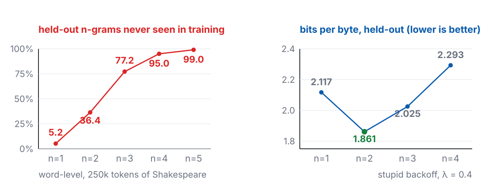
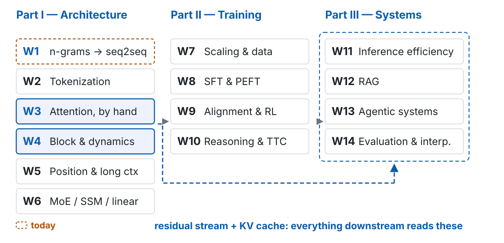
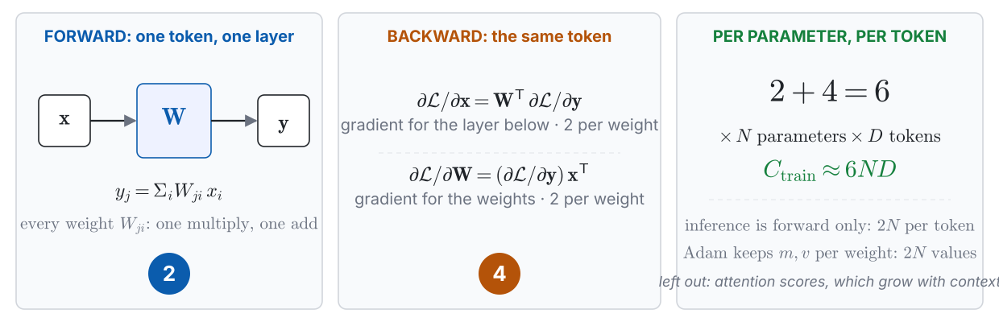
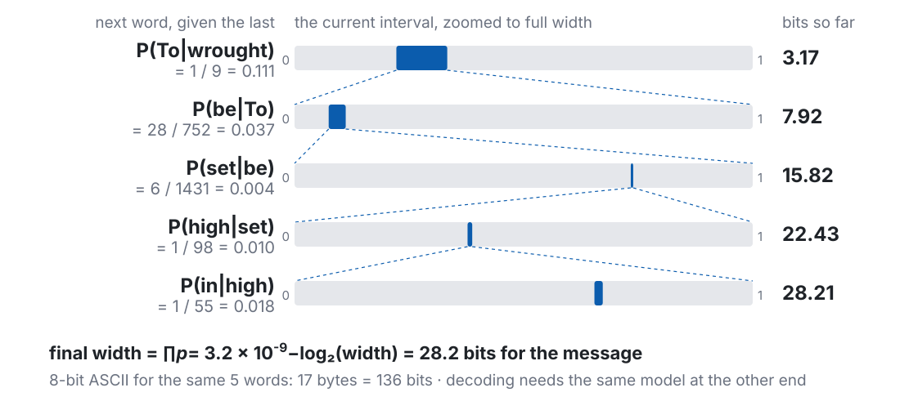
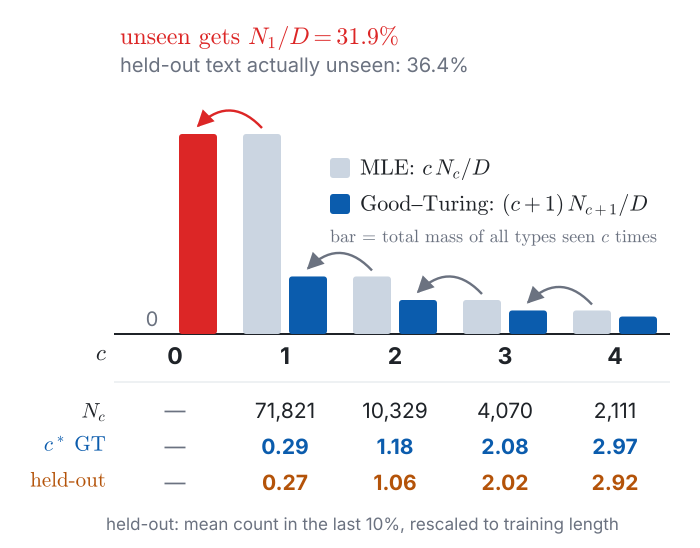
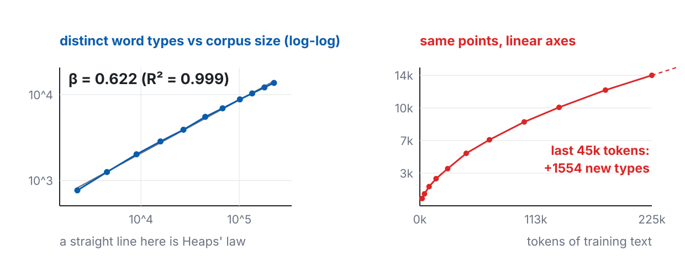
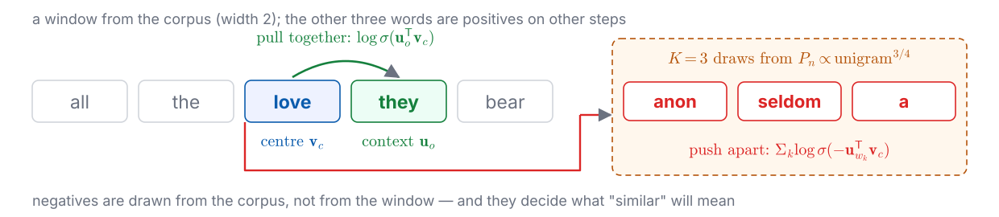
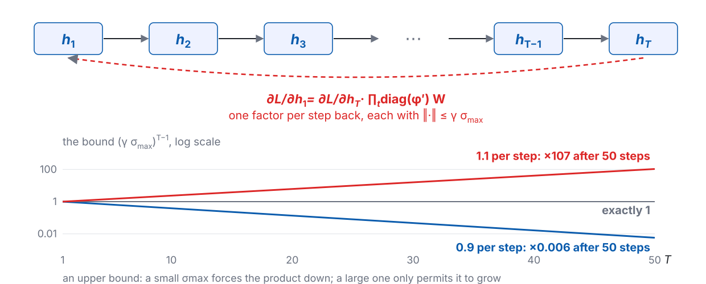
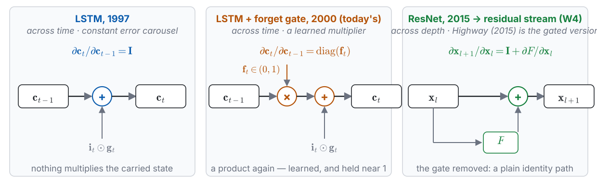
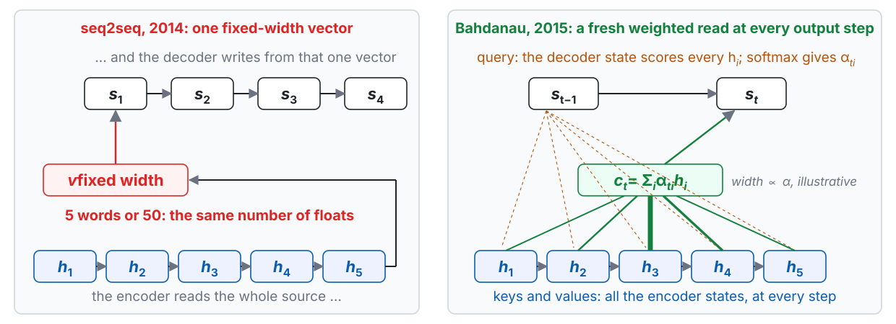

<!-- 此檔由 bin/publish_slides.py 從投影片正本產生（中文講稿區塊已剝除），請勿直接編輯。正本在 private repo 的 <course>/slides/。 -->

# Five samples {.section-title}

## Same corpus. Same prompt. One number changes.

225,333 words of Shakespeare. 14,560 distinct words. A word-level n-gram model, trained by counting.

Every sample below starts from the same eight words, and differs only in **how many previous words the model is allowed to look at**.

::: {.gen}
[prompt]{.n}
… beside well in his person wrought **To be** …
:::

::: {.ask}
Watch what happens to the output as that number goes up.
:::

::: {.footer}
The experiment is Shannon's (1948): approximations to English of increasing order
:::

## $n = 1$: the words are Shakespeare's. Nothing else is.

::: {.gen}
[$n = 1$　·　no context at all]{.n}
We than me or too: here separation PERDITA I majesty exhales the bring child have, night interchange, our to thereto and dad, kiss thinks a country's the pedigree Thy For they Unless but,. the
:::

- The **unigram distribution** is right: `the`, `our`, `to` appear at roughly the right rate
- Nothing else survives. No agreement, no syntax, no clause boundaries

::: {.claim}
A model of word frequency is a model of vocabulary, not of language.
:::

## $n = 2$: local fluency arrives. Global coherence does not.

::: {.gen}
[$n = 2$　·　one word of context]{.n}
be to each of York, you might reproach your lordship cool your will show it. For thy due to your channel should be furnished with patience but a truth, seven night: He shift a word, my
:::

- Two- and three-word spans are now plausible English: *your lordship*, *furnished with patience*
- Sentences still go nowhere. The model cannot remember what it said four words ago

::: {.claim}
One word of context buys local fluency. That is a remarkably good return on one word.
:::

## $n = 4$: this reads like Shakespeare.

::: {.gen}
[$n = 4$　·　three words of context]{.n}
wrought To be set high in place, we did: he desires to make atonement Betwixt the Duke of York is there alive but we? And who durst mine when Warwick bent his brow? Lo, now my sovereign speaketh
:::

- Clauses hold together. Rhetorical questions are well formed. Names are used consistently
- If I had not told you how this was produced, you might not have guessed counting

::: {.claim}
Four words of context, and pure counting, gets you something you would call fluent.
:::

## $n = 8$: this is not generation. This is recall.

::: {.gen .hit}
[$n = 8$　·　seven words of context]{.n}
well in his person wrought To be set high in place, we did commend To your remembrances: but you have found, Scaling his present bearing with his past, That he's your fixed enemy, and revoke Your sudden approbation. BRUTUS: Say
:::

That passage is in the training corpus, word for word, including the speaker tag that follows it.

::: {.claim .warn}
Somewhere between $n = 4$ and $n = 8$, the model stopped generalizing and started remembering. **Nothing in the training objective told us where that line was.**
:::

::: {.footer}
Corpus: Shakespeare (public domain), `tinyshakespeare` split · computed for this course
:::

## Two curves explain the whole sweep

{width="100%"}

::: {.metrics}
::: {.metric .bad}
[95.0%]{.num}[of held-out 4-grams never appeared in training]{.lab}
:::
::: {.metric .good}
[$n = 2$]{.num}[where bits-per-byte actually bottoms out]{.lab}
:::
::: {.metric}
[99.0%]{.num}[unseen at $n = 5$. More data will not fix this]{.lab}
:::
:::

## Same prompt. A 2026 model. Live.

::: {.gen}
[live · an open model on this laptop, the same eight words]{.n}
:::

Then one more, in Traditional Chinese, asking for something specific and checkable.

::: {.ask}
Third failure mode. Name it before I do.
:::

- $n = 1$ failed **locally**: the words never combine
- $n = 4$ failed **globally**: every clause holds, the passage goes nowhere
- This one fails at **neither** scale — and will still state something checkable and wrong, in exactly the same even voice

::: {.claim .warn}
Local, global, and fluent-but-false. The first two are solved problems. The third is why this course runs for fourteen weeks.
:::

::: {.footer}
This laptop: 64 GB unified memory, no CUDA · what it cannot run is itself a topic (W11)
:::

## A lower perplexity is not a better text

You just watched this. $n = 4$ read best of the four samples. On held-out text it scored **2.293** bits per byte; $n = 2$ scored **1.861**.

::: {.claim .warn}
Reading well and predicting well are different measurements, and they ranked the same four models in different orders.
:::

- Theis, van den Oord & Bethge (2015): in high dimensions, likelihood and sample quality are largely independent — they construct counterexamples in **both** directions
- $n = 8$ is the other direction on today's screen: flawless text, by copying

::: {.footer}
Misconception 1 of 10 · bits-per-byte is defined in Part 3 · the general case is W14
:::

# What this course is {.section-title}

## By week 14 you should be able to open any layer and say why it is there

Not "what is a Transformer" — you can read that anywhere. The target is harder and more useful:

1. **Derive** the pieces: why $1/\sqrt{d_k}$, why Chinchilla's exponents, why DPO's partition function cancels
2. **Cost** any design: given a model, say what it costs to train, to serve, and where the bottleneck actually is
3. **Diagnose** a failure: given a broken output, name the layer responsible and the mechanism
4. **Judge** a claim: read a 2026 paper and say whether its evidence supports its abstract

::: {.claim}
Every component in this course is introduced through the specific failure it was invented to fix.
:::

## Fourteen weeks, and which weeks hold up which

{width="100%"}

## W3 and W4 are the hinge. If you skip one week, do not skip those two.

Everything in Part III reads from two objects built in W3–W4:

- **the residual stream** — a shared bus every layer reads from and writes back to
- **the KV cache** — the model's actual state at inference time, and usually its dominant cost

::: {.claim}
By W11 the question is no longer "how does attention work" but "how many bytes does it move per token." You cannot ask the second question until you have built the first.
:::

## What you should be able to do by the end of today

1. **Write** the n-gram MLE and perplexity, and say why sparsity survives any affordable amount of data
2. **Explain** how word2vec turns the distributional hypothesis into a loss — and name three ways static embeddings fail
3. **Identify** the gradient product in BPTT and the seq2seq bottleneck, name the symptom attention was aimed at, and compare recurrence with attention
4. **State** the language-model–compressor equivalence in bits-per-byte, and where it breaks
5. **Estimate** a model's training compute from $C \approx 6ND$

::: {.claim}
Item 4 is the one that carries furthest. It comes back in W7, W11 and W12.
:::

## The ledger we refill every week

| Where the cost falls | Formula | What binds it | Filled in |
|:---|:---|:---|:---|
| **Training**, one run | $C_{\text{train}} \approx 6ND$ FLOPs | compute | today · W7 |
| **Optimizer state** (Adam) | $\approx 2N$ extra values | memory | W4 |
| **Prefill**, once per request | $C_{\text{pre}} \approx 2NL_{\text{in}}$ FLOPs | compute | W11 |
| **Decode**, per generated token | $C_{\text{dec}} \approx 2N$ FLOPs | memory bandwidth | W11 |
| **KV cache**, state carried | $M_{\text{KV}} = 2\,n_{\text{layer}}\,n_{\text{kv}}\,d_{\text{head}}\,L\,b$ bytes | capacity, then bandwidth | W3 · W5 |
| **MoE** | memory $\propto N_{\text{total}}$, FLOPs $\propto N_{\text{active}}$ | both, separately | W6 |

: {tbl-colwidths="[25,45,19,11]"}

::: {.small}
$N$ parameters · $D$ training tokens · $L_{\text{in}}$ prompt length · $L$ context so far · $b$ bytes per element · $n_{\text{kv}}$ KV heads · $6 = 2$ forward $+\,4$ backward
:::

::: {.claim}
**Decode is short of bandwidth, not FLOPs** — and the KV cache is what fills the road.
:::

## Where the $6$ in $6ND$ comes from

{width="100%"}

::: {.claim}
Every parameter touches every token three times — once forward, twice backward — at two FLOPs a touch. Nothing else in the model is counted.
:::

::: {.footer}
Multiply-add $= 2$ FLOPs · attention scores left out; when that matters is W3 and W5
:::

## One number, now, on paper

For a **7B dense model** at Chinchilla-optimal, $D \approx 20N$:

1. The training compute, from $C \approx 6ND$, in FLOPs
2. Then: how many **years** on one consumer GPU — the 16 GB card your term project will actually run on

::: {.ask}
Five minutes. Work it out by hand, then I will ask three of you for your answers.
:::

::: {.claim}
The answer is why pretraining is something a handful of institutions do — and why a card ten times faster would not change that.
:::

::: {.footer}
The memory-side number, this model's KV cache, opens W3 · the MoE number opens W6
:::

## Three questions we ask every single week

::: {.prose}
| Axis | The question |
|---|---|
| **Representation** | The unit at this layer — byte, token, hidden state, KV entry, retrieved chunk, latent thought. **Who chose it, and what does that choice cost downstream?** |
| **Compute** | *Training* compute or *inference* compute? FLOPs bound, or memory-bandwidth bound? |
| **Supervision** | Where does this capability come from? Five possible answers — today, exactly one exists |
:::

::: {.claim}
The same observed behaviour can come from entirely different places on the third axis. That is the central dispute of W10 and W14.
:::

## Today, the third column has one entry

| Where a capability can come from | today | arrives in |
|---|:---:|---|
| the **pretraining distribution** | **✓** | — |
| human demonstrations | | W8 |
| human preference | | W9 |
| a verifiable reward | | W9 → W10 |
| retrieved knowledge | | W12 |
| extra compute at test time | | W10 |

Everything today learns to **match a distribution in text**. Even seq2seq, trained on human translations, is matching one.

::: {.claim .warn}
**W8 is where that column starts to branch**, and you will not feel how large that change is unless you notice how empty the column is today.
:::

## Four questions to ask of every paper in this course

1. **Was the baseline actually tuned?** The most common source of illusory progress. W8 and W9 both have cases where the gain vanishes after a learning-rate sweep
2. **Is the comparison at equal compute?** Iso-FLOPs, iso-parameter and iso-latency are three different comparisons, and they often disagree
3. **What is the metric rewarding?** In W11, KV-cache compression leaves perplexity almost untouched and quietly breaks instruction following
4. **Is the claim mechanistic, or correlational?** "The attention weight is high", "the chain of thought wrote this step", "the reward went up" — all three are correlations

::: {.claim}
You already used question 3 today: the $n = 4$ sample read best, and scored worse. Question 1 comes back before we finish.
:::

# A language model is a compressor {.section-title}

## Predicting well and compressing well are the same problem

Give me a distribution over the next token and I can build a code. Arithmetic coding reaches the entropy of that distribution, to within a couple of bits over the whole message.

$$H(p,q) = -\mathbb{E}_{x\sim p}\big[\log_2 q(x)\big] = H(p) + D_{\mathrm{KL}}(p\,\|\,q) \quad\text{bits per symbol}$$

So the training objective of every model in this course is *literally* a compression rate — and training can only ever shrink the second term.

::: {.claim}
This is the metaphor that runs the whole term. **Pretraining is compression. A scaling law is the regularity in the compression ratio. Quantization compresses the compressor. RAG refuses to compress and looks things up instead.**
:::

## Arithmetic coding: the interval is the probability

{width="100%"}

::: {.claim}
Each word narrows the interval by its probability. Naming a point in the last interval takes $-\log_2 \prod_t q(w_t \mid w_{<t})$ bits — the model's log-loss, summed.
:::

::: {.footer}
Bigram counts, training split · sub-intervals in alphabetical order · Shannon (1948)
:::

## Where the compression metaphor fails

1. **What gets compressed is a distribution over strings, not a set of propositions.** A fluent string that fits the distribution and is false is exactly what a compressor produces — later today, a theorem says how often
2. **A compression rate that ignores the model's own size is not a compression ratio.** Count the weights, and a large model only pays for itself on terabytes of text
3. **Bits-per-byte comparisons come with conditions.** Four of them, three slides from now

::: {.claim .warn}
So "the model knows X" is a badly posed sentence. It has a distribution, not a knowledge base.
:::

## The evidence for the metaphor, and what it does not show

- **Delétang et al. (2023)** run large language models as general-purpose lossless compressors, on text and on other modalities, and report two rates: **raw**, and **adjusted** for the size of the model itself
- Adjusted for its own weights, a large model only compresses well once the data is measured in terabytes
- **Huang et al. (COLM 2024)**: across 31 public models, average benchmark scores track compression ability almost linearly

::: {.claim}
That last result is a correlation across models. It does not show that compression *causes* capability — question 4, applied to this course's own metaphor.
:::

## Perplexity is not comparable across models

$$\mathrm{PPL} = \exp\!\left(-\frac{1}{T}\sum_{t=1}^{T} \log P(w_t \mid w_{<t})\right)$$

The denominator is $T$, **the number of tokens** — a property of the tokenizer, not of the text. The same Chinese paragraph can differ by more than a factor of two in $T$ between two tokenizers.

::: {.claim .ok}
Use **bits-per-byte**: the same total log-likelihood in bits, divided by the number of bytes $B$ — a property of the text.
:::

::: {.small}
The conversion is one line. The total code length is $\sum_{t} -\log_2 P(w_t \mid w_{<t}) = T \log_2 \mathrm{PPL}$; divide by $T$ tokens and you have $\log_2 \mathrm{PPL}$, divide by $B$ bytes and you have $\mathrm{BPB} = \frac{T}{B}\log_2 \mathrm{PPL}$. Same numerator, different denominator.
:::

::: {.footer}
Misconception 2 of 10 · returns with real numbers in W2
:::

## Live: the same paragraph, two tokenizers

One Traditional Chinese paragraph: 209 characters, 627 bytes. Two open models whose tokenizers split it differently. Identical text, identical bytes.

| | model A | model B |
|---|---|---|
| tokens for the passage | | |
| perplexity | | |
| **bits-per-byte** | | |

::: {.ask}
Predict before I run it: which rows move with the tokenizer, and which one moves only with the model?
:::

::: {.footer}
Demo 2 · run live · next week's cold open compares five tokenizers
:::

## "Comparable" has four conditions

Bits-per-byte fixes the **denominator**. It does not make the number unconditional.

1. **Lossless on this text.** A tokenizer that normalizes, or drops a rare character to `UNK`, never pays for those bytes — and scores **artificially low**
2. **The same bytes.** Different held-out sets give different numbers, whatever the units
3. **The same context length and splitting.** The same text at 8k of context beats itself at 2k
4. **The same language.** The same content takes different numbers of UTF-8 bytes in different languages — a *byte premium*. A common Chinese character is three bytes

::: {.footer}
Condition 1: next week, byte-level fallback · condition 4: Arnett et al. (2024)
:::

# From counting to sharing parameters {.section-title}

## Smoothing is not a hack. It is a statistical necessity.

The MLE is just a count ratio:

$$P(w_t \mid w_{t-n+1:t-1}) = \frac{C(w_{t-n+1:t})}{C(w_{t-n+1:t-1})}$$

With vocabulary $V$, there are $V^n$ possible n-grams. Ours: $V = 14{,}560$, so $V^4 \approx 4.5\times10^{16}$ — against 225,333 training words.

Good–Turing puts the total probability of everything unseen at roughly $N_1/D$, where $N_1$ counts the n-grams seen exactly once and $D$ counts all training tokens.

::: {.claim}
The MLE assigns zero to 95% of the 4-grams you will actually meet. Any usable model must therefore invent probability mass — and *how* it invents it is an inductive bias, not an implementation detail.
:::

## Good–Turing: count $c$ borrows its mass from count $c+1$

:::: {.columns}
::: {.column width="50%"}
{width="100%"}
:::
::: {.column width="50%"}
::: {.small}
$N_c$ = number of bigram types seen exactly $c$ times, so $\sum_c c\,N_c = D$.

A type with probability $p$ is seen $c$ times with probability $\binom{D}{c}p^c(1-p)^{D-c}$. Multiply by $p$:

$$p\binom{D}{c}p^c(1-p)^{D-c} = \frac{c+1}{D+1}\binom{D+1}{c+1}p^{c+1}(1-p)^{D-c}$$

Summed over all types, the right side is $\frac{c+1}{D+1}\,\mathbb{E}_{D+1}[N_{c+1}]$. So a type seen $c$ times has mean probability

$$\hat{p}_c = \frac{c+1}{D+1}\cdot\frac{\mathbb{E}_{D+1}[N_{c+1}]}{\mathbb{E}_{D}[N_c]} \approx \frac{c^*}{D}$$

with $c^* = (c+1)\,N_{c+1}/N_c$. At $c = 0$ the unseen share $N_0\,\hat{p}_0 \approx N_1/D$, and $\sum_c N_c\,c^* = D$: the total is unchanged.
:::
:::
::::

::: {.claim}
The unseen mass is paid for by **discounting every seen count**.
:::

::: {.footer}
Good (1953) · bigrams, this corpus · raw $c^*$ fails once $N_{c+1} = 0$ (from $c = 80$)
:::

## More data does not fix this

Doubling the corpus halves neither of these numbers by much. The count table grows; the space it must cover grows faster.

| | $n = 1$ | $n = 2$ | $n = 3$ | $n = 4$ | $n = 5$ |
|---|---|---|---|---|---|
| **Unseen in held-out** | 5.2% | 36.4% | 77.2% | **95.0%** | **99.0%** |
| **Distinct n-grams stored** | 13.7k | 94.8k | 182k | 213k | 222k |

Notice the second row saturating: past $n = 3$, almost every new n-gram is seen exactly once. The table is memorizing, not estimating.

::: {.claim .warn}
Counting cannot generalize to unseen contexts, because it has no notion that two contexts might be similar.
:::

## Zipf and Heaps: the vocabulary never stops growing

{width="84%"}

::: {.claim .warn}
After all 225k tokens, **47.7%** of the vocabulary is still words seen **exactly once**, and Good–Turing puts **2.9%** of the next token's mass on words never seen at all.
:::

::: {.footer}
Measured on this corpus · this tail returns in W7 (dedup) and W14 (contamination)
:::

## The unseen mass does fall — at a rate that goes to zero as $n$ grows

Good–Turing's unseen mass is $N_1/D$. If a roughly fixed share of types are seen once, then $N_1 \propto D^{\beta_n}$ and $N_1/D \propto D^{\beta_n-1}$.

| $n$ | Heaps $\beta_n$ | unseen mass, 2.3k → 225k words | slope | more text to halve it |
|---|---|---|---|---|
| $1$ | $0.622$ | $0.231 \to 0.029$ | $-0.46$ | about $\times 5$ |
| $2$ | $0.852$ | $0.738 \to 0.319$ | $-0.19$ | about $\times 40$ |
| $3$ | $0.963$ | $0.926 \to 0.733$ | $-0.05$ | about $\times 500{,}000$ |
| $4$ | $\mathbf{0.990}$ | $\mathbf{0.975 \to 0.917}$ | $\mathbf{-0.02}$ | about $\times 2^{66}$ |

::: {.small}
Last column: $(D'/D)^{s} = \tfrac{1}{2} \Rightarrow D'/D = 2^{1/|s|}$, with the measured slope $s$ standing in for $\beta_n - 1$.
:::

::: {.claim .warn}
A useful n-gram model needs $n \geq 3$ — which is exactly where the decay stops. That is what "more data cannot fix it" means.
:::

::: {.footer}
Measured on this corpus, 11 prefixes · last column from the fitted slope
:::

## The same count, over facts: calibrated models must hallucinate

**Kalai & Vempala (STOC 2024).** If no single fact is too probable, a **calibrated** language model hallucinates at a rate close to **the fraction of facts that appear exactly once** in its training data — a Good–Turing estimate.

- This holds **even if the training data contains no errors**
- So hallucination is also a cost of predicting the distribution well — not only a symptom of dirty data

::: {.claim .warn}
To a good predictor, a fact seen once is just another hapax. The same $N_1/D$ that made n-grams sparse puts a floor under hallucination.
:::

::: {.footer}
Misconception 3 of 10 · one reason W9 (post-training) and W12 (retrieval) exist
:::

## Two inductive biases for one problem

| | n-gram | Neural LM (Bengio 2003) |
|---|---|---|
| **What it stores** | a table of counts | a parameterized function |
| **Unseen context** | zero, then a backoff rule | interpolates in a continuous space |
| **Similarity** | none; strings are atomic | built in; nearby vectors behave alike |
| **Cost of more context** | table size grows like $V^n$ | a few more input weights |

::: {.claim}
The move from 2003 on was not "neural networks are stronger". It was **replacing a lookup table with a function, so that unseen inputs land somewhere sensible** — and everything since, attention included, varies how that function is built.
:::

So *"an LLM is just a bigger n-gram"* is wrong in both directions: the inductive bias differs, **and** at the long tail an LLM does fall back on memorization — which is what we watched at $n = 8$.

::: {.footer}
Misconception 4 of 10 · the memorization half returns in W7 and W14
:::

## Where does the $n = 8$ sample sit on that table?

::: {.ask}
It was fluent. It was grammatical. It was, word for word, in the training set.
:::

Ask it of any model, at any scale:

- Is this output **interpolation** — a point in a continuous space the model has never visited?
- Or is it **retrieval** — a path through the training data that happens to be smooth?

::: {.claim .warn}
For a 4-gram table you can grep the corpus. For an open corpus of trillions of tokens, a suffix array now lets you do the same. **For a closed one you cannot — and W14 is about what we do instead.**
:::

::: {.footer}
This question returns as benchmark contamination (W14) and as data deduplication (W7)
:::

## n-grams did not die. They became instruments.

- **Infini-gram** (Liu et al., COLM 2024): an n-gram model over **5 trillion tokens**, with no upper limit on $n$, answered in milliseconds by a suffix array. It complements neural LLMs and greatly reduces their perplexity
- **Nguyen (NeurIPS 2024)**: for **79%** of LLM next-token distributions on TinyStories and **68%** on Wikipedia, the top-1 prediction agrees with a ruleset built from n-gram statistics of the training data

::: {.claim}
So "just a bigger n-gram" is wrong about the mechanism — and still a surprisingly good first description of what comes out.
:::

# The distributional hypothesis, and its trap {.section-title}

## The hypothesis becomes a loss function

*You shall know a word by the company it keeps.* Word2vec (SGNS) turns that into an objective:

$$\mathcal{L} = -\log\sigma(\mathbf{u}_o^\top \mathbf{v}_c) \;-\; \sum_{k=1}^{K}\log\sigma(-\mathbf{u}_{w_k}^\top \mathbf{v}_c), \qquad w_k \sim P_n \propto \text{unigram}^{3/4}$$

{width="100%"}

::: {.claim}
Read the second term carefully. **The set of negatives defines what "similar" is going to mean.** Change the negative sampling and you change the geometry.
:::

## Negative sampling is not an approximate softmax

**NCE** scores a pair as $\sigma\big(s(w,c) - \log(K\,P_n(w))\big)$. That correction term is what makes it a consistent estimator of the softmax.

**Negative sampling** scores it as $\sigma\big(s(w,c)\big)$ — the correction is gone, and so is the softmax. At the optimum, with enough dimensions (Levy & Goldberg 2014):

$$\mathbf{u}_w^\top \mathbf{v}_c = \mathrm{PMI}(w,c) - \log K$$

::: {.claim}
So word2vec does not learn $P(\text{context} \mid \text{word})$. It learns **pointwise mutual information** — and that is the key to the next three slides.
:::

::: {.footer}
Misconception 5 of 10 · Dyer (2014) is the clearest four-page account of the difference
:::

## Why the optimum is $\mathrm{PMI} - \log K$, in three lines

Fix one pair $(w, c)$ and write $x = \mathbf{u}_w^\top \mathbf{v}_c$. Over the corpus $\mathcal{D}$ it is a positive $\#(w,c)$ times, and — if negatives are drawn from the unigram distribution — a negative about $K\,\#(w)\,\#(c)/|\mathcal{D}|$ times:

$$\ell(x) = \#(w,c)\,\log\sigma(x) \;+\; K\,\frac{\#(w)\,\#(c)}{|\mathcal{D}|}\,\log\sigma(-x)$$

Set $\partial\ell/\partial x = 0$, using $\tfrac{d}{dx}\log\sigma(x) = \sigma(-x)$ and $\sigma(x)/\sigma(-x) = e^{x}$:

$$\#(w,c)\,\sigma(-x) = K\,\frac{\#(w)\,\#(c)}{|\mathcal{D}|}\,\sigma(x)
\quad\Longrightarrow\quad
x = \log\frac{\#(w,c)\,|\mathcal{D}|}{\#(w)\,\#(c)} - \log K = \mathrm{PMI}(w,c) - \log K$$

::: {.claim}
Valid only if the dimension is large enough that every $x_{wc}$ can be set independently — that is Levy & Goldberg's "enough dimensions". Low-rank vectors approximate this matrix; they do not change what it measures.
:::

::: {.footer}
Levy & Goldberg (2014) · with $P_n \propto$ unigram$^{3/4}$, $P(c)$ in the ratio becomes $P_n(c)$
:::

## Live: the nearest neighbour of `love` in this corpus

PPMI on a 4-word window, then SVD to 200 dimensions, on the same Shakespeare. Function words removed for display.

| query | nearest neighbours (cosine) |
|---|---|
| `love` | **hate .412** · know .405 · him .405 · devotion .394 · romeo .381 |
| `king` | richard .781 · edward .666 · iii .642 · vi .630 · ii .625 |
| `father` | child .511 · son .507 · york .475 · heir .465 · grandfather .458 |

::: {.claim .warn}
The nearest neighbour of `love` is `hate`.
:::

::: {.footer}
Demo 3 · computed for this course · PPMI + truncated SVD, 4,000-word vocabulary
:::

## Antonyms beat synonyms

| | pair | cosine |
|---|---|---|
| **antonym** | love / hate | **0.412** |
| **antonym** | life / death | **0.404** |
| **antonym** | good / bad | 0.228 |
| **antonym** | friend / enemy | 0.220 |
| **synonym** | good / excellent | 0.212 |
| **synonym** | sword / blade | 0.163 |

::: {.claim .warn}
Both synonym pairs score **below** every antonym pair. If cosine measured semantic similarity, this table would be impossible.
:::

## This is not a word2vec quirk

The optimum is shifted PMI — which is why the demo above, **PPMI plus a truncated SVD**, reproduces the behaviour. It belongs to the *objective*, not to the optimizer or the implementation.

::: {.claim}
Cosine similarity means **"similar under the notion of similarity this model's training objective defines."** Nothing more. Say that sentence out loud whenever you see a cosine on a slide.
:::

- A better optimizer will not change it. A different objective, or different negatives, will

::: {.footer}
Misconception 6 of 10 · returns as a retrieval failure in W12
:::

## Live: one vector, several senses — and words with no vector at all

| query | nearest neighbours (cosine) |
|---|---|
| `grave` | **buried .453** · **bury .432** · renown'd .419 · joys .410 · quiet .405 · lady's .401 |
| `light` | **breaks .502** · *vanity .486* · **yonder .413** · through .408 · dwell .404 · clouds .397 |

**5.7%** of the held-out words never occur in training — led by *prospero*, *sebastian*, *gonzalo*, *miranda* (the held-out text is *The Tempest*). **11.3%** have no vector in this embedding at all.

::: {.claim .warn}
A word's vector is not its most common sense. The senses are **superposed** in it — and a word it never saw has nothing.
:::

::: {.footer}
Demo 3 · misconception 7 of 10 · superposition: Arora et al. (2018)
:::

## Three failures, three different fates

| failure | what fixes it | where |
|---|---|---|
| several senses, one vector | **contextual** embeddings — ELMo (2018), then every Transformer | W3 |
| no vector for an unseen word | building words out of **pieces** — fastText's character n-grams, then subword tokenizers | next week |
| antonyms close under cosine | **nothing** — it is what the objective asks for | W12 |

::: {.claim}
Contextual models fix the first failure and inherit the third. A static vector explains under 5% of the variance of a word's contextual representations (Ethayarajh 2019) — and those representations are not isotropic, which matters for cosine.
:::

# Why recurrence died {.section-title}

## The gradient is a product, and products go to zero

$$\frac{\partial \mathcal{L}}{\partial \mathbf{h}_1} = \frac{\partial \mathcal{L}}{\partial \mathbf{h}_T}\prod_{t=2}^{T}\frac{\partial \mathbf{h}_t}{\partial \mathbf{h}_{t-1}}, \qquad \frac{\partial \mathbf{h}_t}{\partial \mathbf{h}_{t-1}} = \mathrm{diag}\big(\phi'(\cdot)\big)\,\mathbf{W}$$

So the product's norm is at most $(\gamma\,\sigma_{\max}(\mathbf{W}))^{T-1}$, where $\gamma = \sup|\phi'|$ — 1 for tanh.

- $\sigma_{\max} < 1/\gamma$ is **sufficient** for vanishing; $\sigma_{\max} > 1/\gamma$ is only **necessary** for exploding
- Exploding has a cheap fix still used to train every LLM: **clip the gradient norm** (Pascanu et al.). Vanishing needs a different architecture

::: {.claim}
Either way, the effective memory is far shorter than the sequence.
:::

## One factor per step — and its fiftieth power

{width="100%"}

::: {.claim .warn}
Nothing in $\mathbf{W}$ has to be extreme. A per-step factor of $0.9$ or $1.1$ is enough to lose the signal, or blow it up, inside one sentence.
:::

## Two LSTMs, and a line to W4

- **1997** (Hochreiter & Schmidhuber): $\mathbf{c}_t = \mathbf{c}_{t-1} + \mathbf{i}_t \odot \mathbf{g}_t$. Along the cell, the Jacobian is $\mathbf{I}$ — a genuinely **additive path**
- **2000** (Gers, Schmidhuber & Cummins): add a forget gate, $\mathbf{c}_t = \mathbf{f}_t \odot \mathbf{c}_{t-1} + \mathbf{i}_t \odot \mathbf{g}_t$. Now it is $\mathrm{diag}(\mathbf{f}_t)$: still a product, but one the model **learns to hold near 1**. This is the LSTM in use today

::: {.claim}
LSTM: a gated additive path across **time**. Highway networks: gated, across **depth**. ResNet: the gate removed, $\mathbf{x}_{l+1} = \mathbf{x}_l + F(\mathbf{x}_l)$. **That last line is the residual stream of W4.**
:::

::: {.footer}
This lineage is our framing, not those papers' claim · gate equations: ZZM ch 2.5
:::

## The same wire, drawn three times

{width="100%"}

::: {.claim}
Read the three Jacobians left to right: $\mathbf{I}$, then $\mathrm{diag}(\mathbf{f}_t)$, then $\mathbf{I} + \partial F/\partial \mathbf{x}_l$. A path the gradient can walk along unchanged — across time in 1997, across depth from 2015.
:::

::: {.footer}
Jacobians ignore the gates' own dependencies · our framing, not the papers' claim
:::

## Then seq2seq squeezed everything through one vector

The encoder reads the whole source into **one fixed-width vector**; the decoder writes from it.

::: {.claim .warn}
A 5-word sentence and a 50-word sentence get the same number of floats. Cho et al. (2014) measured what follows: translation quality **degrades rapidly as sentences get longer.**
:::

Bahdanau, Cho & Bengio (2015) aimed at that one symptom:

$$\mathbf{c}_t = \sum_i \alpha_{ti} \mathbf{h}_i, \qquad \alpha_{ti} = \mathrm{softmax}_i\big(a(\mathbf{s}_{t-1}, \mathbf{h}_i)\big)$$

Instead of one vector, the decoder builds **a different weighted read of the source at every output step**.

## One vector, or a fresh weighted read at every step

{width="100%"}

::: {.claim}
Left: the whole source must fit through $\mathbf{v}$, whatever its length. Right: the decoder state scores every $\mathbf{h}_i$, and $\mathbf{c}_t$ is rebuilt at every $t$. **Note who asks and who answers** — that is the next slide.
:::

## That attention is cross-attention, not self-attention

The query is the **decoder** state $\mathbf{s}_{t-1}$. The keys and values are the **encoder** states $\mathbf{h}_i$. Query and key/value come from **two different sequences**.

Self-attention — one sequence attending to itself — does not appear until 2017.

::: {.claim .warn}
Keep these apart or W5 will not make sense. *"Why does the model need extra position information?"* is a question that **only arises once a sequence attends to itself.** A decoder already runs in time order; an encoder–decoder alignment never needed to be told what came first.
:::

- W3's causal mask is a statement about self-attention. It has no counterpart here
- The weights $\alpha_{ti}$ do look like an alignment, and that resemblance is where a decade of misreading begins — W3

::: {.footer}
Misconception 8 of 10 · this distinction is doing the work in W3 and W5
:::

## Attention is older than the Transformer

Bahdanau attention is 2015; the dot-product form is Luong et al. (2015), also before the Transformer. **What 2017 removed was recurrence, not attention.**

::: {.claim}
"Attention Is All You Need" is a claim about what you can *delete*, not about what was invented.
:::

Two consequences you need today:

- Once recurrence is gone, nothing in the architecture knows word order any more — hence positional encoding, and hence **W5**
- Once recurrence is gone, the sequence dimension is fully parallel — and that is the main cause of death

::: {.footer}
Misconception 9 of 10 · only the dot-product form is one matrix product (W3)
:::

## RNNs lost on parallelism and path length — and partly on tuning

- Step $t$ needs step $t-1$: **the sequence dimension cannot be parallelized**, so more GPUs cannot buy more training data. After 2017, that was decisive
- Any two positions are $O(n)$ steps apart in an RNN and $O(1)$ in self-attention — the Transformer paper's third criterion, and the gradient product again
- Melis, Dyer & Blunsom (2017): **properly regularized standard LSTMs beat newer architectures**. Part of the quality gap was an untuned baseline

::: {.claim}
Reading question 1, applied to the history of the field itself.
:::

::: {.footer}
Misconception 10 of 10 · the next slide is why W6 exists
:::

## What recurrence kept, and what it paid

At inference an RNN carries a **fixed-size state**; a Transformer carries a KV cache that grows with every token. That advantage is real, and it is not free:

- A fixed state is **fundamentally limited at copying** from context — Jelassi et al. (2024) prove it. Recall from context explains most of the gap between efficient models and attention (Zoology, 2023)
- 2024–2026, the **training** half got solved: minimal LSTMs and GRUs train fully in parallel (Feng et al. 2024), and Mamba-2 writes one operation as either a recurrence or a matrix product

::: {.claim .warn}
So W6's hybrids keep some attention: the recurrent layers collect the inference saving, and the attention layers pay the recall cost.
:::

# Where this goes {.section-title}

## Each Part fills in part of the ledger

::: {.prose}
| Part | What it adds to the compute ledger |
|---|---|
| **I — Architecture** | where the FLOPs and the bytes actually go; what the unit of representation is at each layer, and who chose it |
| **II — Training** | how to spend a training budget optimally, and what post-training buys that pretraining cannot |
| **III — Systems** | why decode is memory bound; what a retrieval hop costs; and how we find out whether any of it works |
:::

::: {.claim}
Today you filled in the first entry of that ledger, and met most of the course's recurring failures in a model you could write in twenty lines.
:::

## Next week: the unit you cannot change after training

**Tokenization.** The one design decision in the whole system that cannot be fixed post hoc.

- Today ended with words that had no vector. Next week: what a model sees instead
- We build BPE by hand, and put the same Traditional Chinese paragraph through five tokenizers to measure fertility — with the actual token counts that make perplexity incomparable
- A 2026 result: the tokenizer shifts the **compute-optimal** parameter/data configuration, which moves it out of preprocessing and into architecture

::: {.ask}
Before then, read: **JM3 Vol I ch 2** *Words and Tokens* (the 2026-08-19 release — pin that one), and **ZZM ch 7**, which covers the same ground with Chinese segmentation in it and is open access. To review today: **ZZM ch 5** and **ch 3**.
:::

::: {.claim}
Nothing to install. Every demo in this course runs at the front of the room.
:::

## Sources (1 of 2)

::: {.cite}
**Textbooks** · Jurafsky & Martin, *Speech and Language Processing*, 3rd ed., **2026-08-19 draft release** — ch 2 Words and Tokens; ch 3 N-gram Language Models (whole chapter); ch 5 Embeddings; ch 6 Neural Networks (§6.5, the feedforward LM); ch 14 RNNs and LSTMs (incl. §14.7–14.8) · Zong, Zhao & Ma, *Natural Language Processing and Large Language Models*, Springer Nature Singapore / Tsinghua University Press, 2026 (**open access**) — ch 2.5, ch 3, ch 4, ch 5, ch 7

**History and n-grams** · Shannon, *A Mathematical Theory of Communication*, Bell System Technical Journal, 1948 · Shannon, *Prediction and Entropy of Printed English*, Bell System Technical Journal, 1951 · Good, *The Population Frequencies of Species and the Estimation of Population Parameters*, Biometrika, 1953 · Church & Gale, *A comparison of the enhanced Good-Turing and deleted estimation methods for estimating probabilities of English bigrams*, Computer Speech & Language, 1991 · Kneser & Ney, *Improved backing-off for M-gram language modeling*, ICASSP 1995 · Chen & Goodman, *An empirical study of smoothing techniques for language modeling*, Computer Speech & Language, 1999 · Bengio, Ducharme, Vincent & Jauvin, *A Neural Probabilistic Language Model*, JMLR 2003 · Liu et al., *Infini-gram*, COLM 2024 (arXiv:2401.17377) · Nguyen, *Understanding Transformers via N-gram Statistics*, NeurIPS 2024 (arXiv:2407.12034)

**Compression and evaluation** · Theis, van den Oord & Bethge, *A note on the evaluation of generative models*, arXiv:1511.01844 (2015) · Delétang et al., *Language Modeling Is Compression*, arXiv:2309.10668 (2023) · Huang, Zhang, Shan & He, *Compression Represents Intelligence Linearly*, COLM 2024 (arXiv:2404.09937) · Kalai & Vempala, *Calibrated Language Models Must Hallucinate*, STOC 2024 (arXiv:2311.14648) · Cao & Rimell, *You should evaluate your language model on marginal likelihood over tokenisations*, EMNLP 2021 · Arnett, Chang & Bergen, *A Bit of a Problem: Measurement Disparities in Dataset Sizes Across Languages*, arXiv:2403.00686 (2024)

**Data and figures** · Corpus: the standard `tinyshakespeare` split of Shakespeare's works (public domain); held-out text is its last 10%. Every n-gram generation, sparsity and Heaps figure, bits-per-byte value, cosine similarity, neighbour list and out-of-vocabulary rate on these slides was computed by scripts written for this course, and so were the figures. Nothing on these slides is a remembered number.
:::

## Sources (2 of 2)

::: {.cite}
**Embeddings** · Mikolov, Chen, Corrado & Dean, *Efficient Estimation of Word Representations in Vector Space*, arXiv:1301.3781 · Mikolov, Sutskever, Chen, Corrado & Dean, *Distributed Representations of Words and Phrases and their Compositionality*, NeurIPS 2013 · Pennington, Socher & Manning, *GloVe*, EMNLP 2014 · Levy & Goldberg, *Neural Word Embedding as Implicit Matrix Factorization*, NeurIPS 2014 · Dyer, *Notes on Noise Contrastive Estimation and Negative Sampling*, arXiv:1410.8251 (2014; a technical note, not peer reviewed) · Bojanowski, Grave, Joulin & Mikolov, *Enriching Word Vectors with Subword Information*, TACL (arXiv:1607.04606) · Arora, Li, Liang, Ma & Risteski, *Linear Algebraic Structure of Word Senses, with Applications to Polysemy*, TACL 2018 · Peters et al., *Deep contextualized word representations*, NAACL 2018 · Ethayarajh, *How Contextual are Contextualized Word Representations?*, EMNLP 2019

**Recurrence and attention** · Bengio, Simard & Frasconi, *Learning Long-Term Dependencies with Gradient Descent is Difficult*, IEEE Transactions on Neural Networks, 1994 · Hochreiter & Schmidhuber, *Long Short-Term Memory*, Neural Computation, 1997 · Gers, Schmidhuber & Cummins, *Learning to Forget: Continual Prediction with LSTM*, Neural Computation, 2000 · Pascanu, Mikolov & Bengio, *On the difficulty of training Recurrent Neural Networks*, arXiv:1211.5063 (2012) · Cho, van Merriënboer, Bahdanau & Bengio, *On the Properties of Neural Machine Translation: Encoder-Decoder Approaches*, SSST-8, 2014 · Sutskever, Vinyals & Le, *Sequence to Sequence Learning with Neural Networks*, NeurIPS 2014 · Bahdanau, Cho & Bengio, *Neural Machine Translation by Jointly Learning to Align and Translate*, ICLR 2015 · Luong, Pham & Manning, *Effective Approaches to Attention-based Neural Machine Translation*, EMNLP 2015 · Srivastava, Greff & Schmidhuber, *Highway Networks*, ICML 2015 Deep Learning Workshop · He, Zhang, Ren & Sun, *Deep Residual Learning for Image Recognition*, arXiv:1512.03385 (2015) · Vaswani et al., *Attention Is All You Need*, NeurIPS 2017 · Melis, Dyer & Blunsom, *On the State of the Art of Evaluation in Neural Language Models*, arXiv:1707.05589 (2017) · Arora et al., *Zoology*, arXiv:2312.04927 (2023) · Jelassi, Brandfonbrener, Kakade & Malach, *Repeat After Me: Transformers are Better than State Space Models at Copying*, arXiv:2402.01032 (2024) · Feng et al., *Were RNNs All We Needed?*, arXiv:2410.01201 (2024)

**Search terms, not citations** · arithmetic coding neural language model · bits per byte evaluation · Zipf Heaps law vocabulary growth · attention is not not explanation
:::
