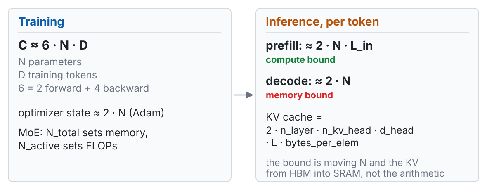

<!-- 此檔由 bin/publish_slides.py 從投影片正本產生（中文講稿區塊已剝除），請勿直接編輯。正本在 private repo 的 <course>/slides/。 -->

# Five samples {.section-title}

## Same corpus. Same prompt. One number changes.

225,333 words of Shakespeare. 14,560 distinct words. A word-level n-gram model, trained by counting.

Every sample below starts from the same seven words, and differs only in **how many previous words the model is allowed to look at**.

::: {.gen}
[prompt]{.n}
… beside well in his person wrought **To be** …
:::

::: {.ask}
Watch what happens to the output as that number goes up.
:::

## n = 1: the words are Shakespeare's. Nothing else is.

::: {.gen}
[n = 1　·　no context at all]{.n}
We than me or too: here separation PERDITA I majesty exhales the bring child have, night interchange, our to thereto and dad, kiss thinks a country's the pedigree Thy For they Unless but,. the
:::

- The **unigram distribution** is right: `the`, `our`, `to` appear at roughly the right rate
- Nothing else survives. No agreement, no syntax, no clause boundaries

::: {.claim}
A model of word frequency is a model of vocabulary, not of language.
:::

## n = 2: local fluency arrives. Global coherence does not.

::: {.gen}
[n = 2　·　one word of context]{.n}
be to each of York, you might reproach your lordship cool your will show it. For thy due to your channel should be furnished with patience but a truth, seven night: He shift a word, my
:::

- Two- and three-word spans are now plausible English: *your lordship*, *furnished with patience*
- Sentences still go nowhere. The model cannot remember what it said four words ago

::: {.claim}
One word of context buys local fluency. That is a remarkably good return on one word.
:::

## n = 4: this reads like Shakespeare.

::: {.gen}
[n = 4　·　three words of context]{.n}
wrought To be set high in place, we did: he desires to make atonement Betwixt the Duke of York is there alive but we? And who durst mine when Warwick bent his brow? Lo, now my sovereign speaketh
:::

- Clauses hold together. Rhetorical questions are well formed. Names are used consistently
- If I had not told you how this was produced, you might not have guessed counting

::: {.claim}
Four words of context, and pure counting, gets you something you would call fluent.
:::

## n = 8: this is not generation. This is recall.

::: {.gen .hit}
[n = 8　·　seven words of context]{.n}
well in his person wrought To be set high in place, we did commend To your remembrances: but you have found, Scaling his present bearing with his past, That he's your fixed enemy, and revoke Your sudden approbation. BRUTUS: Say
:::

That passage is in the training corpus, word for word, including the speaker tag that follows it.

::: {.claim .warn}
Somewhere between n = 4 and n = 8, the model stopped generalizing and started remembering. **Nothing in the training objective told us where that line was.**
:::

::: {.footer}
Corpus: Shakespeare (public domain), the standard `tinyshakespeare` split · figures computed for this course
:::

## Two curves explain the whole sweep

{width="100%"}

::: {.metrics}
::: {.metric .bad}
[95.0%]{.num}[of held-out 4-grams never appeared in training]{.lab}
:::
::: {.metric .good}
[n = 2]{.num}[where bits-per-byte actually bottoms out]{.lab}
:::
::: {.metric}
[99.0%]{.num}[unseen at n = 5. More data will not fix this]{.lab}
:::
:::

## Same prompt. A 2026 model. Live.

::: {.gen}
[live · an open model on this laptop, the same seven words]{.n}
:::

Then one more, in Traditional Chinese, asking for something specific and checkable.

::: {.ask}
Third failure mode. Name it before I do.
:::

- n = 1 failed **locally**: the words never combine
- n = 4 failed **globally**: every clause holds, the passage goes nowhere
- This one fails at **neither** scale — and will still state something checkable and wrong, in exactly the same even voice

::: {.claim .warn}
Local, global, and fluent-but-false. The first two are solved problems. The third is why this course runs for fourteen weeks.
:::

::: {.footer}
Also your first look at the machine these demos run on: 64 GB of unified memory, no CUDA. What it can and cannot run is itself a topic — W11
:::

# What this course is {.section-title}

## By week 14 you should be able to open any layer and say why it is there

Not "what is a Transformer" — you can read that anywhere. The target is harder and more useful:

1. **Derive** the pieces: why $1/\sqrt{d_k}$, why Chinchilla's exponents, why DPO's partition function cancels
2. **Cost** any design: given a model, say what it costs to train, to serve, and where the bottleneck actually is
3. **Diagnose** a failure: given a broken output, name the layer responsible and the mechanism
4. **Judge** a claim: read a 2026 paper and say whether its evidence supports its abstract

::: {.claim}
Every component in this course is introduced through the specific failure it was invented to fix.
:::

## Fourteen weeks, and which weeks hold up which

{width="100%"}

## W3 and W4 are the hinge. If you skip one week, do not skip those two.

Everything in Part III reads from two objects built in W3–W4:

- **the residual stream** — a shared bus every layer reads from and writes back to
- **the KV cache** — the model's actual state at inference time, and usually its dominant cost

::: {.claim}
By W11 the question is no longer "how does attention work" but "how many bytes does it move per token." You cannot ask the second question until you have built the first.
:::

## What you should be able to do by the end of today

1. **Write** the n-gram MLE and the perplexity definition, and say why sparsity cannot be fixed by collecting more data
2. **Explain** how the distributional hypothesis becomes a loss function in word2vec, and where static embeddings structurally fail
3. **Identify** the gradient product in BPTT and the fixed-width bottleneck in seq2seq — and say which symptom Bahdanau attention was aimed at
4. **State** the equivalence between a language model and a compressor, using bits-per-byte, and say where that equivalence breaks

::: {.claim}
Item 4 is the one that carries furthest. It comes back in W7, W11 and W12.
:::

## The ledger we refill every week

{width="100%"}

## Two numbers, now, on paper

For a 7B dense model — work these out and keep them:

1. Training FLOPs at Chinchilla-optimal ($D \approx 20N$). Then: how many years on **one consumer GPU** — the 16 GB card your term project will actually run on?
2. The KV cache at batch 1, 32k context, FP16. Hold it against **two real ceilings**: that same 16 GB card, and the **64 GB of unified memory** these demos run on.

::: {.ask}
Number 2 is the one that will surprise you. It is the shared motivation for W5, W6 and W11.
:::

::: {.claim}
Capacity and bandwidth are different limits. 64 GB removes the first and does nothing at all about the second — which is most of W11, in one sentence.
:::

::: {.footer}
A third number — why a 2026 flagship is "trillion total, tens of billions active" — opens W6, where the idea of an *active* parameter arrives
:::

## Three questions we ask every single week

::: {.prose}
| Axis | The question |
|---|---|
| **Representation** | The unit at this layer — byte, token, hidden state, KV entry, retrieved chunk, latent thought. **Who chose it, and what does that choice cost downstream?** |
| **Compute** | *Training* compute or *inference* compute? FLOPs bound, or memory-bandwidth bound? |
| **Supervision** | Where does this capability come from? Five possible answers — today, exactly one exists |
:::

::: {.claim}
The same observed behaviour can come from entirely different places on the third axis. That is the central dispute of W10 and W14.
:::

## Today, the third column has one entry

| Where a capability can come from | today | arrives in |
|---|:---:|---|
| the **pretraining distribution** | **✓** | — |
| human demonstrations | | W8 |
| human preference | | W9 |
| a verifiable reward | | W9 → W10 |
| retrieved knowledge | | W12 |
| extra compute at test time | | W10 |

Everything today — n-grams, word2vec, an LSTM LM, seq2seq — is **self-supervised from raw text**.

::: {.claim .warn}
**W8 is where that column starts to branch**, and you will not feel how large that change is unless you notice how empty the column is today.
:::

## Four questions to ask of every paper in this course

1. **Was the baseline actually tuned?** The most common source of illusory progress. W8 and W9 both have cases where the gain vanishes after a learning-rate sweep
2. **Is the comparison at equal compute?** Iso-FLOPs, iso-parameter and iso-latency are three different comparisons, and they often disagree
3. **What is the metric rewarding?** In W11, KV-cache compression leaves perplexity almost untouched and quietly breaks instruction following
4. **Is the claim mechanistic, or correlational?** "The attention weight is high", "the chain of thought wrote this step", "the reward went up" — all three are correlations

::: {.claim}
You already used question 3 today: the n = 4 sample read best, and scored worse.
:::

## Practicalities

- Slides in English, taught in Mandarin. The speaker notes are mine and stay with me; the slides are yours, and they go up the same day
- There is an **open-access English companion** for the first three weeks: Zong, Zhao & Ma, *NLP and Large Language Models* (Springer / Tsinghua, 2026). Ch 5 is essentially today's lecture in prose
- **Assessed on two pieces of writing**: a midterm report (40%) and a final paper (60%), both treated as conference submissions rather than coursework. Group work, plus two online discussions
- Everything is on the course site: weekly pages, the reading list, these slides, a half-life map saying which weeks go stale next year, and four Chinese guides for the two reports

::: {.tag}
hungshinlee.github.io/NLP-LLM
:::

## What you will run: nothing

Every demo in this course is run **live, in front of you**, on one laptop: **64 GB of unified memory, no CUDA.**

- That buys room — a mid-sized model loads fine. It also rules things out: no `vLLM`, no `bitsandbytes` QLoRA, no FP8 or NVFP4 measurement
- When a demo cannot run on this machine, **I will say so on the slide** and we read the number out of the paper instead

::: {.claim}
That gap is not an apology. It is W11's thesis arriving early: **inference optimization is bound to hardware.** Whether the same `transformers` code runs, and how fast, *is* the content of that week.
:::

Your **term project** is a different machine: one 16 GB consumer GPU. Plan for that, not for what you see at the front of the room.

::: {.footer}
The KV cache you just computed — 16 GiB — was computed for the project card, not for this laptop
:::

# A language model is a compressor {.section-title}

## Predicting well and compressing well are the same problem

Give me a distribution over the next token and I can build a code. Arithmetic coding reaches the entropy of that distribution, to within a bit.

$$H(p,q) = -\mathbb{E}_{x\sim p}\big[\log_2 q(x)\big] \quad\text{bits per symbol}$$

So the training objective of every model in this course is *literally* a compression rate.

::: {.claim}
This is the metaphor that runs the whole term. **Pretraining is compression. A scaling law is the regularity in the compression ratio. Quantization compresses the compressor. RAG refuses to compress and looks things up instead.**
:::

## Where the compression metaphor fails, and why that matters

What gets compressed is a **distribution over strings**, not a set of propositions.

::: {.claim .warn}
The model can therefore emit a fluent string it never saw, that fits the distribution perfectly, and is false. That is not a bug in the compressor. That is what a compressor does.
:::

- This is one mechanism behind hallucination — a mechanistic account, not a moral one
- It is also the reason W12 exists: if you need propositions with sources, do not compress them into weights
- And it is why "the model knows X" is a badly posed sentence. It has a distribution, not a knowledge base

## Perplexity is not comparable across models

$$\mathrm{PPL} = \exp\!\left(-\frac{1}{T}\sum_{t=1}^{T} \log P(w_t \mid w_{<t})\right)$$

The denominator is $T$, **the number of tokens** — and that is a property of the tokenizer, not of the text.

The same Chinese paragraph can differ by more than a factor of two in $T$ between two tokenizers. Perplexity moves with it.

::: {.claim .ok}
Use **bits-per-byte** instead: total negative log-likelihood in bits, divided by the number of bytes. The denominator is a property of the text.
:::

::: {.footer}
Misconception 1 of 7 · returns with real numbers in W2
:::

## Live: the same paragraph, two tokenizers

One Traditional Chinese paragraph. Two open models whose tokenizers disagree sharply about Chinese. Identical text, identical bytes.

| | model A | model B |
|---|---|---|
| tokens for the passage | | |
| perplexity | | |
| **bits-per-byte** | | |

::: {.ask}
Predict before I run it: which rows disagree, and which row nearly agrees?
:::

::: {.footer}
Run live on the lecture machine · the full five-tokenizer fertility comparison is next week's cold open
:::

## "Comparable" has three conditions

Bits-per-byte fixes the **denominator**. It does not make the number unconditional.

1. **The tokenizer must be lossless on this text.** One that normalizes away distinctions, or drops a rare character to `UNK`, never pays for those bytes — and therefore scores **artificially low**. For Traditional Chinese this is the easy mistake to make
2. **The same bytes on both sides.** Different held-out sets are different numbers, whatever the units
3. **The same context length and document splitting.** The same text scored with 8k of context beats itself at 2k, with no change to the model at all

::: {.claim}
"The only metric comparable across tokenizers" is a claim about the *denominator*. It is not a claim that the metric is immune to the evaluation setup.
:::

::: {.footer}
Condition 1 gets its mechanism next week: byte-level fallback is what keeps a tokenizer lossless on rare CJK characters
:::

## And a low perplexity does not mean good generations

Even with the denominator fixed, likelihood and sample quality are **largely independent in high dimensions**. Theis, van den Oord & Bethge (2015) construct models that are good at one and bad at the other — in both directions.

::: {.claim .warn}
You watched this happen forty minutes ago. The **n = 4** sample read best of the four. It scored **worse** in bits-per-byte than n = 2.
:::

- A model can put its mass in roughly the right place and still generate nothing you would keep
- And a model can generate beautifully by copying, while assigning poor probability to text it has never seen — which is exactly what n = 8 does

::: {.footer}
Misconception 2 of 7 · the general form of this argument is all of W14
:::

# From counting to sharing parameters {.section-title}

## Smoothing is not a hack. It is a statistical necessity.

The MLE is just a count ratio:

$$P(w_t \mid w_{t-n+1:t-1}) = \frac{C(w_{t-n+1:t})}{C(w_{t-n+1:t-1})}$$

With vocabulary $V$, there are $V^n$ possible n-grams. Ours: $V = 14{,}560$, so $V^4 \approx 4.5\times10^{16}$ — against 225,333 training words.

Good–Turing puts the total probability of everything unseen at roughly $N_1/D$, where $N_1$ counts the n-grams seen exactly once.

::: {.claim}
The MLE assigns zero to 95% of the 4-grams you will actually meet. Any usable model must therefore invent probability mass — and *how* it invents it is an inductive bias, not an implementation detail.
:::

## More data does not fix this

Doubling the corpus halves neither of these numbers by much. The count table grows; the space it must cover grows faster.

| | n = 1 | n = 2 | n = 3 | n = 4 | n = 5 |
|---|---|---|---|---|---|
| **Unseen in held-out** | 5.2% | 36.4% | 77.2% | **95.0%** | **99.0%** |
| **Distinct n-grams stored** | 13.7k | 94.8k | 182k | 213k | 222k |

Notice the second row saturating: past n = 3, almost every new n-gram is seen exactly once. The table is memorizing, not estimating.

::: {.claim .warn}
Counting cannot generalize to unseen contexts, because it has no notion that two contexts might be similar.
:::

## Why more data cannot fix it: Zipf and Heaps

$V^n$ tells you the space is huge. It does **not** yet tell you that more data fails — the space is fixed while the corpus can keep growing. What closes that gap is the *shape* of the word distribution.

- **Zipf**: word frequency follows a power law. Most *distinct types* live in the tail
- **Heaps**: distinct types grow as $|V| \propto D^{\beta}$, $\beta < 1$ — sublinear, and yet **never saturating**
- So the share of **hapax** does not fade away as $D$ grows. Put that into Good–Turing's unseen mass, $\approx N_1/D$:

::: {.claim .warn}
The probability mass sitting on things you have never seen **does not go to zero as the corpus grows.** Sparsity is a property of language, not a shortage of text.
:::

::: {.footer}
The same tail returns in W7 (deduplication, compute-optimal budgets) and W14 (long-tail memorization, contamination)
:::

## Two inductive biases for one problem

| | n-gram | Neural LM (Bengio 2003) |
|---|---|---|
| **What it stores** | a table of counts | a parameterized function |
| **Unseen context** | zero, then a backoff rule | interpolates in a continuous space |
| **Similarity** | none; strings are atomic | built in; nearby vectors behave alike |
| **Cost of more context** | table size grows like $V^n$ | a few more input weights |

::: {.claim}
The move from 2003 on was not "neural networks are stronger". It was **replacing a lookup table with a function, so that unseen inputs land somewhere sensible** — and everything since, attention included, varies how that function is built.
:::

So *"an LLM is just a bigger n-gram"* is wrong in both directions: the inductive bias differs, **and** at the long tail an LLM does fall back on memorization — which is what we watched at n = 8.

::: {.footer}
Misconception 3 of 7 · the memorization half returns in W7 and W14
:::

## Where does the n = 8 sample sit on that table?

::: {.ask}
It was fluent. It was grammatical. It was, word for word, in the training set.
:::

Ask it of any model, at any scale:

- Is this output **interpolation** — a point in a continuous space the model has never visited?
- Or is it **retrieval** — a path through the training data that happens to be smooth?

::: {.claim .warn}
For a 4-gram table you can check by grepping the corpus. For a model trained on ten trillion tokens you cannot. **W14 is about what we do instead.**
:::

::: {.footer}
This question returns as benchmark contamination (W14) and as data deduplication (W7)
:::

# The distributional hypothesis, and its trap {.section-title}

## The hypothesis becomes a loss function

*You shall know a word by the company it keeps.* Word2vec (SGNS) turns that into an objective:

$$\mathcal{L} = -\log\sigma(\mathbf{u}_o^\top \mathbf{v}_c) \;-\; \sum_{k=1}^{K}\log\sigma(-\mathbf{u}_k^\top \mathbf{v}_c)$$

Push a word and its true context together; push it away from $K$ sampled non-contexts.

::: {.claim}
Read the second term carefully. **The set of negatives defines what "similar" is going to mean.** Change the negative sampling and you change the geometry.
:::

## Live: the nearest neighbour of `love` in this corpus

PPMI on a 4-word window, then SVD to 200 dimensions, on the same Shakespeare. Function words removed for display.

| query | nearest neighbours (cosine) |
|---|---|
| `love` | **hate .412** · know .405 · him .405 · devotion .394 · romeo .381 |
| `king` | richard .781 · edward .666 · iii .642 · vi .630 · ii .625 |
| `father` | child .511 · son .507 · york .475 · heir .465 · grandfather .458 |

::: {.claim .warn}
The nearest neighbour of `love` is `hate`.
:::

::: {.footer}
Computed for this course · PPMI + truncated SVD, 4,000-word vocabulary
:::

## Antonyms beat synonyms

| | pair | cosine |
|---|---|---|
| **antonym** | love / hate | **0.412** |
| **antonym** | life / death | **0.404** |
| **antonym** | good / bad | 0.228 |
| **antonym** | friend / enemy | 0.220 |
| **synonym** | good / excellent | 0.212 |
| **synonym** | sword / blade | 0.163 |

::: {.claim .warn}
Both synonym pairs score **below** every antonym pair. If cosine measured semantic similarity, this table would be impossible.
:::

## This is not a word2vec quirk

Levy & Goldberg (2014): **SGNS is implicitly factorizing a shifted PMI matrix.** That is why the demo above — PPMI plus a truncated SVD — reproduces the same behaviour, and why the behaviour is a property of the *objective*, not of the optimizer.

::: {.claim}
Cosine similarity means **"similar under the notion of similarity this model's training objective defines."** Nothing more. Say that sentence out loud whenever you see a cosine on a slide.
:::

- Static embeddings additionally fail on polysemy: one vector per word, so `bank` gets one point for two senses
- W3 fixes polysemy — contextual representations — and does **not** fix the cosine problem

::: {.footer}
Misconception 4 of 7 · returns as a retrieval failure in W12
:::

# Why recurrence died {.section-title}

## The gradient is a product, and products go to zero

$$\frac{\partial \mathcal{L}}{\partial h_1} = \frac{\partial \mathcal{L}}{\partial h_T}\prod_{t=2}^{T}\frac{\partial h_t}{\partial h_{t-1}}$$

$T$ factors multiplied together. Spectral radius below 1 and it vanishes; above 1 and it explodes. Either way, the effective memory is far shorter than the sequence.

An LSTM's gates replace part of that **multiplicative** path with an **additive** one — the cell state is carried forward and added to, not repeatedly transformed.

::: {.claim}
Remember the phrase *additive path*. In W4 the same trick reappears under a different name — the residual stream — and it is the reason 100-layer models train at all.
:::

## Then seq2seq squeezed everything through one vector

Encoder reads the whole source, produces one fixed-width vector, decoder writes from it.

::: {.claim .warn}
A 5-word sentence and a 50-word sentence get the same number of floats. Translation quality fell off with length, and it fell off exactly the way a fixed-capacity channel predicts.
:::

Bahdanau, Cho & Bengio (2015) aimed at that one symptom:

$$c_t = \sum_i \alpha_{ti} h_i, \qquad \alpha_{ti} = \mathrm{softmax}_i\big(a(s_{t-1}, h_i)\big)$$

Instead of one vector, let the decoder build **a different weighted read of the source at every output step**.

## That attention is cross-attention, not self-attention

The query is the **decoder** state $s_{t-1}$. The keys and values are the **encoder** states $h_i$. Query and key/value come from **two different sequences**.

Self-attention — one sequence attending to itself — does not appear until 2017.

::: {.claim .warn}
Keep these apart or W5 will not make sense. *"Why does the model need extra position information?"* is a question that **only arises once a sequence attends to itself.** A decoder already runs in time order; an encoder–decoder alignment never needed to be told what came first.
:::

- W3's causal mask is a statement about self-attention. It has no counterpart here
- The weights $\alpha_{ti}$ do look like an alignment, and that resemblance is where a decade of misreading begins — W3

::: {.footer}
Misconception 5 of 7 · this distinction is doing the work in W3 and W5
:::

## Attention is older than the Transformer

Bahdanau attention is 2015. The Transformer is 2017. **What 2017 removed was recurrence, not attention.**

::: {.claim}
"Attention Is All You Need" is a claim about what you can *delete*, not about what was invented.
:::

Two consequences you need today:

- Once recurrence is gone, nothing in the architecture knows word order any more — hence positional encoding, and hence **W5**
- Once recurrence is gone, the sequence dimension is fully parallel — and that is the actual cause of death

::: {.footer}
Misconception 6 of 7
:::

## RNNs did not lose on quality. They lost on throughput.

An RNN's hidden state at step $t$ requires step $t-1$. **The sequence dimension cannot be parallelized.** So you cannot spend more GPUs to train on more data, and after 2017 that was the only thing that mattered.

::: {.claim}
This is the single most important sentence in today's lecture for understanding the rest of the course.
:::

::: {.footer}
Misconception 7 of 7 · and the next slide is why W6 exists
:::

## And what recurrence never lost

At inference an RNN carries a **fixed-size state**. A Transformer carries a KV cache that grows with every token it generates.

::: {.claim .warn}
So the trade was narrower than the usual story: recurrence lost **training throughput**, and kept its **inference** advantage the whole time.
:::

Which is why, in 2026, recurrence is **back** — Mamba, gated linear attention, the hybrid architectures of W6. What changed is not the recurrence. Someone solved the training half, and the advantage that had been sitting on the other side all along became collectable.

# Where this goes {.section-title}

## Each Part fills in part of the ledger

::: {.prose}
| Part | What it adds to the compute ledger |
|---|---|
| **I — Architecture** | where the FLOPs and the bytes actually go; what the unit of representation is at each layer, and who chose it |
| **II — Training** | how to spend a training budget optimally, and what post-training buys that pretraining cannot |
| **III — Systems** | why decode is memory bound; what a retrieval hop costs; and how we find out whether any of it works |
:::

::: {.claim}
Today you built the first row of that ledger with a model you could have written in twenty lines.
:::

## Next week: the unit you cannot change after training

**Tokenization.** The one design decision in the whole system that cannot be fixed post hoc.

- We will build BPE by hand, and put the same Traditional Chinese paragraph through five tokenizers to measure fertility
- Perplexity comes back — this time with the actual token counts that make it incomparable
- And a 2026 result: the tokenizer shifts the **compute-optimal** parameter/data configuration, which moves it out of preprocessing and into architecture

::: {.ask}
Before then, read: **JM3 Vol I ch 2** *Words and Tokens* (the 2026-08-19 release — pin that one), and **ZZM ch 7**, which covers the same ground with Chinese segmentation in it and is open access. To review today: **ZZM ch 5** and **ch 3**.
:::

::: {.claim}
Nothing to install. Every demo in this course runs at the front of the room.
:::

## Sources

::: {.cite}
**Textbooks** · Jurafsky & Martin, *Speech and Language Processing*, 3rd ed., **2026-08-19 draft release** — ch 2 Words and Tokens, ch 3 N-gram Language Models, ch 5 Embeddings, ch 14 RNNs and LSTMs · Zong, Zhao & Ma, *Natural Language Processing and Large Language Models*, Springer Nature Singapore / Tsinghua University Press, 2026 (**open access**) — ch 5 Basic Language Models, ch 3 Distributed Representation, ch 4 Sequence Generation Models, ch 2.5 RNN and LSTM

**Papers** · Bengio, Ducharme, Vincent & Jauvin, *A Neural Probabilistic Language Model*, JMLR 2003 · Mikolov, Chen, Corrado & Dean, *Efficient Estimation of Word Representations in Vector Space*, arXiv:1301.3781 · Mikolov, Sutskever, Chen, Corrado & Dean, *Distributed Representations of Words and Phrases and their Compositionality*, NeurIPS 2013 · Levy & Goldberg, *Neural Word Embedding as Implicit Matrix Factorization*, NeurIPS 2014 · Sutskever, Vinyals & Le, *Sequence to Sequence Learning with Neural Networks*, NeurIPS 2014 · Bahdanau, Cho & Bengio, *Neural Machine Translation by Jointly Learning to Align and Translate*, ICLR 2015 (arXiv:1409.0473) · Vaswani et al., *Attention Is All You Need*, NeurIPS 2017

**Papers, on today's two framing claims** · Bengio, Simard & Frasconi, *Learning Long-Term Dependencies with Gradient Descent is Difficult*, IEEE Transactions on Neural Networks 5(2):157–166, 1994 — the multiplied-gradient argument · Hochreiter & Schmidhuber, *Long Short-Term Memory*, Neural Computation 9(8):1735–1780, 1997 — the additive path · Delétang, Ruoss, Duquenne, Catt, Genewein, Mattern, Grau-Moya, Wenliang, Aitchison, Orseau, Hutter & Veness, *Language Modeling Is Compression*, arXiv:2309.10668 (2023) — compression as a measurement, not only a metaphor · Theis, van den Oord & Bethge, *A note on the evaluation of generative models*, arXiv:1511.01844 (2015) — why a low perplexity does not mean good samples

**Data and figures** · Corpus: the standard `tinyshakespeare` split of Shakespeare's works (public domain). All n-gram generations, sparsity percentages, bits-per-byte values, cosine similarities and nearest-neighbour lists on these slides were computed for this course by `scripts/make_demo_w01.py`; the figures by `scripts/make_figs_w01.py`. Nothing on these slides is a remembered number.

**Search terms, not citations** · arithmetic coding neural language model · bits per byte evaluation · Chen & Goodman empirical study of smoothing · Zipf Heaps law vocabulary growth · attention is not not explanation
:::
