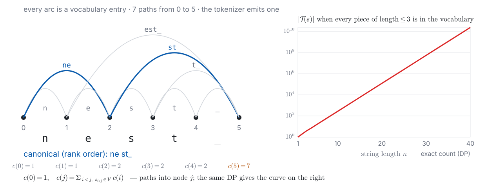
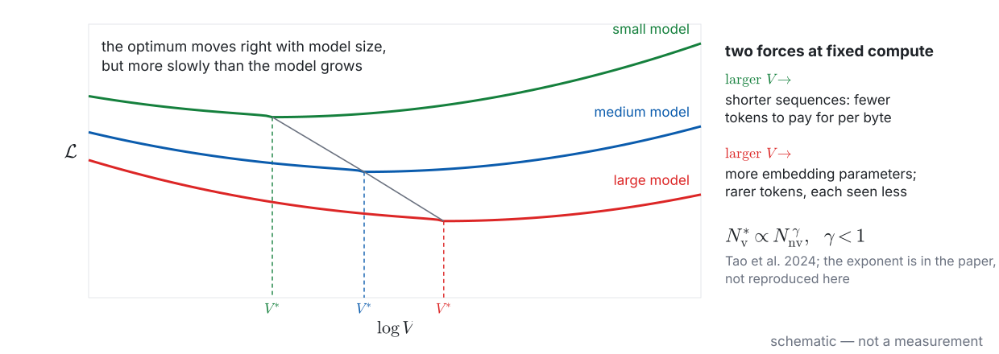
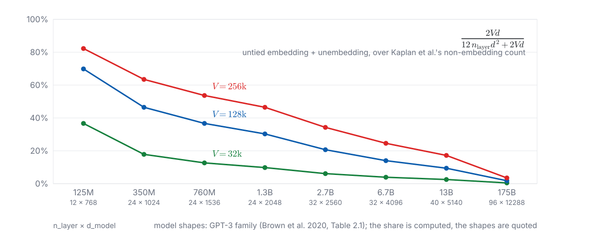

<!-- 此檔由 bin/publish_slides.py 從投影片正本產生（中文講稿區塊已剝除），請勿直接編輯。正本在 private repo 的 <course>/slides/。 -->

# Two loose ends from last week {.section-title}

## Last week ended on two things that would not compare

::: {.columns}
::: {.column width="50%"}
**Demo 3, last slide.** A whole cast of characters — *prospero*, *miranda* — had **no vector at all**. The model had nothing to say about them.
:::
::: {.column width="50%"}
**Demo 2.** Two models, one Traditional Chinese paragraph. Perplexity **12.2** vs **9.1** — and the lower number was the **worse** model.
:::
:::

::: {.ask}
What do these two failures have in common?
:::

::: {.claim}
Both come from the same place: **someone decided what the unit is** — and the model never got a vote.
:::

::: {.footer}
W1 demo 2, 2026-09-20: Qwen3.8 PPL 12.23 / BPB 0.81 · Mistral 7B PPL 9.14 / BPB 1.38
:::

## The tokenizer is the model's retina

The model never sees your text. It sees what the tokenizer sends up.

- The retina's resolution is **not uniform**: dense for English, coarser for Chinese, coarser still for characters outside the Basic Multilingual Plane
- It is fitted **before** the model is trained — and **after training, replacing it costs almost as much as regrowing the visual cortex**
- Where the metaphor fails: a retina is passive. A tokenizer is **trained on a corpus**, so its biases are the corpus's, not the language's

::: {.claim}
Tokenization is the design decision that is **most expensive to fix after training** — not impossible, but every route back means paying for training again.
:::

::: {.footer}
W1 said "cannot be fixed" — too strong: vocabulary extension and transfer exist (§9)
:::

## What you should be able to do by the end of today

1. **Hand-compute** BPE merges on a toy corpus, read a reference implementation, and state what BPE, WordPiece and Unigram each **optimize**
2. Draw the **four-stage pipeline** and say which stage decides digits, spaces and special tokens
3. Tell **byte-level BPE** from **byte fallback**, and give the UTF-8 cost of a CJK character under each
4. Explain why vocabulary size is a **scaling-law variable**, and fill three rows of the ledger: $2Vd$, the unit of $D$, cost per byte
5. Diagnose at least four **tokenization-caused failures** — and for each, say whether the evidence is mechanistic or correlational
6. Compare the three routes for a **short-changed language**: extend the vocabulary, transplant the tokenizer, or drop tokens

::: {.footer}
Six objectives · every one of them is checked in class today, not in homework
:::

# Demo 1: one paragraph, many tokenizers {.section-title}

## Same 209 characters. Same 627 bytes. Four answers to "how many tokens?"

| tokenizer | tokens | tokens / character | bytes / token | relative cost |
|:---|---:|---:|---:|---:|
| Qwen3.8 27B (byte-level BPE, Chinese-heavy) | **141** | 0.675 | 4.45 | 1.00 |
| Gemma 4 26B-A4B (SentencePiece, byte fallback) | 164 | 0.785 | 3.82 | 1.16 |
| Mistral 7B v0.3 (SentencePiece, 32k, English-heavy) | 272 | 1.301 | 2.31 | 1.93 |
| ByT5 (every byte is a token) | 627 | 3.000 | 1.00 | 4.45 |

::: {.claim}
The same text costs **1.9×** more on one modern model than another — and the byte model marks the ceiling: $T \leq B$, always.
:::

::: {.footer}
Measured on this laptop, 2026-09-20 (W1 demo 2 rehearsal) · ByT5 row is arithmetic
:::

## Three denominators, fixed for this course

| question | measure | why this denominator |
|:---|:---|:---|
| same language, **which tokenizer** is cheaper? | $\dfrac{T}{\#\text{chars}}$ tokens per character | Chinese has no ready-made "word"; characters are the stable unit |
| **compression** across tokenizers | $\bar{b} = \dfrac{B}{T}$ bytes per token | same $T$ and $B$ as last week; the ledger uses this one |
| **across languages**, same content | token-count ratio on a **parallel** corpus | bytes would smuggle in last week's *byte premium* |

::: {.claim}
Never divide by bytes when comparing languages — the byte premium is a property of UTF-8, not of the tokenizer.
:::

::: {.footer}
Petrov et al. (NeurIPS 2023) call the cross-language ratio the *tokenization premium*
:::

## Live: the full table

| text | GPT-2 | o200k | Llama 3 | Qwen3 | Gemma | Mistral | Breeze | bert-zh | ByT5 |
|:---|---:|---:|---:|---:|---:|---:|---:|---:|---:|
| 繁中 (209 chars) | | | | | | | | | 627 |
| the same, in English | | | | | | | | | |
| 簡體 (OpenCC) | | | | | | | | | |
| 台語漢字 (61 chars) | | | | | | | | | 184 |
| 台羅 NFC / NFD | | | | | | | | | |
| 客語 with 𠊎 | | | | | | | | | |
| Python, 8 lines | | | | | | | | | |
| numbers: `3.14159…`, `1234567` | | | | | | | | | |

::: {.ask}
Predict, before the numbers land: which column is cheapest for the Chinese rows? Which row will hurt Mistral most?
:::

::: {.footer}
Demo 1 · live · Breeze = Mistral's vocabulary + 29,873 Traditional Chinese tokens
:::

## Traditional vs Simplified: same language, same meaning, different bill

::: {.gen}
[the same sentence, two scripts]{.n}
清晨六點半，城市還沒完全醒來。　／　清晨六点半，城市还没完全醒来。
:::

- Nothing linguistic changed. Two characters differ in **glyph** only
- Every tokenizer in the table gives a **different** ratio between the two rows — some favour one script, some the other
- The only thing that differs between them is **what the tokenizer's training corpus contained**

::: {.claim}
A tokenizer does not know Chinese. It knows the **frequency table of the text it was fitted on** — and that table has a script bias baked in.
:::

::: {.footer}
Numbers: the live table · the retina metaphor fails here — a retina is not fitted
:::

## Two scripts for one Taiwanese sentence — and the cost of a tone mark

| written as | text | characters | UTF-8 bytes |
|:---|:---|---:|---:|
| 漢字 | 𪜶是台灣人 | 5 | 16 |
| Tâi-lô, NFC (precomposed) | In sī Tâi-uân-lâng | 18 | 22 |
| Tâi-lô, NFD (base letter + combining mark) | In sī Tâi-uân-lâng | **22** | **26** |
| 客語漢字 | 𠊎係客家人 | 5 | 16 |
| 客語白話字, NFC / NFD | Ngài he Hak-kâ-ngìn | 19 / 22 | 22 / 25 |

::: {.claim}
Two identical-looking strings, four bytes apart. **Orthography is a cost decision** — and the tokenizer sees the bytes, not the glyphs.
:::

::: {.footer}
Python `unicodedata` (make_demo_w02.py §1) · each 16-byte row has one 4-byte character
:::

## `[UNK]` is the floor that lies; the byte model is the ceiling that does not

::: {.columns}
::: {.column width="50%"}
**bert-base-chinese** on 𠊎係客家人

- Character vocabulary, no fallback
- 𠊎 → `[UNK]` — one token, **and the bytes are gone**
- `decode(encode(x)) ≠ x`: the tokenizer is **lossy** on this text
- Last week's condition (a) for bits-per-byte fails: the model **never pays** for those four bytes, so its BPB reads artificially low
:::
::: {.column width="50%"}
**ByT5** on the same sentence

- No vocabulary; 16 bytes → 16 tokens
- Lossless by construction
- Token count is the **upper bound** for every byte-based tokenizer: $T \leq B$
- The price: sequences 3–4× longer than a modern subword model on Chinese
:::
:::

::: {.claim}
Between the floor and the ceiling sit all the real tokenizers — and where each one lands on **your** language is a measurement, not a spec-sheet number.
:::

::: {.footer}
Condition (a) from W1 p30 · fertility rows for 台語 and 客語 on the live table
:::

## Misconception 1: "a token is a character" — or "a token is a word"

What the live table just showed, all at once:

- A frequent two-character word is often **one** token — the tokenizer did not "understand" it; it was frequent
- A rare character is **two or three** tokens; a character outside the BMP is **three or four**
- Punctuation and whitespace are handled differently by every tokenizer on the table
- Merge boundaries and word boundaries **sometimes coincide, sometimes do not** — a by-product of frequency, not of grammar

::: {.claim}
"One character, one token" is wrong. "One word, one token" is wrong. What is true: **one frequent byte-string, one token.**
:::

::: {.footer}
Misconception 1 of 10 · this one has to be seen, not told — hence the demo comes first
:::

# The four-stage pipeline {.section-title}

## A tokenizer is four objects, and each decides something different



::: {.claim}
Digits, spaces and punctuation are decided by the **pre-tokenizer** — before any merge happens. Blame the right stage.
:::

::: {.footer}
Terms are Hugging Face `tokenizers`' — the demo shows these four objects by name
:::

## The normalizer is lossy — and that has a bits-per-byte consequence

| input | after NFKC | bytes before → after |
|:---|:---|:---|
| ＡＢＣ１２３ (full-width) | ABC123 | 18 → 6 |
| ①②③ | 123 | 9 → 3 |
| ㎏ | kg | 3 → 2 |
| café (NFC) | café | 5 → 5 |

- After NFKC, full-width and half-width are **the same thing** to the model; `decode` cannot bring the original back. NFC does less: it only unifies precomposed vs. decomposed forms — the Tâi-lô case
- Condition (a) again: a normalizing tokenizer's bits-per-byte must divide by the bytes **after** normalization

::: {.claim}
Normalization is the one stage where the model is allowed to see **less** than you typed — decide deliberately, and measure with the right bytes.
:::

::: {.footer}
Python `unicodedata.normalize` · Qwen2 applies NFC (source read 2026-09-17; verify fast)
:::

## The pre-tokenizer decides how digits split. Three generations, three rules

| generation | digit rule | `1234567` becomes | consequence |
|:---|:---|:---|:---|
| GPT-2 (2019) | `\p{N}+` — one span, merges decide | depends on corpus frequency | the **same** four-digit number can be 1, 2 or 3 tokens; the model learns carrying once per split pattern |
| cl100k / o200k (GPT-4 family) | `\p{N}{1,3}` — 1–3 digits, left to right | `123` `456` `7` | consistent — but grouped **against** the carry direction |
| Qwen (2023–) | `\p{N}` — one digit per token | `1` `2` `3` `4` `5` `6` `7` | no grouping to get wrong; sequences 3× longer on numbers |

::: {.claim}
Inconsistent splitting was fixed by a regex. **Direction** was not — and that is what §7's demo will measure.
:::

::: {.footer}
Rules read from `tiktoken` and `transformers` source, 2026-09-17 · Llama 3, Gemma: verify
:::

## Control tokens are in the vocabulary — and must not be reachable from text

::: {.columns}
::: {.column width="52%"}
```text
<|im_start|>system
You are a helpful assistant.<|im_end|>
<|im_start|>user
請問雪山隧道全長幾公里？<|im_end|>
<|im_start|>assistant
```
:::
::: {.column width="48%"}
- `<|im_start|>` is **one token id**, added to the vocabulary, never produced by merges
- The post-processor inserts it from the **chat template**
- The line that must hold: typing the string `<|im_start|>` into the user turn must **not** yield that id
- If it does, a user can forge a system turn — W13's *special-token injection*
:::
:::

::: {.claim}
The vocabulary has two kinds of entries: those the text can reach, and those only the template may insert. **Keeping them apart is a security boundary**, not a formatting detail.
:::

::: {.footer}
Hooks: W8 (SFT format is this template), W13 (injection) · ChatML shown; families differ
:::

# BPE, by hand {.section-title}

## BPE is a compression algorithm. The language model is the second stage



::: {.claim}
Two stages of compression: a **fixed dictionary**, then an **adaptive model**. Perplexity measures only the second. Bits-per-byte measures both.
:::

::: {.footer}
Gage (1994), *C Users Journal* — a magazine article, known here via Sennrich et al.
:::

## Training: merge the most frequent adjacent pair, repeat



::: {.ask}
On paper, before I press anything: the first **three** merges. Which pair, and how many times does it occur?
:::

::: {.footer}
Toy corpus for this course · 15 word tokens, 8 symbols · ties break by dictionary order
:::

## Encoding applies the merge list in rank order — it never counts again



::: {.claim}
A word never seen in training still encodes — into pieces that **were** seen. A character never seen does not encode at all. That gap is what byte alphabets close.
:::

::: {.footer}
Rank = position in the merge list · lowest rank first, leftmost occurrence first on ties
:::

## Live: write it, run three tests

::: {.columns}
::: {.column width="50%"}
**Write, in this order**

1. `get_pairs(corpus)` — count adjacent pairs, weighted by word count
2. `train(corpus, k)` — $k$ rounds of merge; return the merge list
3. `encode(word, merges)` — apply merges by rank
4. `decode(tokens)` — join, strip the end marker

Test after each step. Typos are expected; `bpe_final.py` is the fallback after two minutes.
:::
::: {.column width="50%"}
**Three tests**

- **(a)** merges match the reference — and match what you computed on paper
- **(b)** `decode(encode(w)) == w` for every word; in the **byte-level** variant, for any UTF-8 string
- **(c)** 𠊎 under byte-level: **4 byte tokens, no UNK** — and then the same character into `bert-base-chinese`
:::
:::

::: {.footer}
Demo 2 · live coding · reference implementation is handed out after class, not before
:::

## Three subword algorithms, three objectives

::: {.prose}
| | BPE | WordPiece | Unigram LM |
|:---|:---|:---|:---|
| direction | bottom-up: merge | bottom-up: merge | **top-down: prune** a large candidate set |
| what it maximizes | **frequency** of the merged pair | **likelihood gain**: $\dfrac{\mathrm{count}(ab)}{\mathrm{count}(a)\,\mathrm{count}(b)}$ | corpus likelihood under $P(\mathbf{x}) = \prod_i p(x_i)$, via EM |
| encoding | merges in rank order | greedy longest-match-first | Viterbi: most probable segmentation |
| OOV | none if byte-level | **`[UNK]`** (character vocabulary) | none with byte fallback |
| can it sample? | only with BPE-dropout | no | **yes**: it is a probability model |

: {tbl-colwidths="[16,26,29,29]"}
:::

::: {.footer}
Toy corpus: WordPiece's first merge is `i`+`d` (0.50, seen 2×); BPE's `n`+`e` ranks 7th
:::

## Sampling the segmentation: subword regularization and BPE-dropout

::: {.columns}
::: {.column width="50%"}
**Unigram (Kudo 2018)**

- Every segmentation $\mathbf{t}$ of $s$ has a probability $P(\mathbf{t}) = \prod_i p(t_i)$
- Training: draw a segmentation instead of taking the Viterbi one
- The model then sees `un` `happy` **and** `unh` `appy` — and learns that both spell the same word
:::
::: {.column width="50%"}
**BPE-dropout (Provilkov et al. 2020)**

- BPE has no probabilities — so drop each merge with probability $p$ **at encoding time**
- Same effect: the canonical segmentation is no longer the only one the model ever sees
- Reported as a consistent gain for translation, largest on small data
:::
:::

::: {.claim}
Both make the model robust to **non-canonical segmentations** — which matters in §5, where the prompt boundary hands it exactly that.
:::

::: {.footer}
Kudo, ACL 2018 · Provilkov, Emelianenko & Voita, ACL 2020
:::

## Two ways to kill OOV — and what each one costs on one character



::: {.claim}
Both byte routes are lossless. Only one of them can ever get **cheaper** than four — and only if the corpus paid for it.
:::

::: {.footer}
Byte counts: make_demo_w02.py §1 · which kind each live tokenizer is: check the demo
:::

## Why subwords work: the trade-off argument, and a harder one

::: {.columns}
::: {.column width="50%"}
**The trade-off** (the usual story)

- Characters: no OOV, but sequences are long — and attention is $O(n^2)$ (W3)
- Words: short sequences, but OOV and a long sparse tail (W1)
- Subwords: frequent words become one token, rare words fall back to pieces — **resolution set by data frequency**
:::
::: {.column width="50%"}
**The harder claim** (Rajaraman, Jiao & Ramchandran, NeurIPS 2024)

- Data from a $k$-th order Markov source
- A transformer on **raw** symbols learns something close to the unigram distribution — it does not pick up the higher-order dependence
- With tokenization, even a **unigram** model over tokens reaches near-optimal cross-entropy
- Read: the tokenizer folds local dependence **into** the token, so the model need not learn it
:::
:::

::: {.claim}
A controlled-setting theorem, not a proof about real text — but it says tokenization is doing modelling work, not just shortening sequences.
:::

::: {.footer}
arXiv:2404.08335 · conference title: *An Analysis of Tokenization* (NeurIPS 2024)
:::

# One string, many tokenizations {.section-title}

## The same string has many legal token sequences. The tokenizer emits one

{width="100%"}

::: {.footer}
Left: the toy vocabulary on `nest_` · right: exact count by DP · make_demo_w02.py §4
:::

## The string's probability is a sum over segmentations — and we only ever report one term

Let $\mathcal{T}(s)$ be every token sequence that decodes to $s$. Then

$$P(s) = \sum_{\mathbf{t} \in \mathcal{T}(s)} P(\mathbf{t}) \;\geq\; P(\mathbf{t}^{\text{canon}})$$

- Perplexity and bits-per-byte use the right-hand term only — so **reported BPB is an upper bound** on the true value (Cao & Rimell, W1)
- $|\mathcal{T}(s)|$ grows exponentially in $|s|$: the sum is estimated by sampling, never computed exactly
- Subword regularization and BPE-dropout are **training-time sampling from $\mathcal{T}(s)$**: the model gets a sensible probability on non-canonical $\mathbf{t}$

::: {.claim}
Every number we compared last week was a **lower bound on the probability, an upper bound on the bits** — usually tight, never exact.
:::

::: {.footer}
Skeleton only: no estimator here · Cao & Rimell, EMNLP 2021
:::

## Misconception 2: "the same text always becomes the same tokens"

::: {.gen}
[the prompt ends with a space — or does not]{.n}
`The answer is` **→** next token candidates: ` A`, ` B`, ` yes` …　　　`The answer is ` **→** next token candidates: `A`, `B`, `yes` …
:::

- Most tokenizers glue the **leading space onto the following word**: ` world` is one token, `world` is a different one
- A prompt that ends in a space forces the model to continue from a segmentation it almost never saw in training
- Multiple-choice scoring: the logits of `A` and ` A` belong to **different tokens** — W14 meets this as an evaluation bug
- Same complete string → same tokens; **same word in a different context** → not necessarily

::: {.claim}
Tokenization is context-dependent at the boundary. The last character of your prompt can change which tokens are even possible next.
:::

::: {.footer}
Misconception 2 of 10 · search: *token healing*, *prompt boundary problem* — no paper
:::

# Vocabulary enters the scaling law {.section-title}

## Vocabulary size is a scaling-law variable, not a preprocessing detail

{width="100%"}

::: {.footer}
Tao et al., *Scaling Laws with Vocabulary*, NeurIPS 2024 (arXiv:2407.13623) — main paper
:::

## The derivation skeleton: one first-order condition

1. Write the loss as a function of three things: $\mathcal{L}(N_{\text{nv}},\, N_{\text{v}},\, D)$, with $N_{\text{v}} = V d$
2. Fix the compute: $C \approx 6\,(N_{\text{nv}} + N_{\text{v}})\, D$ — every parameter, embedding or not, costs the same FLOPs per token
3. But $D$ is in **tokens**, and tokens depend on $V$: the same text is $D(V)$ tokens, fewer as $V$ grows — so Tao et al. measure data in **characters** and convert
4. At fixed $C$, take $\partial \mathcal{L} / \partial V = 0$: the gain from shorter sequences balances the cost of more embedding parameters and rarer tokens
5. The solution: $N_{\text{v}}^{*}$ grows with $N_{\text{nv}}$ as a power **below one** — the vocabulary should grow, but more slowly than the model

::: {.claim}
Step 3 is the whole point: once $D$ depends on $V$, the tokenizer is inside the compute budget, not outside it.
:::

::: {.footer}
Skeleton only — the fitted form and the exponent are in the paper; check before quoting
:::

## The ledger, week 2: three rows the tokenizer owns

| Where the cost falls | Formula | What binds it | Filled in |
|:---|:---|:---|:---|
| **Vocabulary parameters** | $2Vd$ untied ($Vd$ tied) — a share of $N$ that **rises fast as the model shrinks** | memory, and the logits tensor $B_{\text{batch}} \times L \times V$ | **today** |
| **The unit of $D$** | $D_{\text{bytes}} = \bar{b}\, D$ — "15T tokens" means different text for different tokenizers | comparability | **today** |
| **Inference, per byte** | decode $2N$ per token $\Rightarrow$ $2N/\bar{b}$ per **byte**; a window of $L$ tokens holds $L\bar{b}$ bytes | bandwidth, and context | **today** · W11 |

: {tbl-colwidths="[24,46,19,11]"}

::: {.small}
$V$ vocabulary size · $d$ model width · $\bar{b} = B/T$ bytes per token, this week's measure · $L$ context length · the other rows are unchanged from W1
:::

::: {.claim}
A tokenizer with low $\bar{b}$ on your language makes you pay **three times**: more parameters spent on it, less text per training token, and more FLOPs per byte at inference.
:::

::: {.footer}
Ledger master: W1 p16 · today's three rows are new; the other six keep their W1 entries
:::

## The vocabulary's share of the parameters — and why small models are mostly embedding

{width="100%"}

::: {.footer}
Shapes: GPT-3 Table 2.1 · $N_{\text{nv}} = 12\,n_{\text{layer}} d^2$ (Kaplan) · Qwen3: demo 1
:::

## "Trained on 15T tokens" is not a quantity of text

Same 7B model, Chinchilla-optimal $D = 20N = 1.4 \times 10^{11}$ tokens. Convert with this week's measured $\bar{b}$ on Traditional Chinese:

| tokenizer | $\bar{b}$ (bytes / token) | $D_{\text{bytes}}$ for $1.4 \times 10^{11}$ tokens | text seen, relative |
|:---|---:|---:|---:|
| Qwen3.8 | 4.45 | $6.2 \times 10^{11}$ bytes | 1.93 |
| Mistral 7B | 2.31 | $3.2 \times 10^{11}$ bytes | 1.00 |
| ByT5 | 1.00 | $1.4 \times 10^{11}$ bytes | 0.43 |

::: {.claim}
The same token budget buys **1.9× more Chinese text** through one tokenizer than through another. Report data in bytes or characters, or the comparison is meaningless.
:::

::: {.footer}
$\bar{b}$ from the 209-character paragraph (2026-09-20): one text, one language
:::

## Inference, per byte: the same 7B model, the same Chinese, two tokenizers

| | Qwen3.8's $\bar{b} = 4.45$ | Mistral's $\bar{b} = 2.31$ | ratio |
|:---|---:|---:|---:|
| decode FLOPs per **byte**, $2N/\bar{b}$ with $N = 7 \times 10^{9}$ | $3.1 \times 10^{9}$ | $6.1 \times 10^{9}$ | **1.93** |
| bytes that fit in a 32k-token window, $L\bar{b}$ | 146k | 76k | 1.93 |
| ≈ Chinese characters in that window (3 bytes each) | ≈ 48,600 | ≈ 25,200 | 1.93 |

::: {.claim}
Same weights, same hardware, same text: the "wrong" tokenizer **doubles the cost per character and halves the usable context** — before any model quality enters the picture.
:::

::: {.footer}
Arithmetic on this week's $\bar{b}$ · decode $2N$ per token (W1 ledger) · W11: latency
:::

## Compute-optimal tokenization (2026): a strong claim, a single preprint

- **Claim** (Limisiewicz et al., arXiv:2605.01188, May 2026): parameters should scale with data measured in **bytes**, not tokens — so a tokenizer's compression ratio **shifts the whole compute-optimal curve**
- Pedagogical value: it moves the tokenizer from *preprocessing* into *architecture design*, one step past Tao et al.
- **Evidence strength**, said out loud:
  - "the tokenizer affects modelling" — **several independent papers** (Tao et al.; Ali et al.; Goldman et al.)
  - "compression shifts the compute-optimal allocation" — **this one preprint**, four months old, no independent replication yet

::: {.claim}
Teach it as *a clear argument worth following*, not as a settled result. The difference between those two is the whole of this course's reading discipline.
:::

::: {.footer}
Misconception 4 of 10: "the tokenizer is preprocessing" — half refuted, half open
:::

## Is compression even the right target? Two papers that disagree — read them as a pair

::: {.columns}
::: {.column width="50%"}
**Goldman et al.**, Findings of EMNLP 2024

- Measured tokenizers' compression and downstream performance across many settings
- Finding: they **correlate** — better compression, better models
- Question 3 of the four: *what is the evidence?* → a correlation across tokenizers
:::
::: {.column width="50%"}
**Schmidt et al.**, EMNLP 2024, *Tokenization Is More Than Compression*

- Built **PathPiece**: a tokenizer that minimizes the token count outright
- Finding: downstream performance did **not** improve
- Question 4: *does the intervention work?* → no; pre-tokenization and vocabulary construction matter more than compression itself
:::
:::

::: {.claim}
Fertility is a **cost** metric, not a **quality** metric. Misconception 5: "fewer tokens means a better tokenizer" — correlated, yes; causal, no.
:::

::: {.footer}
Misconception 5 of 10 · arXiv:2403.06265 and 2402.18376 · reading-question 3 vs. 4
:::

# A tour of the failures {.section-title}

## Digits: the grouping runs one way, the carry runs the other



::: {.claim}
Singh & Strouse (2024): forcing right-to-left groups with commas **raises arithmetic accuracy** in frontier models. A **partly mechanistic** cause of bad arithmetic — not the whole cause.
:::

::: {.footer}
arXiv:2402.14903 · rules from §3 · the next slide measures the effect on this laptop
:::

## Live: one model, one set of sums, three ways of writing the numbers

| digits | (A) as written `5591+3092` | (B) with commas `5,591+3,092` | (C) spaced `5 5 9 1 + 3 0 9 2` |
|:---|---:|---:|---:|
| 4 | | | |
| 7 | | | |
| 10 | | | |

- Same model, same random problems, **only the digit grouping changes**
- Model must use a `\p{N}{1,3}` pre-tokenizer (Llama 3 family or an o200k-vocabulary model) — **not Qwen**, where (A) and (C) are the same thing
- Qwen as the **control**: with per-digit tokens, the three columns should differ much less
- Thinking mode **off** — with it on, the model rewrites the digits in its own scratchpad and bypasses the tokenizer (W10)

::: {.footer}
Demo 3 · live: ~20 problems per cell; the full table is from rehearsal, with n and date
:::

## Misconception 7: "it cannot count the r's in *strawberry* because it cannot see letters"

::: {.columns}
::: {.column width="50%"}
**Half right**

- The input really has no letters: `straw` `berry` are two opaque integer ids
- Reversing a word, finding the $k$-th letter, counting a letter — all require information that is not in the input sequence
:::
::: {.column width="50%"}
**Half wrong**

- Kaushal & Mahowald (NAACL 2022): token embeddings encode a **surprising amount of spelling** — a probe recovers characters from them
- Edman, Schmid & Fraser, CUTE (EMNLP 2024): models **know** the spelling, and are still poor at **manipulating** it
:::
:::

::: {.claim}
Say "the representation makes it hard", not "it is impossible". The failure is in operating on characters, not in having them.
:::

::: {.footer}
Misconception 7 of 10 · both verified by title and authors; claims from abstracts
:::

## Glitch tokens: in the tokenizer's corpus, not in the model's

- A tokenizer is fitted on one corpus; the model is trained on another (filtered, deduplicated, rebalanced)
- A token frequent in the first and absent from the second gets an embedding that is **never updated** — it stays near its random initialization
- Prompt the model with it and behaviour is unpredictable: evasion, repetition, unrelated output
- Land & Bartolo (EMNLP 2024) detect them **automatically**, from the embedding matrix alone, and find them in many open models

::: {.claim}
A vocabulary entry is a promise that the model will see it. Glitch tokens are the promises the training data broke.
:::

::: {.footer}
arXiv:2405.05417 · the original discovery was a blog post — search *SolidGoldMagikarp*
:::

## Cross-language: the same content, a different bill, and it is not about ability

- Petrov et al. (NeurIPS 2023): the same sentence across languages, through the same tokenizer, yields **very different token counts** — a *tokenization premium* that can be large
- The premium turns directly into: **API cost** (billed per token), **latency** (decode is per token), and **usable context** (the window is in tokens)
- It compounds with last week's byte premium (UTF-8 bytes per character), which is why the cross-language measure is a token ratio on parallel text, not bytes
- A measured, mechanistic disparity — before any question of model quality

::: {.claim}
Two users asking the same question in two languages are charged **different prices for the same information** — by the tokenizer, not by the model.
:::

::: {.footer}
arXiv:2305.15425 · the paper's multipliers are deliberately not quoted: read its tables
:::

## Two more, briefly: code indentation and morphology

::: {.columns}
::: {.column width="50%"}
**Code**

- Older tokenizers: one space, one token — a Python block indented eight spaces spent eight tokens on nothing
- Modern vocabularies merge runs of spaces; the pre-tokenizer regex decides whether they may
- NFKC in the normalizer can rewrite characters that **code cannot afford to lose** — a normalizer choice is a correctness choice here
:::
::: {.column width="50%"}
**Morphologically rich languages**

- Merges follow frequency, so they do not align with morpheme boundaries
- The model must reconstruct one morpheme from several tokens, and the same morpheme looks different in different words
- Evidence here is mostly **correlational** (worse downstream numbers, plausible mechanism, few clean interventions)
:::
:::

::: {.claim}
Same root cause each time: token boundaries are frequency boundaries, and frequency does not respect syntax, morphology, or whitespace.
:::

::: {.footer}
Two entries with no single canonical paper in this course's list · skip if short on time
:::

## Each failure, one question: mechanism or correlation?

::: {.prose}
| failure | mechanism | evidence | strength |
|:---|:---|:---|:---|
| multi-digit arithmetic | grouping direction vs. carry direction | intervention: change grouping, accuracy moves | **mechanistic**, partial |
| character-level tasks | letters absent from the input; present in embeddings | probes + a benchmark separating knowing from doing | mechanistic, with a caveat |
| glitch tokens | embedding never updated | detectable from the embedding matrix alone | **mechanistic** |
| cross-language cost | token count per unit of content | measured on parallel text | mechanistic (cost); ability is a separate question |
| code, morphology | boundaries follow frequency | mostly downstream numbers | **correlational** |
:::

::: {.footer}
Reading-question 3, applied five times — the answer differs, and that is the point
:::

# After BPE: bigger tokens, or no tokens {.section-title}

## Direction one: bigger tokens — SuperBPE crosses the whitespace

- Ordinary BPE never merges across a pre-tokenizer boundary, so `of the` is always at least two tokens
- SuperBPE (Liu et al., COLM 2025): train BPE normally first, then **lift the whitespace boundary** and keep merging — *superword* tokens like `by the way` appear
- Same vocabulary size, fewer tokens per text; the paper reports downstream gains at fixed compute, with shorter sequences as the mechanism
- Where it sits: still a fixed dictionary — a better stage 1, not a different design

::: {.claim}
The cheapest gain left in tokenization may be **relaxing a rule the pre-tokenizer imposed** — the same stage that decided digits and spaces.
:::

::: {.footer}
arXiv:2503.13423 · this is *not* tokenizer-free; it is BPE with one constraint removed
:::

## Direction two: no tokens — from bytes to learned chunks

::: {.prose}
| | idea | what it costs | what it buys |
|:---|:---|:---|:---|
| **ByT5** (2022) | every byte is a token; no vocabulary | sequences 3–4× longer on Chinese (today's table) | no OOV, no normalizer, no glitch tokens; robust to noise |
| **MegaByte** (2023) | a global model over **patches** of bytes, a local model within | two models; fixed patch size | attention cost falls with patch size |
| **BLT** (2024) | patches sized by **entropy**: split where the next byte is hard | an entropy model runs first | compute goes where the data is hard |
| **H-Net** (2025) | chunking **learned end-to-end**, hierarchical (Mamba authors — W6) | a new architecture | reports gains on Chinese and code |

: {tbl-colwidths="[15,33,24,28]"}
:::

::: {.footer}
Misconception 8 of 10: "tokenizer-free has replaced BPE" — active, not a deployed default
:::

## When is dropping the tokenizer worth it?

| consider it when | because |
|:---|:---|
| the language is **badly served** by every available vocabulary (today's 台語 / 客語 rows) | the fixed dictionary is the problem; no amount of stage 2 fixes it |
| inputs are **noisy**: OCR, speech transcripts, typos, code-switching | byte models degrade gracefully; subword models fragment unpredictably |
| you need **character-level control**: spelling, reversal, exact string edits | the information is in the input, not only in embeddings |
| you can pay for **longer sequences** — or have an architecture that hides them | ByT5's cost is real; MegaByte / BLT / H-Net exist to pay it back |

::: {.claim}
Tokenizer-free is not "better" — it is a **different point on the same trade-off**: sequence length versus vocabulary. The architecture decides whether you can afford the move.
:::

::: {.footer}
Hook: W6 (hierarchical / SSM architectures) holds the "hide the length" half of this
:::

# When a language is short-changed {.section-title}

## Three routes back, and what each one costs

::: {.prose}
| route | example | what you pay | what you get |
|:---|:---|:---|:---|
| **Extend the vocabulary**, then continue pre-training | Chinese-LLaMA (+20k Chinese tokens on LLaMA); **Breeze-7B**: Mistral's 32k → 61,872 with 29,873 Traditional Chinese tokens | new embeddings start from zero — CPT compute to fill them; risk to the base model's abilities (W8: catastrophic forgetting) | Breeze's technical report: ≈2× compression on Traditional Chinese, ≈2× faster training and inference |
| **Transplant the tokenizer** | Zero-Shot Tokenizer Transfer (Minixhofer, Ponti & Vulić, 2024): a hypernetwork predicts embeddings for a new vocabulary | a small gap to the original; the paper says < 1B tokens of continued training closes most of it; validated up to 7B | swap the retina without retraining the cortex — almost |
| **Drop the tokenizer** | ByT5 → H-Net (previous section) | longer sequences; a new architecture | no vocabulary to be short-changed by |
:::

::: {.footer}
Misconception 9 of 10: "cannot be changed after training" — it can, at a price
:::

## Misconception 10: "Traditional Chinese is weak because there is less training data"

- Data volume is a major cause — nobody disputes it
- But fertility is a **second, independent, measurable** cause: it eats context, cost and effective sequence length at once — today's ledger rows
- Keeping the two apart is what lets you decide **which one to invest in**: Breeze-7B invested in the second alone and reported ≈2× gains without touching the first
- Today's table is the diagnostic: if your language's row is expensive, that cost exists **whatever** the training data was

::: {.claim}
"Less data" and "worse retina" are different problems with different fixes — and only one of them is visible in a loss curve.
:::

::: {.footer}
Misconception 10 of 10 · the last one, because it needs everything before it
:::

## The gap: nobody has measured this systematically — which makes it a project

- What exists: numbers measured **in passing** in individual model reports (Breeze-7B's compression ratio is the clearest)
- What does not exist: a **systematic comparison** of tokenizers on Traditional Chinese, 台語 and 客語 — across scripts (漢字 / 台羅 / 白話字), across normalizations, across the extension and transfer routes
- Related resources are **evaluation** sets, not tokenizer studies: TMLU (arXiv:2403.20180), TMMLU+ (arXiv:2403.01858)
- Today's live table is therefore a **measurement this room made**, not a citation — and a term project could turn it into one

::: {.claim}
One of this course's four honest gaps. It is on the syllabus page as a project source, not as a footnote.
:::

::: {.footer}
Term-project hardware is a 16 GB CUDA card — a tokenizer study needs none of it
:::

## Next week: attention — the operation that reads the tokens

- Today decided **what the units are**. Next week: how a model lets every unit look at every other — attention as retrieval, and as a soft dictionary lookup
- The ledger's KV-cache row gets its first number in the opening ten minutes: for a 7B model at 32k context in FP16 it is exactly 16 GiB — **the whole project card**
- The first of three times this course will catch the same mistake: an attention weight is a readable intermediate, not an explanation

::: {.ask}
Before then: **JM3 Vol I ch 7**, first half (the 2026-08-19 release), and **RAS ch 3**. To consolidate today: **JM3 ch 2** and **ZZM ch 7** — the latter is the only chapter on our list that treats Chinese segmentation.
:::

::: {.claim}
Two weeks in, two things the model never chose: the unit, and — next week — what it is allowed to attend to.
:::

## Sources (1 of 2)

::: {.cite}
**Textbooks** · Jurafsky & Martin, *Speech and Language Processing*, 3rd ed., **2026-08-19 draft release** — ch 2 Words and Tokens (rewritten for this release) · Raschka, *Build a Large Language Model (From Scratch)* — ch 2 · Hands-On Large Language Models — ch 2 Tokens and Embeddings · Zong, Zhao & Ma, *Natural Language Processing and Large Language Models*, 2026 (**open access**) — ch 7 Word Segmentation and Tokenization (PaddleNLP code: read, do not run)

**Algorithms** · Sennrich, Haddow & Birch, *Neural Machine Translation of Rare Words with Subword Units*, ACL 2016 · Kudo, *Subword Regularization*, ACL 2018 · Kudo & Richardson, *SentencePiece*, EMNLP 2018 · Provilkov, Emelianenko & Voita, *BPE-Dropout*, ACL 2020 · Gage, *A New Algorithm for Data Compression*, C Users Journal, 1994 — a magazine article, known here through Sennrich et al.'s citation; original not consulted · Rajaraman, Jiao & Ramchandran, *Toward a Theory of Tokenization in LLMs*, NeurIPS 2024 (arXiv:2404.08335; conference title differs)

**Vocabulary and compute** · Tao et al., *Scaling Laws with Vocabulary: Larger Models Deserve Larger Vocabularies*, NeurIPS 2024 (arXiv:2407.13623) · Limisiewicz et al., *Compute Optimal Tokenization*, arXiv:2605.01188 (May 2026 preprint — the only source for its claim) · Ali et al., *Tokenizer Choice For LLM Training: Negligible or Crucial?*, arXiv:2310.08754 · Goldman et al., *Unpacking Tokenization*, Findings of EMNLP 2024 (arXiv:2403.06265) · Schmidt et al., *Tokenization Is More Than Compression*, EMNLP 2024 (arXiv:2402.18376) · Brown et al., *Language Models are Few-Shot Learners*, NeurIPS 2020 — model shapes quoted from Table 2.1 · Kaplan et al., *Scaling Laws for Neural Language Models*, arXiv:2001.08361 — the non-embedding parameter count

**Data and figures** · Fertility rows: the 209-character paragraph and 61-character 台語 text written for this course (W1 demo 2), tokenized on this laptop 2026-09-20; ByT5 rows are byte counts. UTF-8, NFC/NFD and NFKC figures computed with Python's `unicodedata`. The toy BPE corpus, its merges, the segmentation lattice and the digit examples are computed by scripts written for this course. The vocabulary-share curve is arithmetic on quoted model shapes; the vocabulary U-curve is a schematic, not a measurement.
:::

## Sources (2 of 2)

::: {.cite}
**Failures** · Singh & Strouse, *Tokenization counts: the impact of tokenization on arithmetic in frontier LLMs*, arXiv:2402.14903 (2024) · Kaushal & Mahowald, *What do tokens know about their characters and how do they know it?*, NAACL 2022 · Edman, Schmid & Fraser, *CUTE: Measuring LLMs' Understanding of Their Tokens*, EMNLP 2024 · Land & Bartolo, *Fishing for Magikarp: Automatically Detecting Under-trained Tokens in Large Language Models*, EMNLP 2024 (arXiv:2405.05417) · Petrov et al., *Language Model Tokenizers Introduce Unfairness Between Languages*, NeurIPS 2023 (arXiv:2305.15425) · Cao & Rimell, *You should evaluate your language model on marginal likelihood over tokenisations*, EMNLP 2021

**After BPE** · Liu et al., *SuperBPE: Space Travel for Language Models*, COLM 2025 (arXiv:2503.13423) · Xue et al., *ByT5*, TACL 10:291–306, 2022 · Yu et al., *MEGABYTE*, arXiv:2305.07185 (2023) · Pagnoni et al., *Byte Latent Transformer: Patches Scale Better Than Tokens*, arXiv:2412.09871 · Hwang, Wang & Gu, *Dynamic Chunking for End-to-End Hierarchical Sequence Modeling*, arXiv:2507.07955 (2025)

**Short-changed languages** · Cui, Yang & Yao, *Efficient and Effective Text Encoding for Chinese LLaMA and Alpaca*, arXiv:2304.08177 · Hsu et al., *Breeze-7B Technical Report*, arXiv:2403.02712 — an industrial technical report, not peer-reviewed; the compression and speed figures are in its body, not its abstract · Minixhofer, Ponti & Vulić, *Zero-Shot Tokenizer Transfer*, arXiv:2405.07883 · Chen et al., *TMLU*, arXiv:2403.20180 and Tam et al., *TMMLU+*, arXiv:2403.01858 — evaluation resources, not tokenizer studies

**Search terms, not citations** · token healing · prompt boundary problem tokenization · SolidGoldMagikarp · language models over characters from tokens
:::
