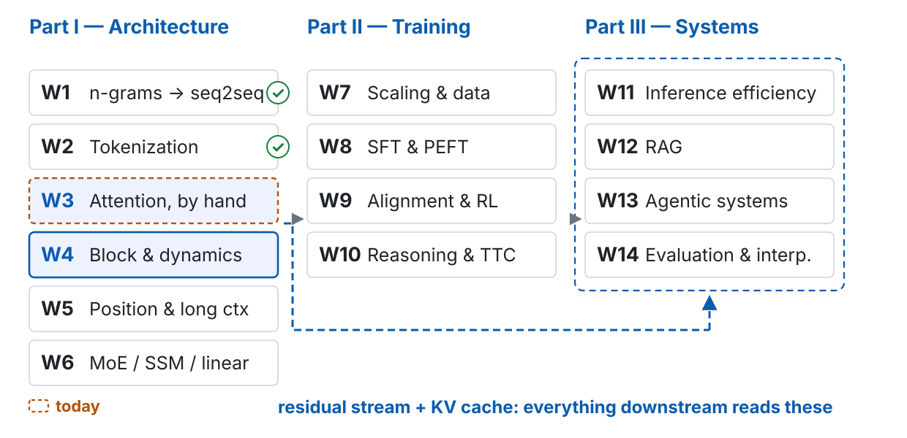
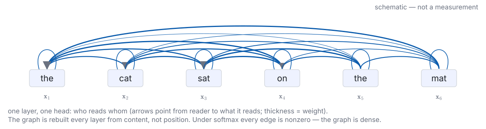
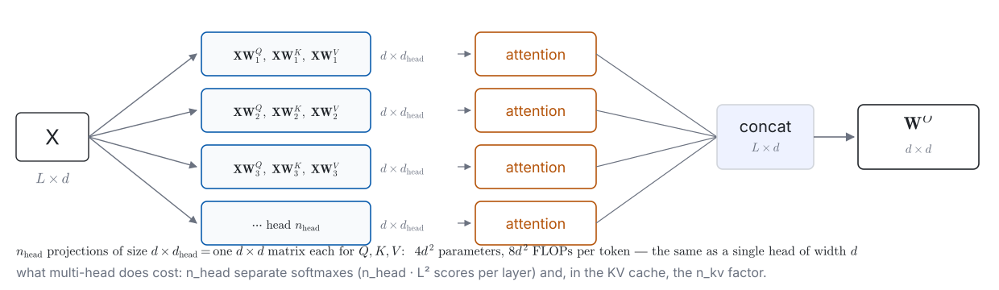
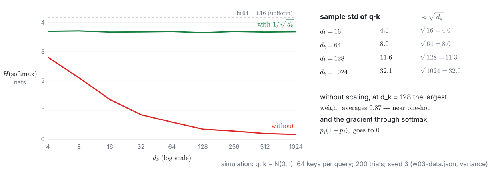
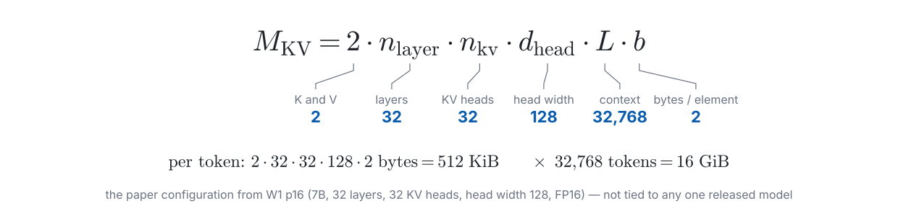
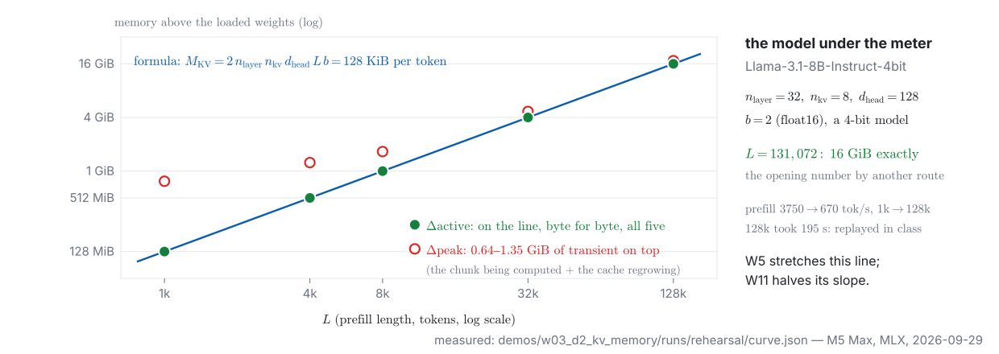
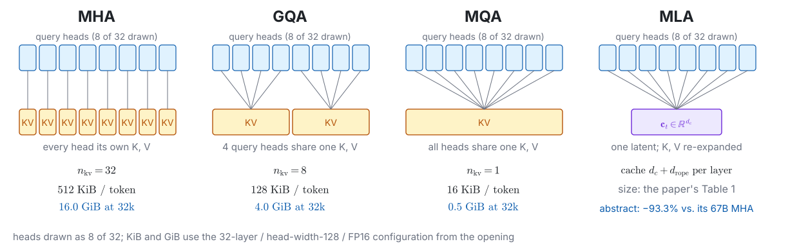
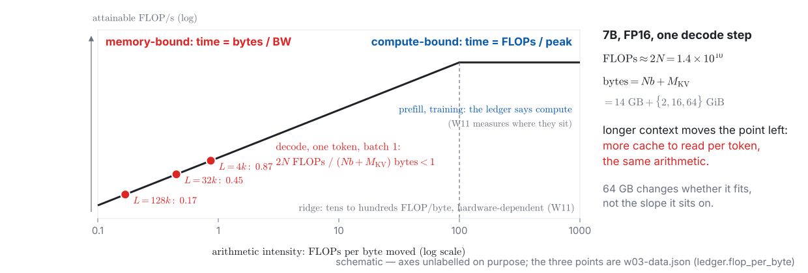
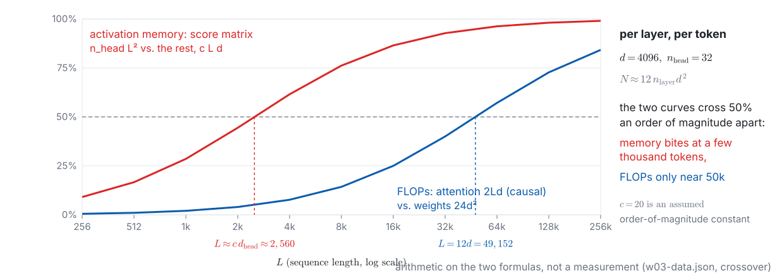
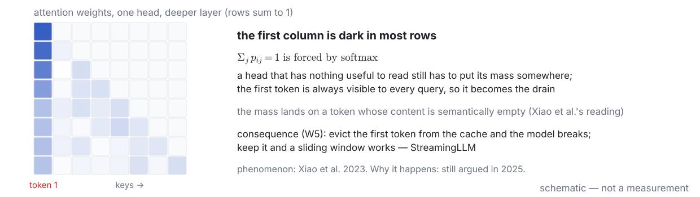

<!-- 此檔由 bin/publish_slides.py 從投影片正本產生（中文講稿區塊已剝除），請勿直接編輯。正本在 private repo 的 <course>/slides/。 -->

# The number last week promised {.section-title}

## Where we are: week 3 of 14

{width="100%"}

## Last week, in one picture



::: {.claim}
**Week 2 gave us the rows.** Nothing yet lets one row read another — that is this week's operation, and its price is the number we derive next.
:::

::: {.footer}
Token counts: W2 demo 1 rehearsal · pipeline W2 p18 · ledger W2 p40 · schematic
:::

## Last week ended with a number. Derive it before you trust it

The ledger row from W1: $M_{\text{KV}} = 2\,n_{\text{layer}}\,n_{\text{kv}}\,d_{\text{head}}\,L\,b$ bytes

| the paper configuration | value |
|:---|---:|
| layers $n_{\text{layer}}$ | 32 |
| KV heads $n_{\text{kv}}$ (every query head has its own) | 32 |
| head width $d_{\text{head}}$ | 128 |
| bytes per element $b$ (FP16) | 2 |
| context $L$ | 32,768 |

::: {.ask}
Multiply it out yourself — first **per token**, then for the whole context. You have two minutes.
:::

::: {.footer}
Configuration: W1 p16 · the answer was announced on W2 p65
:::

## Now guess three variants — before computing them

| change one thing | your guess | computed |
|:---|:---|---:|
| keep everything, but only **8 KV heads** (GQA, next section) | | **4 GiB** |
| keep everything, but context **128k** | | **64 GiB** |
| **64 GB** unified memory, minus 14 GB of FP16 weights: how long a context fits? | | $\approx 95\text{k}$ tokens |

- The project card: **16 GB**. The KV cache alone fills it **before a single weight is loaded**
- The demo machine: **64 GB**. It fits — but capacity is one limit and **bandwidth** is another; 64 GB removes only the first

::: {.claim}
Capacity decides whether it fits. Bandwidth decides how long each token waits. **They are independent limits** — W11 will make this a whole lecture.
:::

::: {.footer}
w03-data.json (kv.variants) · 64 GB decimal, minus FP16 weights; an upper bound
:::

## The problem this week handles, in one picture



::: {.claim}
Recurrence lost on **parallelism** and **path length** — not on quality. This week's operation fixes both, and pays with a state that grows with $L$.
:::

::: {.footer}
W1 p51–p57: BPTT, the Jacobian chain, seq2seq's bottleneck, Bahdanau's read
:::

## What you should be able to do by the end of today

1. Explain $\mathbf{Q}, \mathbf{K}, \mathbf{V}$ from **two angles** — soft dictionary lookup, differentiable routing — and say where each picture fails; answer what happens if $\mathbf{Q} = \mathbf{K} = \mathbf{V} = \mathbf{X}$
2. Derive $1/\sqrt{d_k}$ from a **variance argument**, and say why it only fixes initialization
3. Write the **causal mask**; say why the **KV cache is correct**, and state its cost per step and per sequence — then predict what each of demo 1's five tests checks
4. Compute KV bytes per token for **MHA → MQA → GQA → MLA**, and explain why multi-head does **not** multiply the projection cost
5. Locate the **two crossovers** — FLOPs and activation memory — an order of magnitude apart; explain FlashAttention as IO, exact, not approximate
6. State the evidence that **attention weights are not explanations**, both sides — and what would count as mechanistic evidence

# Two ways to read one operation {.section-title}

## Angle one: a soft dictionary lookup



::: {.claim}
A query is compared with **every** key; the similarities become weights that sum to one; the output is a **blend** of all the values. Nothing is retrieved — everything is read, by degree.
:::

## Angle two: differentiable routing — who reads whom, every layer

::: {.claim}
Attention builds a **weighted directed graph** over the tokens, rebuilt at every layer from content. This is the picture that connects to circuits (W14) — and it is a **dense** graph: under softmax, no edge is zero.
:::

## Where each picture fails

::: {.prose}
| picture | what it gets right | where it misleads |
|:---|:---|:---|
| **soft dictionary lookup** | similarity → weights → weighted sum; "content-addressed" | keys and values look like *stored data*. They are **projections of the same residual stream**, recomputed at every layer; and nothing is "retrieved" — the output is a blend |
| **differentiable routing** | who-reads-whom is rebuilt per layer from content; separates *addressing* (QK) from *payload* (OV) | "routing" suggests sparse, chosen edges. Under softmax **every edge is nonzero**; the graph is a dense weighted average |
:::

::: {.footer}
Course rule: every metaphor comes with the place it breaks (W1, W2, W4)
:::

## The formula: one line, and every symbol is familiar

$$\mathrm{Attn}(\mathbf{Q},\mathbf{K},\mathbf{V}) = \mathrm{softmax}\!\left(\frac{\mathbf{Q}\mathbf{K}^\top}{\sqrt{d_k}} + \mathbf{M}\right)\mathbf{V},\qquad \mathbf{Q} = \mathbf{X}\mathbf{W}^Q,\ \ \mathbf{K} = \mathbf{X}\mathbf{W}^K,\ \ \mathbf{V} = \mathbf{X}\mathbf{W}^V$$

- $\mathbf{X} \in \mathbb{R}^{L \times d}$: the layer's input, one row per token ($L$ tokens, width $d$). Next week this is the *residual stream*
- $\mathbf{Q}\mathbf{K}^\top$ is $L \times L$: every query against every key. softmax is applied **row by row**
- $\mathbf{M}$: the mask — $0$ where reading is allowed, $-\infty$ where it is not
- **Self-attention** means $\mathbf{Q}, \mathbf{K}, \mathbf{V}$ all come from the **same** $\mathbf{X}$. Bahdanau's (W1) was **cross**-attention: $\mathbf{K}, \mathbf{V}$ from another sequence

::: {.ask}
Stop and think: what happens if we drop the three projections and set $\mathbf{Q} = \mathbf{K} = \mathbf{V} = \mathbf{X}$?
:::

::: {.footer}
Vaswani et al. 2017, eq. 1 · bold: vectors and matrices · $L$: sequence length (ledger)
:::

## Multi-head: split the width, not multiply the cost

::: {.claim}
$n_{\text{head}}$ heads of width $d_{\text{head}} = d / n_{\text{head}}$ cost **the same** projections as one head of width $d$. What multi-head buys is $n_{\text{head}}$ separate softmaxes; what it costs is $n_{\text{head}} L^2$ scores — and, at inference, the $n_{\text{kv}}$ in the cache.
:::

::: {.footer}
Misconception 1: "multi-head costs $n_{\text{head}}$ times a single head" · $d_k = d_{\text{head}}$
:::

## Causal mask: why the KV cache is correct, not just cheap



::: {.claim}
Old $\mathbf{k}, \mathbf{v}$ **never change** → storable. Every step **reads them all** → the state grows with $L$.
:::

::: {.footer}
Decoder-only: every layer is causal · an encoder has nothing to cache — its keys change
:::

# Why divide by $\sqrt{d_k}$ {.section-title}

## The variance argument, on the board

Take $\mathbf{q}, \mathbf{k} \in \mathbb{R}^{d_k}$ with components independent, zero-mean, unit-variance.

$$\mathbf{q}^\top\mathbf{k} = \sum_{i=1}^{d_k} q_i k_i,\qquad \mathbb{E}\big[\mathbf{q}^\top\mathbf{k}\big] = 0,\qquad \mathrm{Var}\big(\mathbf{q}^\top\mathbf{k}\big) = \sum_{i=1}^{d_k} \mathbb{E}[q_i^2]\,\mathbb{E}[k_i^2] = d_k$$

- so the **logits** — the pre-softmax scores $s_{ij}$ — have standard deviation $\sqrt{d_k}$: for $d_k = 128$, about $11$
- softmax over $64$ keys whose logits spread over $\pm 11$ is nearly one-hot; its gradient $\partial p_j / \partial s_j = p_j(1 - p_j)$ is then nearly $0$
- dividing by $\sqrt{d_k}$ brings the variance back to $1$. Equivalently: $\sqrt{d_k}$ is a **temperature**

::: {.ask}
Do the variance line yourself — where do independence and zero mean get used?
:::

::: {.footer}
Vaswani et al. 2017, §3.2.1 footnote · both assumptions hold only at initialization
:::

## Simulated: without the scaling, the entropy collapses as $d_k$ grows

::: {.claim}
At $d_k = 128$ the unscaled softmax already puts $0.87$ of its mass on one key; scaled, the entropy stays where it started. **Demo 1's test (d) is this figure, run live.**
:::

## It only fixes initialization — logits grow during training

- The two assumptions — independent components, unit variance — describe **random weights**. Training moves $\mathbf{W}^Q$ and $\mathbf{W}^K$
- As the products $\mathbf{W}^Q\mathbf{W}^{K\top}$ grow, the logits grow with them, the softmax sharpens, the entropy falls — the same collapse, arriving later
- Zhai et al. (2023) tie training instability to exactly this entropy collapse; Wortsman et al. (2023) show **attention-logit growth** as a signature of the loss spikes in small-scale proxies — and that normalizing $\mathbf{q}$ and $\mathbf{k}$ (**QK-norm**) removes it

::: {.claim}
$1/\sqrt{d_k}$ sets the temperature **at step 0**. Keeping it sane at step 100,000 is W4's problem — and W4's failure demo is a training run where it isn't.
:::

::: {.footer}
Misconception 2: "$1/\sqrt{d_k}$ fixes the numerics" · Zhai et al. 2023 · Wortsman et al. 2023 (W4)
:::

# Demo 1: write it, run five tests {.section-title}

## Live: attention and a KV cache, from scratch, in this order

::: {.columns}
::: {.column width="48%"}
**Write, in this order**

1. `scaled_dot_product_attention(Q, K, V, mask)` — scores, scale, mask, softmax, weighted sum
2. `causal_mask(L)` — $-\infty$ above the diagonal
3. `decode_step(x_t, cache, W)` — compute $\mathbf{k}_t, \mathbf{v}_t$ once, append, attend over the cache

Tests run after each step (`tests.py` skips what is not written yet). Typos are expected; `attention_final.py` is the fallback after two minutes.
:::
::: {.column width="52%"}
**Five tests — predict first: what does each check, and which fails first?**

- **(a)** matches `F.scaled_dot_product_attention` to $10^{-5}$
- **(b)** output $t$ has **zero gradient** w.r.t. inputs after $t$ — autograd Jacobian, not eyes
- **(c)** step-by-step decoding with the cache equals one full forward pass
- **(d)** remove $1/\sqrt{d_k}$: row entropy collapses as $d_k$ grows
- **(e)** a row that is **fully masked** returns `NaN` — break it, then fix it
:::
:::

::: {.footer}
Demo 1 · live coding, CPU · skeleton: Raschka ch 3 · reference implementation after class
:::

## Per step and per sequence: say both numbers

| | per generated token | whole sequence of $L$ tokens |
|:---|:---|:---|
| **no cache** — recompute every query against every key | $O(L^2 d)$ | $O(L^3 d)$ |
| **with cache** — one query against $L$ stored keys | $O(L\,d)$ | $O(L^2 d)$ |
| what the cache costs | $2\,n_{\text{layer}}\,n_{\text{kv}}\,d_{\text{head}}\,b$ bytes **per token, kept for the whole conversation** | $M_{\text{KV}}$ |

::: {.claim}
"From $O(n^2)$ to $O(n)$" is a **per-step** statement. The whole generation is still quadratic — and the price is paid in memory instead: the cache is the state.
:::

::: {.footer}
Misconception 3: "the KV cache is an engineering optimization" — it is the state
:::

# The KV cache, and the ledger {.section-title}

## The formula, factor by factor — carry the per-token number

::: {.claim}
Two of the six factors are **levers** — $n_{\text{kv}}$, chosen before training (next slides), and $b$, changeable at serving time (W11) — and one is **the user's**, $L$. The other three are the architecture.
:::

::: {.footer}
Ledger row filled today: KV cache · W5 changes $L$, W6 the mechanism, W11 $b$
:::

## Live: predict the curve from `config.json`, then measure it

| context $L$ | predicted from the formula | measured: $\Delta$active (resident − baseline) |
|:---|---:|---:|
| 1k | | |
| 4k | | |
| 8k | | |
| 32k | | |
| model maximum (131,072) | | |

::: {.ask}
Read three numbers from the model's `config.json` — `num_hidden_layers`, `num_key_value_heads`, `head_dim` — and fill the middle column **before** the first measurement.
:::

::: {.footer}
Demo 2 · live · MLX · Llama 3.1 8B, a GQA model — the point: formula and meter agree
:::

## What the meter said: the formula, byte for byte

::: {.claim}
$\Delta$active **is** the formula at every $L$; the transient above it is the prefill's working set, not the cache. **This is the line W5 stretches and W11 halves.**
:::

::: {.footer}
Demo 2 rehearsal, 2026-09-29 · Llama 3.1 8B Instruct 4-bit · MLX · runs/rehearsal/curve.json
:::

## One problem, four answers: MHA → MQA → GQA → MLA

::: {.claim}
Every design on this line changes **one factor**, $n_{\text{kv}}$ — or, for MLA, what is cached at all. None of them touches the FLOPs of attention itself.
:::

::: {.footer}
Shazeer 2019 (MQA) · Ainslie et al. 2023 (GQA) · DeepSeek-V2 2024 (MLA) · opening config
:::

## MLA: cache a latent, re-expand on the way out

$$\mathbf{c}_t = \mathbf{W}^{DKV}\,\mathbf{x}_t \in \mathbb{R}^{d_c},\qquad \mathbf{k}_t = \mathbf{W}^{UK}\mathbf{c}_t,\qquad \mathbf{v}_t = \mathbf{W}^{UV}\mathbf{c}_t,\qquad d_c \ll 2\,n_{\text{head}}\,d_{\text{head}}$$



::: {.claim}
Cache $\mathbf{c}_t$, not $\mathbf{k}_t, \mathbf{v}_t$, and score against $\mathbf{c}_t$ directly. **What is cached changed; the attention itself did not.**
:::

::: {.footer}
DeepSeek-AI 2405.04434 §2.1 · $d_c$ and the position-key width: its Table 1, not quoted
:::

## Low rank is LoRA's trick too — and RoPE is where it breaks

- **The same trick as LoRA (W8)**: a matrix written as the product of two thin ones. Used for a completely different purpose — here to shrink the **state** carried at inference, there to shrink the **update** learned in fine-tuning
- **RoPE breaks the absorption**: the rotation $\mathbf{R}_t$ depends on the position of $\mathbf{k}_t$ and sits between $\mathbf{W}^{UK}$ and $\mathbf{q}$, so no single matrix can be folded into the query
- DeepSeek-V2's answer: a **small separate key that carries position** — the *decoupled* RoPE key — not compressed, cached alongside $\mathbf{c}_t$. The cache per token is $d_c$ **plus** that key, not $d_c$ alone

::: {.claim}
**Low rank and rotation do not commute.** W5 comes back to this sentence when it explains what RoPE is.
:::

::: {.footer}
DeepSeek-AI, arXiv:2405.04434 §2.1 · LoRA: W8 · RoPE: W5
:::

## Why decode is memory-bound: the ledger's first roofline

| the 7B model, FP16, per decode step | at $L = 4\text{k}$ | at $L = 32\text{k}$ | at $L = 128\text{k}$ |
|:---|---:|---:|---:|
| FLOPs, weights: $2N$ | $1.4 \times 10^{10}$ | $1.4 \times 10^{10}$ | $1.4 \times 10^{10}$ |
| FLOPs, attention: $4\,n_{\text{layer}} L d$ | $0.2 \times 10^{10}$ | $1.7 \times 10^{10}$ | $6.9 \times 10^{10}$ |
| bytes moved: weights $N b$ + cache $M_{\text{KV}}$ | 14 GB + 2 GiB | 14 GB + 16 GiB | 14 GB + 64 GiB |
| FLOPs per byte | $1.0$ | $1.0$ | $1.0$ |

$$t_{\text{step}} \;\geq\; \frac{N\,b + M_{\text{KV}}}{\text{BW}}, \qquad \frac{2N}{Nb} = \frac{2}{b} = 1, \quad \frac{4\,n_{\text{layer}} L d}{M_{\text{KV}}} = \frac{2\,n_{\text{head}}}{n_{\text{kv}}\,b} = 1 \ \text{(MHA)}$$

::: {.claim}
Every accelerator balances at tens to hundreds of FLOPs per byte. Decode delivers **about one — at every $L$**: both roads, weights and cache, pay one FLOP per byte. A longer context takes longer, not a different kind of time.
:::

::: {.footer}
w03-data.json (ledger) · attention: one query, $L$ keys, no causal average · BW unmeasured · W11
:::

## Where decode sits: the roofline, drawn once, filled in at W11

::: {.claim}
Below the ridge, time is **bytes over bandwidth**. Decode sits there at every $L$, at the **same** spot: $L$ scales bytes and FLOPs together. Omit attention's FLOPs and it seems to drift left (hollow).
:::

::: {.footer}
schematic — no bandwidth, no peak FLOP/s quoted · the points: w03-data.json (ledger) · W11
:::

## After MLA: what 2025–2026 added, and what belongs elsewhere

| addition | what it does to the cache | evidence, as of this deck |
|:---|:---|:---|
| **TPA** (tensor product attention) | factorizes $\mathbf{Q}, \mathbf{K}, \mathbf{V}$ per token; caches the factors | NeurIPS 2025 (spotlight), one group's results |
| **gated attention** (Qwen) | a gate after the attention output; the title claims *attention-sink-free* | NeurIPS 2025, oral and best paper; shipped in Qwen3-Next (Sept 2025, a model blog, not a paper); still only the abstract was read for this deck |
| **sparse attention** (NSA, DSA) | each query reads a **subset** of keys — an **approximation**, unlike everything above | NSA: ACL 2025, best paper · W6 (mechanism) and W11 (serving) |

::: {.claim}
Everything on this slide is the part of this week that will be rewritten next year. The formula above it will not.
:::

::: {.footer}
Zhang et al. 2501.06425 · Qiu et al. 2505.06708 · Yuan et al. 2502.11089 · appendix D
:::

# The truth about $O(n^2)$ {.section-title}

## Per layer, per token: the two sides of the bill

| | forward FLOPs, one layer, one token | grows with |
|:---|:---|:---|
| **weights**: $\mathbf{W}^Q, \mathbf{W}^K, \mathbf{W}^V, \mathbf{W}^O$ — four $d \times d$ | $8d^2$ | $d$ |
| **weights**: the FFN, width $4d$, two matrices | $16d^2$ | $d$ |
| **attention**: one query against $L$ keys ($\mathbf{Q}\mathbf{K}^\top$ and $\mathbf{A}\mathbf{V}$) | $4Ld$ — causal average $2Ld$ | $L$ |

- Weight side total: $24d^2 = 2 \times 12d^2$ — the $2N$ per token of the ledger, since $N \approx 12\,n_{\text{layer}}d^2$ (W4 does this accounting)
- They are equal when $2Ld = 24d^2$, i.e. $L = 12d$. For $d = 4096$: $L \approx 49\text{k}$

::: {.claim}
A 7B model at 32k context spends **less** on attention than on its weights. "$O(n^2)$" is true and, at 32k, not the bill.
:::

::: {.footer}
Multiply-add $= 2$ FLOPs · same convention as W1 p17 ($d_{\text{model}} \gg L/12$)
:::

## Two crossovers, an order of magnitude apart

::: {.claim}
Memory bites first: the score matrix overtakes the other activations at a few thousand tokens. FLOPs cross near $50\text{k}$. **Ask which quantity, and which phase, before you say "bottleneck".**
:::

::: {.footer}
Misconception 4: "attention is $O(n^2)$, so it is the bottleneck" · which quantity, which phase
:::

## FlashAttention: change the cost model, not the mathematics



::: {.footer}
Dao et al., NeurIPS 2022 (2205.14135) · FA-2, FA-3, FA-4: new engineering, same argument
:::

## Online softmax: two blocks give the same answer as one

$$m^{(j)} = \max\!\big(m^{(j-1)},\ \max \mathbf{s}^{(j)}\big),\qquad
\ell^{(j)} = \ell^{(j-1)}\,e^{\,m^{(j-1)} - m^{(j)}} + \sum_i e^{\,s^{(j)}_i - m^{(j)}},\qquad
\mathbf{o}^{(j)} = \mathbf{o}^{(j-1)}\,e^{\,m^{(j-1)} - m^{(j)}} + \sum_i e^{\,s^{(j)}_i - m^{(j)}}\,\mathbf{v}_i$$

Output after the last block: $\mathbf{o}/\ell$. The whole trick is the factor $e^{\,m^{(j-1)} - m^{(j)}}$: when the running max moves, everything accumulated so far is rescaled once.

| eight scores, two blocks of four | $m$ after block | $\ell$ after block | output |
|:---|---:|---:|---:|
| block 1: $\{2.62, 0.40, 3.93, 1.77\}$ | $3.93$ | $1.414$ | |
| block 2: $\{1.72, -2.05, 4.44, -1.60\}$ — rescale by $e^{3.93 - 4.44} = 0.60$ | $4.44$ | $1.919$ | $0.7414$ |
| **one shot** over all eight | | | $0.7414$ |

::: {.ask}
On paper: take the first two scores as block 1 and the next two as block 2 (values as in the table). Show the rescaling reproduces the one-shot softmax over those four.
:::

::: {.footer}
Milakov & Gimelshein 2018 — an NVIDIA technical report, not peer-reviewed · w03-data.json
:::

## Exact, not approximate; less traffic, not fewer FLOPs

::: {.prose}
| said | true? | what is actually the case |
|:---|:---|:---|
| "FlashAttention approximates attention" | **no** | identical output in exact arithmetic; only the order of operations and the memory traffic change |
| "FlashAttention makes attention $O(n)$" | **no** | FLOPs stay $O(L^2 d)$ (recomputation adds some); the **extra memory** becomes $O(L)$ |
| "sparse attention is the same idea" | **no** | sparse attention drops keys — a genuine approximation (W6); FlashAttention drops nothing |
| "exact means bitwise identical" | **no** | tiling changes the summation order; floating-point results can differ in the last bits (W11: batch invariance) |
:::

::: {.footer}
Misconception 5: "FlashAttention is an approximation" — the word in its title is *exact*
:::

# What softmax forces {.section-title}

## Attention sinks: the first token soaks up what no one wants

::: {.claim}
$\sum_j p_{ij} = 1$ is not a modelling choice, it is a constraint — and the model finds a place to dump the mass it does not need. **W5 will build StreamingLLM on exactly this.**
:::

::: {.footer}
Xiao et al., ICLR 2024 · Misconception 6: "the softmax probability is the model's belief"
:::

## Why? The phenomenon is settled; the explanation is not

| claim | source | evidence, as of this deck |
|:---|:---|:---|
| the sink exists; keeping the first tokens rescues a sliding window | Xiao et al. 2023 | widely reproduced; the basis of W5 |
| the model **uses** the sink to avoid over-mixing across tokens | Barbero et al. 2025 | COLM 2025; one group's account |
| a gate on the attention output removes the sink | Qiu et al. 2025 (Qwen) | NeurIPS 2025, best paper; abstract read here |
| a learnable sink term in the softmax denominator, in a shipped model | a 2025 model card | not a paper; search term, Sources |

::: {.claim}
**Phenomenon certain, mechanism open.** An experiment that separates rows two and three is a project.
:::

::: {.footer}
Barbero et al. 2504.02732 · Qiu et al. 2505.06708 · row four: a search term, not a citation
:::

## No positions, no order: attention is permutation-equivariant

With $\mathbf{Q}, \mathbf{K}, \mathbf{V}$ all from $\mathbf{X}$, no mask, and a permutation matrix $\mathbf{P}$:

$$\mathrm{Attn}(\mathbf{P}\mathbf{X}) = \mathrm{softmax}\!\left(\frac{\mathbf{P}\mathbf{X}\mathbf{W}^Q\,(\mathbf{P}\mathbf{X}\mathbf{W}^K)^\top}{\sqrt{d_k}}\right)\mathbf{P}\mathbf{X}\mathbf{W}^V
= \mathbf{P}\,\mathrm{softmax}\!\left(\frac{\mathbf{X}\mathbf{W}^Q\mathbf{W}^{K\top}\mathbf{X}^\top}{\sqrt{d_k}}\right)\mathbf{P}^\top\mathbf{P}\,\mathbf{X}\mathbf{W}^V
= \mathbf{P}\,\mathrm{Attn}(\mathbf{X})$$

- so shuffling the tokens shuffles the outputs the same way — **"the cat sat on the mat" and "mat the on sat cat the" produce the same set of vectors**
- the causal mask breaks the symmetry — and **leaks position**: position $t$ sees exactly $t$ keys, so a causal LM with no positional encoding still infers where it is (Haviv et al. 2022). W5 adds position **explicitly**
- checked numerically in `w03-data.json`: $\max|\mathrm{Attn}(\mathbf{P}\mathbf{X}) - \mathbf{P}\,\mathrm{Attn}(\mathbf{X})| = 2 \times 10^{-16}$

::: {.claim}
Attention addresses by content and has **no idea where anything is** — only the mask hints at it. W5 is about telling it explicitly, and the ways that break at lengths it never saw.
:::

::: {.footer}
uses $\mathbf{P}^\top\mathbf{P} = \mathbf{I}$ and that row-wise softmax commutes with a joint permutation · W5
:::

# Attention is not explanation {.section-title}

## The claim, and the three papers to read together

::: {.prose}
| paper | what it did | what it showed |
|:---|:---|:---|
| Jain & Wallace, NAACL 2019 — *Attention is not Explanation* | compared attention weights with gradient-based importance; searched for **alternative attention distributions** | the rankings agree poorly; very different weightings can give the **same prediction** |
| Serrano & Smith, ACL 2019 — *Is Attention Interpretable?* | **erased** the inputs the model attended to most and watched the decision | removing the highest-attention items often does **not** flip the decision |
| Wiegreffe & Pinter, EMNLP 2019 — *Attention is not not Explanation* | asked what "explanation" is being claimed; trained adversaries **inside** the model | post-hoc counterfactual weights are not what the model learns; attention can still be informative — for some claims |
:::

::: {.footer}
Misconception 7: "a high attention weight means the token mattered" · W3 → W10 → W14
:::

## Live: the same sentence, three rankings

*The keys that the old man who lives next door lost last week* → the model predicts **were** · numbers from the rehearsal run

| rank | attention (layer 14, head 0) | gradient × input | attention rollout |
|:---|---:|---:|---:|
| 1 | lost · 0.29 | man · 0.22 | The · 1.00 |
| 2 | The · 0.24 | that · 0.18 | keys · $<10^{-5}$ |
| 3 | last · 0.16 | week · 0.14 | that · $<10^{-5}$ |
| 4 | week · 0.09 | old · 0.09 | the · $<10^{-5}$ |
| 5 | old · 0.06 | next · 0.07 | old · $<10^{-5}$ |
| **keys** (the subject of *were*) | 13th of 13 · 0.01 | 8th · 0.05 | 2nd · $<10^{-5}$ |

::: {.ask}
Before the numbers: if attention were an explanation, what should the three columns look like?
:::

::: {.footer}
Demo 3 · Qwen3-0.6B · layer 14, head 0 · rollout: Abnar & Zuidema 2020
:::

## Mechanistic evidence, and the three times this course asks

| week | the readable intermediate | mistaken for | the mechanistic test |
|:---|:---|:---|:---|
| **W3** | attention weight | importance, explanation | **intervene**: patch or ablate the head's output, measure the change in the answer (W14: activation patching) |
| W10 | the chain of thought | the model's reasoning | hide a hint in the prompt; does the answer move while the chain stays silent? |
| W14 | a sparse-autoencoder feature | a concept the model uses | random baselines and sanity checks; clamp the feature and it must **do** something |

: {tbl-colwidths="[9,26,24,41]"}

::: {.claim}
Correlation: "when the answer is X, this is high." Mechanism: "**change this, and the answer changes**." Only the second explains — and it needs an intervention, not a heatmap.
:::

::: {.footer}
The fourth question to ask of every paper (W1 p21) · this table closes W14
:::

## Misconception 8: "each head learns a semantic role"

- The **design** motivation (Vaswani et al.): attend jointly from several representation subspaces — a capacity argument, not a linguistic one
- **After** training, most heads can be pruned with little loss: Michel, Levy & Neubig (NeurIPS 2019) remove most heads at test time; Voita et al. (ACL 2019) find a few specialized heads carry the load and the rest can go
- A few heads do have identifiable functions — the best-known is the **induction head** (Olsson et al. 2022, an Anthropic research report, not a peer-reviewed paper), which copies patterns like $A\ B \ldots A \rightarrow B$

::: {.claim}
"Heads specialize" is a finding about **some** heads, made after the fact. Do not let it become the reason the design exists — and do not expect it of every head.
:::

::: {.footer}
Michel et al. 1905.10650 · Voita et al. 1905.09418 · Olsson et al. 2209.11895 (Anthropic)
:::

# Where this goes {.section-title}

## Eight things this week said no to (1 of 2)

::: {.prose}
| The belief | What is true | Returns |
|---|---|---|
| **1** · multi-head costs $n_{\text{head}}$ times a single head | projections cost the same ($4d^2$); it costs $n_{\text{head}}$ softmaxes and the $n_{\text{kv}}$ in the cache | W4 |
| **2** · $1/\sqrt{d_k}$ solves the numerics | it sets the temperature at initialization; logits grow in training (W4: QK-norm) | W4 |
| **3** · the KV cache is an engineering optimization | it is the inference-time state, a consequence of causality; per step $O(Ld)$, per sequence $O(L^2 d)$ | W5, W11 |
| **4** · attention is $O(n^2)$, so it is the bottleneck | which quantity, which phase: memory crosses at $\sim 10^3$ tokens, FLOPs at $12d$; decode is bandwidth-bound | W11 |

: {tbl-colwidths="[34,54,12]"}
:::

## Eight things this week said no to (2 of 2)

::: {.prose}
| The belief | What is true | Returns |
|---|---|---|
| **5** · FlashAttention approximates attention, or makes it $O(n)$ | exact; FLOPs unchanged; extra **memory** $O(L)$; HBM traffic falls. Sparse attention is the approximation | W6, W11 |
| **6** · the softmax probability is the model's belief | rows must sum to one; unwanted mass lands on the first token — the sink (W5: StreamingLLM) | W5 |
| **7** · a high attention weight means the token mattered | correlational; alternative weightings and erasure disagree with it. Mechanism needs an intervention (W14) | W14 |
| **8** · each head learns a semantic role | a capacity argument at design time; most heads are prunable, a few (induction heads) have identifiable functions | W14 |

: {tbl-colwidths="[34,54,12]"}
:::

## The ledger, week 3: the KV row gets its number

| Where the cost falls | Formula | What binds it | Filled in |
|:---|:---|:---|:---|
| **Training**, one run | $C_{\text{train}} \approx 6ND$ FLOPs | compute | W1 · W7 |
| **Optimizer state** (Adam) | $\approx 2N$ extra values | memory | W4 |
| **Prefill**, once per request | $C_{\text{pre}} \approx 2NL_{\text{in}} + 2\,n_{\text{layer}}L_{\text{in}}^2 d$ FLOPs | compute | **today: the second term** · W11 |
| **Decode**, per generated token | $C_{\text{dec}} \approx 2N + 4\,n_{\text{layer}}Ld$ FLOPs; $t_{\text{step}} \geq (Nb + M_{\text{KV}})/\text{BW}$ | memory bandwidth | **today: the bound, the $L$ term** · W11 |
| **KV cache**, state carried | $M_{\text{KV}} = 2\,n_{\text{layer}}\,n_{\text{kv}}\,d_{\text{head}}\,L\,b$ = **512 KiB / token → 16 GiB at 32k** (MHA); **4 GiB** (GQA-8) | capacity, then bandwidth | **today** · W5 · W11 |
| **MoE** | memory $\propto N_{\text{total}}$, FLOPs $\propto N_{\text{active}}$ | both, separately | W6 |

: {tbl-colwidths="[22,48,17,13]"}

::: {.footer}
Same master as W1 p16 · prefill's $L^2$ term is the attention side: $2Ld$ per layer per token
:::

## Next week: the whole block, and what happens when you train it

- Today took one operation apart. Next week puts it back into a **block** — LayerNorm, the FFN, the residual connection — and names the object every layer reads and writes: the **residual stream**
- The parameter accounting behind today's $24d^2$: $N \approx 12\,n_{\text{layer}}d^2$, and where the $6$ in $6ND$ comes from once attention is included
- The failure demo: push the learning rate past its limit and watch the **attention logits** climb while the loss stalls — the growth this week said $1/\sqrt{d_k}$ cannot stop

::: {.ask}
Before then: **JM3 Vol I ch 7**, second half (the 2026-08-19 release), and **RAS ch 4** (ch 3 was this week's). To consolidate today: **ZZM ch 4** for a second walk through self-attention, and Jain & Wallace's abstract.
:::

::: {.claim}
Three weeks in: the unit (W2), what it is allowed to attend to (W3) — and next week, **what carries the result from layer to layer**.
:::

## Sources (1 of 2)

::: {.cite}
**Textbooks** · Jurafsky & Martin, *Speech and Language Processing*, 3rd ed., **2026-08-19 draft release** — ch 7 Transformers and Pretraining, first half · Raschka, *Build a Large Language Model (From Scratch)* — ch 3 (the skeleton of demo 1) · Zong, Zhao & Ma, *Natural Language Processing and Large Language Models*, 2026 (**open access**) — ch 4 Sequence Generation Models

**Mechanism and scaling** · Vaswani et al., *Attention Is All You Need*, NeurIPS 2017 (arXiv:1706.03762) — §3.2.1 footnote for $1/\sqrt{d_k}$, Table 1 for path length · Zhai et al., *Stabilizing Transformer Training by Preventing Attention Entropy Collapse*, ICML 2023 (arXiv:2303.06296) · Wortsman et al., *Small-scale proxies for large-scale Transformer training instabilities*, arXiv:2309.14322 (W4)

**The KV cache line** · Shazeer, *Fast Transformer Decoding: One Write-Head is All You Need*, arXiv:1911.02150 · Ainslie et al., *GQA: Training Generalized Multi-Query Transformer Models from Multi-Head Checkpoints*, EMNLP 2023 (arXiv:2305.13245) · DeepSeek-AI, *DeepSeek-V2*, arXiv:2405.04434 — MLA; the 93.3% figure is from its abstract · Zhang et al., *Tensor Product Attention Is All You Need*, NeurIPS 2025 (arXiv:2501.06425) · Qiu et al., *Gated Attention for Large Language Models*, NeurIPS 2025, best paper (arXiv:2505.06708) — abstract only · Qwen Team, *Qwen3-Next: Towards Ultimate Training & Inference Efficiency*, Sept 2025 — a model blog post, not a paper; where gated attention shipped · Yuan et al., *Native Sparse Attention*, ACL 2025, best paper (arXiv:2502.11089; W6, W11)

**IO** · Dao et al., *FlashAttention: Fast and Memory-Efficient Exact Attention with IO-Awareness*, NeurIPS 2022 (arXiv:2205.14135) · Dao, *FlashAttention-2*, arXiv:2307.08691 · Shah et al., *FlashAttention-3*, arXiv:2407.08608 · Zadouri et al., *FlashAttention-4: Algorithm and Kernel Pipelining Co-Design for Asymmetric Hardware Scaling*, MLSys 2026 (arXiv:2603.05451) · Milakov & Gimelshein, *Online normalizer calculation for softmax*, arXiv:1805.02867 — an NVIDIA technical report, not peer-reviewed
:::

## Sources (2 of 2)

::: {.cite}
**Explanation** · Jain & Wallace, *Attention is not Explanation*, NAACL 2019 (arXiv:1902.10186) · Serrano & Smith, *Is Attention Interpretable?*, ACL 2019 (arXiv:1906.03731) · Wiegreffe & Pinter, *Attention is not not Explanation*, EMNLP-IJCNLP 2019 (DOI 10.18653/v1/D19-1002) · Abnar & Zuidema, *Quantifying Attention Flow in Transformers*, ACL 2020 (arXiv:2005.00928) — attention rollout, demo 3's third column

**Heads** · Michel, Levy & Neubig, *Are Sixteen Heads Really Better than One?*, NeurIPS 2019 (arXiv:1905.10650) · Voita et al., *Analyzing Multi-Head Self-Attention: Specialized Heads Do the Heavy Lifting, the Rest Can Be Pruned*, ACL 2019 (arXiv:1905.09418) · Olsson et al., *In-context Learning and Induction Heads*, arXiv:2209.11895 — an Anthropic research report (Transformer Circuits), not peer-reviewed

**Sinks** · Xiao et al., *Efficient Streaming Language Models with Attention Sinks*, ICLR 2024 (arXiv:2309.17453) · Barbero et al., *Why do LLMs attend to the first token?*, COLM 2025 (arXiv:2504.02732)

**Position without positional encoding** · Haviv et al., *Transformer Language Models without Positional Encodings Still Learn Positional Information*, Findings of EMNLP 2022 (DOI 10.18653/v1/2022.findings-emnlp.99) · Kazemnejad et al., *The Impact of Positional Encoding on Length Generalization in Transformers*, NeurIPS 2023

**Data and figures** · The KV-cache numbers are arithmetic on the W1 p16 configuration (32 layers, 32 KV heads, head width 128, FP16), computed by a script written for this course; the entropy curves are a Gaussian simulation (64 keys, 200 trials, seed 3); the two-crossover curves are arithmetic on the per-layer formulas with an assumed activation constant $c = 20$; the online-softmax table is computed on hand-chosen scores; the lookup, routing, mask, heads, IO and sink figures are schematics.

**Search terms, not citations** · *Is Attention Explanation? An Introduction to the Debate* (ACL 2022 survey) · *Reducing Activation Recomputation in Large Transformer Models* (the activation-memory formula) · *gpt-oss model card attention sink* · *softmax off-by-one* (a blog post)
:::
