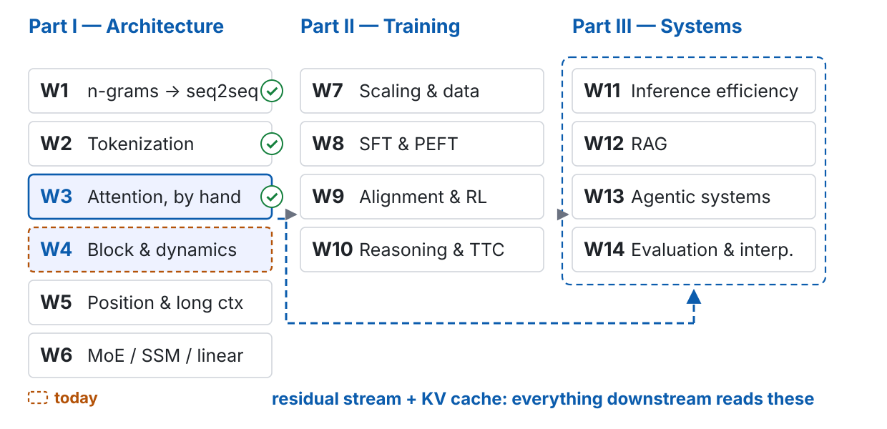
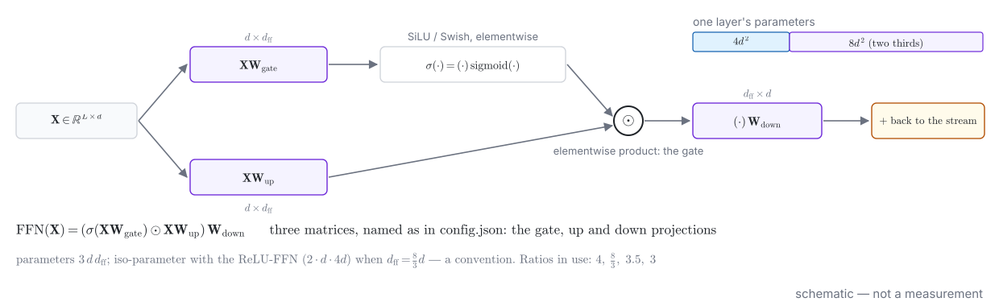
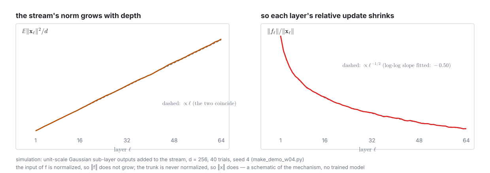
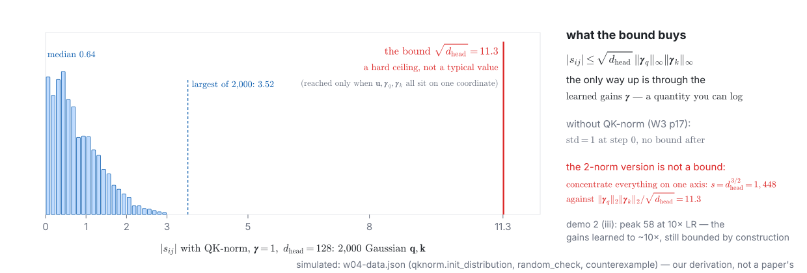
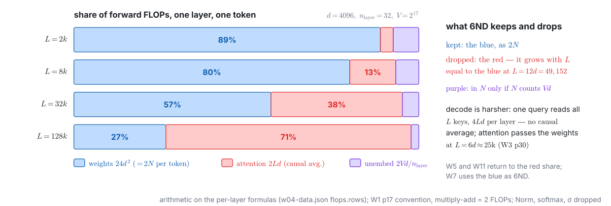
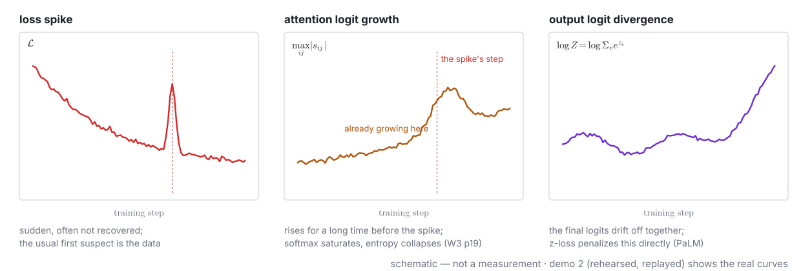
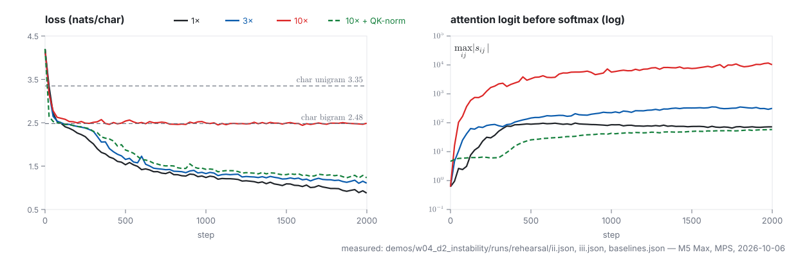
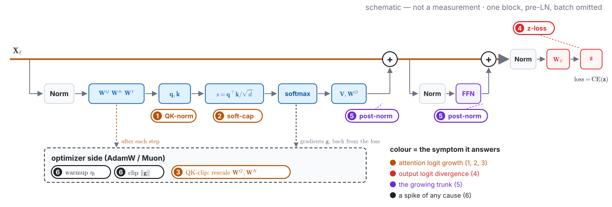
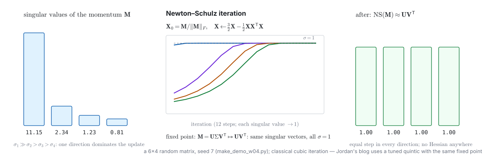

<!-- 此檔由 bin/publish_slides.py 從投影片正本產生（中文講稿區塊已剝除），請勿直接編輯。正本在 private repo 的 <course>/slides/。 -->

# The matrix last week never named {.section-title}

## Where we are: week 4 of 14

{width="100%"}

## Last week, in one picture



::: {.claim}
**Week 3 made every row read the others, and measured the price.** It never said what the result is added *into* — that matrix is this week.
:::

::: {.footer}
KV rows: W3 demo 2 rehearsal (W3 p25–26) · formula W3 p24 · left half: schematic
:::

## Last week's $24d^2$: say where it comes from

Week 3, per layer, per token, forward: **weights cost $24d^2$ FLOPs**, attention costs $2Ld$, and they cross at $L = 12d$.

::: {.ask}
$24d^2 = 2 \times 12d^2$. Two FLOPs per parameter — so **where are the $12d^2$ parameters in one layer?** Name the matrices. Two minutes.
:::

| what you can name from W3 | parameters |
|:---|---:|
| $\mathbf{W}^Q, \mathbf{W}^K, \mathbf{W}^V, \mathbf{W}^O$ — four $d \times d$ | $4d^2$ |
| the rest | $?$ |

::: {.footer}
W3 p34 · the half that W3 took on trust is today's first subject
:::

## The problem this week handles, in one picture



::: {.claim}
One matrix, $L \times d$, enters at the embedding and leaves at the unembedding; every block only **adds** to it. Count it, differentiate it, pay for it — then watch what training does to it.
:::

::: {.footer}
Outline W4 · on the board: p18, p24, p40 · the symptoms: p43
:::

## What you should be able to do by the end of today

1. Write the **pre-LN block** forward and account for its parameters term by term; derive $N \approx 12\,n_{\text{layer}} d^2 + Vd$ and invert it on a real `config.json`, naming the sources of error
2. Write the **layer-to-layer Jacobian** for pre-LN and post-LN; say why one has an $\mathbf{I}$ and the other does not, and what the 2024–2025 return of post-norm repairs
3. Use "every layer is an additive update" to **predict** which layers are cheap to remove — and state the three qualifications
4. Write **SwiGLU** in three matrices; say why $\frac{8}{3}d$ is a convention, not a law
5. Write the **AdamW** update; count the optimizer state in **bytes**; say why an 8B full fine-tune does not fit in 64 GB
6. **Diagnose** three instability symptoms and pair each with a repair; say why statistics come before data
7. State what **muP** claims and where it stops; write **Muon**'s update and say why it is not second order

# The residual stream {.section-title}

## One bus per token: every layer reads, computes, adds back



::: {.claim}
**Each token owns a bus of width $d$.** Attention moves data *between* buses; the FFN computes *on* one bus. Every layer does the same three things, and the third is always an addition.
:::

::: {.footer}
Misconception 1: "the residual connection only fixes vanishing gradients"
:::

## Where the bus picture fails

::: {.prose}
| The picture says | What is actually true | Returns |
|---|---|---|
| **(a)** layers are independent, pluggable modules | adjacent layers often work in pairs — W3's induction head is two layers cooperating | W14 |
| **(b)** a layer reads the values on the bus | every read goes through a Norm first: a layer reads the *direction* of the stream, rescaled | p24 |
| **(c)** the bus has room for everything | $d$ dimensions are shared by every sub-layer of every block; what is written interferes — superposition | W14 |
| **(d)** one bus per token is *the* design | 2026 redesigns the bus itself: hyper-connections, several learnable mixed streams (DeepSeek-V4's mHC) | p34 |

: {tbl-colwidths="[30,58,12]"}
:::

::: {.footer}
"2017–2025's standard form", not a law of nature · W3 p47 (induction heads)
:::

## The block, formally: pre-LN



::: {.claim}
Two sub-layers, each **Norm → function → add**. The trunk is the residual stream; the branches are what training changes. Where the Norm sits: p24.
:::

::: {.footer}
Row-vector convention $\mathbf{X}\mathbf{W}$ as in W3 · $\mathbf{X}_\ell \in \mathbb{R}^{L \times d}$
:::

## Norm: the form. RMSNorm keeps the rescaling and drops the rest

For one row $\mathbf{x} \in \mathbb{R}^d$:

$$\mathrm{LayerNorm}(\mathbf{x}) = \frac{\mathbf{x} - \mu}{\sqrt{\sigma^2 + \epsilon}} \odot \boldsymbol{\gamma} + \boldsymbol{\beta}, \qquad \mathrm{RMSNorm}(\mathbf{x}) = \frac{\mathbf{x}}{\sqrt{\frac{1}{d}\sum_{i=1}^{d} x_i^2 + \epsilon}} \odot \boldsymbol{\gamma}$$

- RMSNorm **does not subtract the mean** and **has no $\boldsymbol{\beta}$**: one reduction fewer, one parameter vector fewer
- Zhang & Sennrich's argument: re-centering is not what makes LayerNorm work; **re-scaling** is — an empirical result
- The same spirit removes the bias from every linear layer: no quality lost, fewer parameters — **engineering simplification, not theory**

::: {.footer}
Misconception 2: "biases don't matter, so drop them" — practice, not theory
:::

## The FFN: three matrices, two thirds of the layer

{width="100%"}

::: {.footer}
Shazeer 2020 · names as in Hugging Face: `gate_proj`, `up_proj`, `down_proj`
:::

## Where the stream ends: one Norm, one $d \times V$ matrix

$$\mathbf{z} = \mathrm{Norm}(\mathbf{X}_{n_{\text{layer}}})\,\mathbf{W}_U, \qquad \mathbf{W}_U \in \mathbb{R}^{d \times V}, \qquad \mathbf{z} \in \mathbb{R}^{L \times V}$$

- **Tied**: $\mathbf{W}_U = \mathbf{E}^\top$, the embedding $\mathbf{E} \in \mathbb{R}^{V \times d}$ read backwards — $Vd$ parameters once
- **Untied**: a separate matrix — $2Vd$ in total. W2 p41 computed how large that share is for a small model with a large vocabulary
- The `config.json` key is `tie_word_embeddings` — the fourth source of error on p21

::: {.claim}
From here the loss of W1 takes over: cross-entropy on $\mathbf{z}$, and $C \approx 6ND$ for training it — reconciled with today's accounting on p36.
:::

::: {.footer}
W2 p41: the vocabulary's share · W1 p23: cross-entropy
:::

# Demo 1: assemble the block {.section-title}

## Live: RMSNorm → SwiGLU → Block → GPT, with a shape test after each

::: {.columns}
::: {.column width="50%"}
**Write, in this order**

1. `RMSNorm(d)` — one line of math, one parameter vector
2. `SwiGLU(d, d_ff)` — three `nn.Linear`, no bias
3. `Block(d, n_head, d_ff)` — two sub-layers around W3's `scaled_dot_product_attention`, pre-LN
4. `GPT(V, d, n_layer, ...)` — embedding, $n_{\text{layer}}$ blocks, final Norm, tied unembedding

A shape test runs after each step; `block_final.py` is the fallback after two minutes.
:::
::: {.column width="50%"}
**Tests — predict first: which one needs the accounting?**

- **(a)** `count_params()` equals the term-by-term count on the board, to the parameter; prints $12\,n_{\text{layer}} d^2 + Vd$ and the relative error
- **(b)** `count_params.py` on any `config.json`: approximate / exact / `safetensors` — three columns (p20)
- **(c)** forward on a batch: shape `[B, L, V]`, all logits finite
- Training is **not** run here: the rehearsal's loss curve and bits-per-byte are replayed after the accounting (p22)
:::
:::

::: {.footer}
Demo 1 · live coding, `torch` on MPS · RAS ch 4 · attention from W3 demo 1
:::

# Parameter accounting {.section-title}

## One layer, term by term



::: {.claim}
**$12d^2$ per layer, and the FFN is two thirds of it.** Multiply by $n_{\text{layer}}$, add the embedding: $N \approx 12\,n_{\text{layer}} d^2 + Vd$.
:::

::: {.footer}
Assumes MHA, $n_{\text{head}} d_{\text{head}} = d$, iso-parameter $d_{\text{ff}}$ · each is an error source (p21)
:::

## Which $N$: embeddings in or out

| the quantity | includes $Vd$? | used by |
|:---|:---|:---|
| $N_{\text{nv}} = 12\,n_{\text{layer}} d^2$ — "non-vocabulary" | no | Kaplan et al.'s scaling laws (W7) |
| $N = 12\,n_{\text{layer}} d^2 + Vd$ or $+ 2Vd$ | yes | the number on the model card; the ledger's $2N$ per token |
| what `safetensors` counts | yes, and every $\boldsymbol{\gamma}$ | demo 1's third column |

- For a **small model with a large vocabulary** the two differ by 20–30%: W2 p41 computed $2Vd/N$ across shapes
- Embedding lookup costs **no FLOPs**; the unembedding $\mathbf{X}\mathbf{W}_U$ costs $2Vd$ per token — in the FLOP count, out of $N_{\text{nv}}$

::: {.footer}
Misconception 3: "parameter count is capability" — it fixes memory and FLOPs
:::

## Live: invert `config.json` — three columns, two models

| | approximate $12\,n_{\text{layer}} d^2 + Vd$ or $2Vd$ | exact, term by term | `safetensors` actual |
|:---|---:|---:|---:|
| Llama 3.1 8B (W3 demo 2 had it) | | | |
| Qwen3-0.6B (W3 demo 3 had it) | | | |

::: {.ask}
Read eight keys: `hidden_size`, `intermediate_size`, `num_hidden_layers`, `num_attention_heads`, `num_key_value_heads`, `head_dim`, `vocab_size`, `tie_word_embeddings`. Fill the first column **by hand** before the script prints the other two.
:::

::: {.footer}
Demo 1, second half · live · the gap between the columns is the next slide
:::

## Where the gap comes from: four assumptions, four corrections

| assumption in $12\,n_{\text{layer}} d^2 + Vd$ | what real models do | correction per layer |
|:---|:---|:---|
| MHA: $\mathbf{W}^K, \mathbf{W}^V$ are $d \times d$ | **GQA** (W3 p27): $n_{\text{kv}} < n_{\text{head}}$ | $4d^2 \to 2d^2 + 2\,d\,n_{\text{kv}} d_{\text{head}}$ — **down** ($2.5d^2$ at $n_{\text{kv}} = n_{\text{head}}/4$) |
| $d_{\text{ff}} = \frac{8}{3}d$ | Llama 3 8B: $3.5d$; Qwen3-0.6B: $3d$ | $8d^2 \to 3\,d\,d_{\text{ff}}$ — **up** ($10.5d^2$, $9d^2$) |
| $n_{\text{head}} d_{\text{head}} = d$ | Qwen3-0.6B: $2d$ | $\mathbf{W}^Q, \mathbf{W}^O$ are $d \times n_{\text{head}} d_{\text{head}}$ — **up** |
| one embedding, $Vd$ | `tie_word_embeddings: false` → $2Vd$ | not per layer: $+Vd$ once — **up** |

::: {.claim}
**The error is the exercise.** Each correction is one design decision; the formula is the special case where none of them was taken.
:::

::: {.footer}
Misconception 4: "$12\,n_{\text{layer}}d^2$ is a law", "$\frac{8}{3}d$ is optimal" — special case, convention
:::

## Two conventions, both from this accounting

::: {.columns}
::: {.column width="50%"}
**Why $\frac{8}{3}$**

ReLU-FFN: $2 \cdot d \cdot 4d = 8d^2$

Gated FFN: $3 \cdot d \cdot d_{\text{ff}}$

Set them equal: $d_{\text{ff}} = \frac{8}{3}d$

*Shazeer 2020 compared GLU variants at equal parameter count. That is where the number lives — a control variable, not an optimum.*
:::
::: {.column width="50%"}
**Why $24d^2$ (W3 p34)**

$12d^2$ parameters per layer

$\times\ 2$ FLOPs per parameter per token (W1 p17)

$= 24d^2$ forward, per layer, per token

*The attention term $2Ld$ is the only part of the layer that is not a weight; it overtakes at $L = 12d$.*
:::
:::

::: {.claim}
Two numbers this course has been using on trust now come from the same table.
:::

# Norm: three decisions {.section-title}

## Where: the fourth wire



::: {.claim}
**pre-LN keeps an $\mathbf{I}$; post-LN does not.** Same question as W1's three Jacobians — does the identity survive the product? — asked with a Norm in the way.
:::

::: {.footer}
Misconception 5: "pre- vs. post-LN is a detail" · Xiong 2020 · GPT-2 is pre-LN
:::

## The price of pre-LN: the trunk is never normalized, so it grows

{width="100%"}

::: {.claim}
Each sub-layer adds an $O(1)$ term to a stream of norm $\propto \sqrt{\ell}$: the **relative** update of layer $\ell$ falls as $\ell^{-1/2}$ — deeper, but harder to move.
:::

::: {.footer}
Three consequences: demo 3 (p32), Peri-LN (p26), CompleteP (p50)
:::

## 2024–2025: the Norm comes back after the sub-layer

::: {.prose}
| who | what they do to the block | what it repairs |
|---|---|---|
| **Gemma 2** (2024) | Norm on the branch **and** on its output — both pre- and post-norm; logit soft-capping | the growing trunk (p25); the growing logits (p43) |
| **OLMo 2** (2024) | *reordered norm*: Norm on the sub-layer output, inside the residual; plus QK-norm and z-loss | the same, as a public recipe |
| **Peri-LN** (ICML 2025) | names the pattern and measures the variance growth of pre-LN | the mechanism of p25, as a paper |
| **DyT** (CVPR 2025) | the other side: replace Norm by elementwise $\tanh(\alpha x)$ and still train | asks what Norm was doing at all — mostly vision, mid-size LMs; "being tested" |

: {tbl-colwidths="[18,50,32]"}
:::

::: {.footer}
Misconception 6: "pre-LN is the end of the story" — a default under repair
:::

## The third place for a Norm: on $\mathbf{q}$ and $\mathbf{k}$

$$s_{ij} = \frac{\mathbf{q}_i^\top \mathbf{k}_j}{\sqrt{d_{\text{head}}}} \quad\longrightarrow\quad s_{ij} = \mathrm{RMSNorm}(\mathbf{q}_i)^\top\,\mathrm{RMSNorm}(\mathbf{k}_j)\,/\,\sqrt{d_{\text{head}}}$$

- W3 p19: $1/\sqrt{d_{\text{head}}}$ sets the temperature **at initialization**; nothing stops $\|\mathbf{q}\|\|\mathbf{k}\|$ from growing during training
- **QK-norm** bounds the logit **by construction**, in two lines — the learned gains are the only way up:

::: {.small}
$\mathbf{u} = \mathbf{q}/\mathrm{rms}(\mathbf{q})$ has $\sum_i u_i^2 = d_{\text{head}}$, so $\|\mathbf{u} \odot \boldsymbol{\gamma}_q\|^2 = \sum_i u_i^2\,\gamma_{q,i}^2 \leq d_{\text{head}}\,\|\boldsymbol{\gamma}_q\|_\infty^2$; the same for $\mathbf{k}$. Cauchy–Schwarz, then divide by $\sqrt{d_{\text{head}}}$:
$$|s_{ij}| \;\leq\; \sqrt{d_{\text{head}}}\;\|\boldsymbol{\gamma}_q\|_\infty\,\|\boldsymbol{\gamma}_k\|_\infty, \qquad \text{at initialization } (\boldsymbol{\gamma} = \mathbf{1}):\ |s_{ij}| \leq \sqrt{d_{\text{head}}} \approx 11.3 \text{ for } d_{\text{head}} = 128$$
:::

- Origin: Henry et al. 2020; scaled up in ViT-22B; adopted by OLMo 2 and Qwen3. The symptom it prevents is the second picture on p43

::: {.footer}
Henry 2020 · Dehghani 2023 · OLMo 2 · Qwen3 (search term, report not verified)
:::

## The bound, sampled: a ceiling of $11.3$ over a typical $0.6$

{width="100%"}

::: {.footer}
simulated · w04-data.json (qknorm) · our derivation · the 1,448 breaks the 2-norm formula, not QK-norm
:::

## Replay: pre-LN vs. post-LN, no warmup, same tiny GPT

| | depth | final loss | gradient norm, first 200 steps | diverged, or stalled? |
|:---|---:|---:|:---|:---|
| pre-LN | | | | |
| post-LN | | | | |

::: {.ask}
Before the curves: from the two Jacobians, **which one needs warmup more**, and which layer's gradient should look wrong first?
:::

::: {.footer}
Demo 2, setting (i) · rehearsed, replayed · a proxy of a proxy: the shape only
:::

# The FFN, and what a layer is worth {.section-title}

## The FFN as a key-value memory — a reading, not a mechanism

- Geva et al. 2021: each **column** of $\mathbf{W}_{\text{up}}$ (and $\mathbf{W}_{\text{gate}}$) is a **key** matched against the normalized stream; the matching **row** of $\mathbf{W}_{\text{down}}$ is the **value** it writes back — $d_{\text{ff}}$ memories per layer (Geva's $\mathbf{K}$ is our $\mathbf{W}_{\text{up}}^\top$: they write $f(\mathbf{x}\mathbf{K}^\top)\mathbf{V}$)
- Lower layers' keys fire on surface patterns, upper layers' on semantic ones — the paper's observation, on GPT-2-scale models
- Two thirds of the parameters sit here; "knowledge lives in the FFN" is **consistent with capacity**, and correlational as evidence

::: {.claim}
A key-value reading tells you where to *look*; it does not tell you what *causes* the output. The intervention experiments (ROME and after) are W14 — the fourth reading question.
:::

::: {.footer}
Geva et al., EMNLP 2021 · W1 p21: the four questions · W14
:::

## Live: skip one layer at a time, and measure the perplexity



::: {.footer}
Demo 3 · live · Qwen3-0.6B (W3 demo 3) · one layer's forward set to the identity
:::

## "Robust to layer removal" — with three qualifications

::: {.prose}
| the claim | the qualification | where it shows |
|---|---|---|
| middle layers can be removed | **only middle layers** — the first layers are catastrophic; the last is clearly worse, not catastrophic, in a single-layer test; the literature's "first and last" cuts a deep *block* and heals. Veit et al.'s ensemble argument applies to the middle | the two ends of today's curve |
| the model still works | **on some metrics** — Gromov et al.: QA benchmarks fall slowly, loss falls fast. Perplexity is the fast one | today's curve is steeper than theirs |
| so layers are redundant | **usually after healing** — a short fine-tune after removal; ShortGPT scores layers by *block influence* before cutting | not done today |

: {tbl-colwidths="[26,52,22]"}
:::

::: {.footer}
Misconception 7: "middle layers are removable, so layers are redundant"
:::

## The bus itself is being redesigned

- **Hyper-connections** (2024–2025): instead of one residual stream per token, several streams with **learnable mixing** between them at every layer — the bus becomes a small bus *fabric*
- **DeepSeek-V4** (model card, 2026-04): states that its residual connection uses a manifold-constrained variant (mHC) — a specification document, not a paper
- What stays: every layer still *adds*; what changes: *into which of several streams*, and with what weights

::: {.claim}
The bus metaphor is **2017–2025's standard form**. Keep the three operations — read, compute, add — and expect the wiring to change.
:::

::: {.footer}
Search terms, not citations: *Hyper-Connections residual stream* · half-life 1 yr
:::

# The ledger: $6ND$, and the optimizer row {.section-title}

## $C \approx 6ND$, reconciled with this week's accounting

| per layer, per token, forward | FLOPs | in $6ND$? |
|:---|:---|:---|
| **weights**: $2 \times 12d^2 = 24d^2$ | the $2N$ per token, layer by layer | yes — this *is* $2N$ |
| **attention**: $2Ld$ (causal average) | grows with $L$, not with the parameters | no — matters once $L > 12d$ (W3 p34) |
| **unembedding**: $2Vd$, once per token | a matrix multiply on the way out | yes if $N$ includes $Vd$; no in $N_{\text{nv}}$ |
| Norm, softmax, $\sigma$: $O(Ld)$ | not $O(Ld^2)$ | dropped |

::: {.claim}
W1 p17 did the $6 = 2 + 4$. Today supplies the $N$ — and shows exactly which three things the formula leaves out.
:::

::: {.footer}
W1 p17 · W3 p34 · the formula is W7's whole week
:::

## Where the forward FLOPs go as $L$ grows

{width="100%"}

::: {.claim}
$6ND$ keeps the blue and drops the red. At $4\text{k}$ the red is noise; at $32\text{k}$ it is $38\%$; at $128\text{k}$ it is most of the bill — and in decode, without the causal average, it passes the weights at $L = 6d$.
:::

::: {.footer}
w04-data.json (flops) · W3 p34 ($L = 12d$) · W3 p30 (decode: $4Ld$) · W1 p17 convention
:::

## AdamW: the update, and where the decay goes

$$\mathbf{m}_t = \beta_1 \mathbf{m}_{t-1} + (1-\beta_1)\,\mathbf{g}_t,\qquad \mathbf{v}_t = \beta_2 \mathbf{v}_{t-1} + (1-\beta_2)\,\mathbf{g}_t^{\odot 2}$$

$$\boldsymbol{\theta}_{t+1} = \boldsymbol{\theta}_t - \eta_t\left(\frac{\hat{\mathbf{m}}_t}{\sqrt{\hat{\mathbf{v}}_t} + \epsilon} + \lambda\,\boldsymbol{\theta}_t\right), \qquad \hat{\mathbf{m}}_t = \frac{\mathbf{m}_t}{1-\beta_1^t},\ \hat{\mathbf{v}}_t = \frac{\mathbf{v}_t}{1-\beta_2^t}$$

- Everything is **elementwise**: each parameter gets its own step size $\eta_t/(\sqrt{\hat v_t} + \epsilon)$
- $\hat{\mathbf{v}}_t$ is a running estimate of $\mathbf{g}^2$; early on it is a poor one — **the Adam-side reason warmup stays** (p24)
- The $\lambda\boldsymbol{\theta}_t$ sits **outside** the division: that is the "W" in AdamW, and the next slide

::: {.footer}
Kingma & Ba 2015 · Loshchilov & Hutter 2019 · $\boldsymbol{\theta}$: this course's bold Greek vector
:::

## Decoupled weight decay vs. L2: the one step that differs

| gradient scale $|g|$ | L2 inside the gradient: decay shrink per step | decoupled: $\eta\lambda\theta$ | ratio |
|---:|---:|---:|---:|
| $0.01$ | $9.1 \times 10^{-4}$ | $1.0 \times 10^{-4}$ | $9.1$ |
| $1$ | $9.1 \times 10^{-5}$ | $1.0 \times 10^{-4}$ | $0.91$ |
| $100$ | $1.0 \times 10^{-6}$ | $1.0 \times 10^{-4}$ | $0.01$ |

- Put $\lambda\theta$ **into** $\mathbf{g}_t$ and it is divided by $\sqrt{\hat v_t}$ with everything else: **the larger the gradient, the weaker the decay** — backwards
- Decoupled: the same $\eta\lambda\theta$ whatever the gradient. For SGD the two differ by a factor $\eta$; for Adam they are **not equivalent** — Loshchilov & Hutter's point

::: {.footer}
Steady state, $\eta = 10^{-3}$, $\lambda = 0.1$, $\theta = 1$ · `w04-data.json` · one parameter, one step
:::

## From "$\approx 2N$ extra values" to bytes



::: {.claim}
**16 bytes per parameter** before a single activation: an 8B model needs 128 GB to fine-tune in full — twice this machine, eight times the project GPU. That number is W8.
:::

::: {.footer}
Rajbhandari 2019 (ZeRO) §3 · $N = 8 \times 10^9$ nominal · activations not included
:::

## The ledger, week 4: the optimizer row gets its number

| Where the cost falls | Formula | What binds it | Filled in |
|:---|:---|:---|:---|
| **Training**, one run | $C_{\text{train}} \approx 6ND$ FLOPs | compute | W1 · **today: which $N$** · W7 |
| **Optimizer state** (Adam) | $\approx 2N$ values: **8 bytes/param (fp32); 16 with weights, grads, master → 8B: 128 GB** | memory | **today** · W8 |
| **Prefill**, once per request | $C_{\text{pre}} \approx 2NL_{\text{in}} + 2\,n_{\text{layer}}L_{\text{in}}^2 d$ FLOPs | compute | W3 · W11 |
| **Decode**, per generated token | $C_{\text{dec}} \approx 2N + 4\,n_{\text{layer}}Ld$ FLOPs; $t_{\text{step}} \geq (Nb + M_{\text{KV}})/\text{BW}$ | memory bandwidth | W3 · W11 |
| **KV cache**, state carried | $M_{\text{KV}} = 2\,n_{\text{layer}}\,n_{\text{kv}}\,d_{\text{head}}\,L\,b$ = 512 KiB / token (MHA), 128 KiB (GQA-8) | capacity, then bandwidth | W3 · W5 · W11 |
| **MoE** | memory $\propto N_{\text{total}}$, FLOPs $\propto N_{\text{active}}$ | both, separately | W6 |

: {tbl-colwidths="[20,52,15,13]"}

::: {.footer}
Same master as W1 p16, W3 p51 · $N \approx 12\,n_{\text{layer}}d^2 + Vd$ is now computable from a `config.json`
:::

# When training breaks {.section-title}

## Three symptoms, one picture each

{width="100%"}

::: {.claim}
**Loss spikes, attention logits that grow, output logits that run away.** The second and third are measurable long before the first — which is why you read them first.
:::

::: {.footer}
Wortsman 2023 — the one paper on training stability this course can teach · Zhai 2023
:::

## Replay: push the learning rate, watch the logits grow; then QK-norm

| LR $\times$ base | final loss | stuck at | peak $\max\lvert s_{ij}\rvert$ | final $\log Z$ | spike? |
|:---|---:|:---|---:|---:|:---|
| $1\times$ | | | | | |
| $3\times$ | | | | | |
| $10\times$ | | | | | |
| $10\times$ + **QK-norm** | | | | | |

::: {.ask}
Setting (ii): three learning rates, four statistics each. **Which statistic moves first — and at $10\times$, what does the loss get stuck at?** Setting (iii): the highest LR again, with QK-norm on.
:::

::: {.footer}
Demo 2 (ii)/(iii) · rehearsed, replayed · "stuck at" = char n-gram cross-entropy on the held-out
:::

## What the replay showed: the logits moved first; the loss never spiked

{width="100%"}

::: {.claim}
Push the LR and $\max|s_{ij}|$ climbs two orders of magnitude while the loss sits on the **bigram line** — saturation, not a spike. QK-norm (dashed) holds the logits near $10^2$ and the same LR trains.
:::

::: {.footer}
measured: demo 2 rehearsal 2026-10-06 · ii.json, iii.json, baselines.json · tiny GPT, 6 layers
:::

## Pair each symptom with a repair

| symptom | repair | who uses it | what it does |
|:---|:---|:---|:---|
| attention logit growth | **QK-norm** | OLMo 2, Qwen3, ViT-22B | bounds $s_{ij}$ by construction (p27) |
| | **logit soft-cap** $s \leftarrow c\tanh(s/c)$ | Gemma 2 | bounds $s_{ij}$ after the fact |
| | **QK-clip** | Kimi K2 (MuonClip) | clips $\mathbf{W}^Q, \mathbf{W}^K$ inside the optimizer |
| output logit divergence | **z-loss** $\alpha(\log Z)^2$, $\alpha = 10^{-4}$ | PaLM, OLMo 2 | pulls $\log Z$ toward $0$ |
| loss spike, any cause | **gradient clipping**, **warmup** | everyone | caps the step; waits for $\hat{\mathbf{v}}_t$ (p38) |
| the trunk's growth | **post-norm on the output** (p26) | Gemma 2, OLMo 2, Peri-LN | keeps the added term $O(1)$ relative to the stream |

::: {.footer}
Takase 2023: a second spike mechanism — sub-layer outputs too large for the shortcut
:::

## Where each repair sits in the block

{width="100%"}

::: {.footer}
schematic · colour = the symptom · numbers = the rows of the previous table · p27 · p43 · p46
:::

## Statistics first, data second

::: {.prose}
| what people do | what the evidence says |
|---|---|
| blame the data: "a bad batch caused the spike" | PaLM's experience: skipping the offending batch helps — **but the same batch fed at another point does not spike**. It is a state problem, not a data problem |
| look for the bad examples first | Wortsman et al. reproduce logit growth and divergence at small scale with a high LR and **no special data**: the causes are architectural and optimizer-side |
| treat the spike as the event | the spike is the *last* event. $\max\lvert s_{ij}\rvert$, $\log Z$ and the gradient norm move first (p44) — log them, read them, then go to the data |

: {tbl-colwidths="[32,68]"}
:::

::: {.footer}
Misconception 8: "a loss spike means dirty data" · PaLM §5.1 · Wortsman 2023
:::

# Hyperparameters at scale {.section-title}

## muP: tune small, transfer wide — and where it stops

- **Claim** (Tensor Programs V): scale the initialization, the learning rate and the output multiplier with width $d$ at the right powers, so that every layer's activations **and every step's change in activations** stay $\Theta(1)$ as $d$ grows. Then the optimal hyperparameters do not depend on $d$: tune on a small model, transfer for free
- **Rules of thumb under Adam**: hidden-layer LR $\propto 1/d$, output layer multiplied by $1/d$, input layer unchanged — *check the paper's table before quoting*
- **Three limits, each a paper**: (a) width only — depth needs its own parametrization: Bordelon et al., CompleteP scale each residual branch by $n_{\text{layer}}^{-\alpha}$, with different $\alpha$; (b) at industrial scale and for MoE, transfer is questioned (Zhou et al., 2026); (c) u-μP merges it with unit scaling for low precision — the original defaults were not optimal

::: {.footer}
Misconception 9: "tuning has no principles" — it has one, for width · Yang 2021
:::

## Muon: orthogonalized momentum, not second order

{width="100%"}

::: {.claim}
$\mathbf{M}_t = \mu\mathbf{M}_{t-1} + \mathbf{G}_t$, then $\mathbf{W} \leftarrow \mathbf{W} - \eta\,\mathrm{NS}(\mathbf{M}_t)$ with $\mathrm{NS}(\mathbf{M}) \approx \mathbf{U}\mathbf{V}^\top$. **No Hessian is estimated or inverted.**
:::

::: {.footer}
Misconception 10: "Muon is second order" — Shampoo/SOAP are; Muon flattens the spectrum
:::

## Muon's status, 2024–2026: a new default, still under validation

| when | what | what kind of evidence |
|:---|:---|:---|
| 2024-12 | Jordan et al., *Muon: An optimizer for hidden layers* | **a blog post**, not a paper; the definition, and "embeddings and outputs stay on AdamW" |
| 2025-02 | Liu et al., *Muon is Scalable for LLM Training* | Moonshot's scaling to LLM size (arXiv) |
| 2025-07 | Kimi K2 technical report: **MuonClip** = Muon + QK-clip | abstract claims zero loss spikes over 15.5T tokens — one lab's report |
| 2026-04 | DeepSeek-V4 model card: Muon adopted | a specification document, not a paper |

::: {.claim}
Open: its interaction with muP, its behaviour under MoE and very large batches. Teach it as **a default being tested**, not a settled result.
:::

::: {.footer}
"Open weights are not open methods": a blog, a paper, two reports · half-life: one year
:::

# Where this goes {.section-title}

## Ten things this week said no to (1 of 2)

::: {.prose}
| The belief | What is true | Returns |
|---|---|---|
| **1** · the residual connection only fixes vanishing gradients | that was the motive; what it builds is a shared bus across layers | W8, W14 |
| **2** · biases don't matter, so drop them | true in practice, unproven in principle — a simplification read back as theory | — |
| **3** · parameter count is capability | it fixes memory and FLOPs; shape and training tokens decide the rest; MoE decouples the two | W6, W7 |
| **4** · $12\,n_{\text{layer}}d^2$ is a law; $\frac{8}{3}d$ is optimal | a special case and a convention; GQA, $d_{\text{ff}}/d$, head width and tied embeddings each move it | W6 |
| **5** · pre- vs. post-LN is an implementation detail | the Jacobian keeps an $\mathbf{I}$ or does not; GPT-2 is already pre-LN | — |

: {tbl-colwidths="[34,54,12]"}
:::

## Ten things this week said no to (2 of 2)

::: {.prose}
| The belief | What is true | Returns |
|---|---|---|
| **6** · pre-LN is the end of the story | the trunk grows $\propto \ell$; 2024–2025 adds a Norm after the sub-layer; DyT asks what Norm does | W6 |
| **7** · middle layers are removable, so layers are redundant | only middle layers, only on some metrics, usually after healing | W11 |
| **8** · a loss spike means dirty data | the same batch at another step does not spike; the logit statistics move first | W7 |
| **9** · hyperparameter tuning has no principles | muP gives one for width; depth, MoE and scale are its open edges | W7 |
| **10** · Muon is a second-order optimizer | orthogonalized momentum: singular values to one, no Hessian; Shampoo/SOAP are second order | W7 |

: {tbl-colwidths="[34,54,12]"}
:::

## Next week: where is the position?

- W3 p42 said attention is **permutation-equivariant** without a mask; today's block adds nothing positional — Norm, FFN and the residual are all per-token. Whatever today's model knows about order, it inferred from the **causal mask alone** (and it did learn: 2.18 bits/char, p22)
- Next week makes position **explicit**: absolute, relative, **RoPE** — asks what that buys over the mask alone, and what happens when the context is longer than anything the model trained on
- The ledger gets its long-context row: the cost that grows with $L$ even after $L > 12d$

::: {.ask}
Before then: **JM3 Vol I ch 7**, the positional-encoding section (the 2026-08-19 release), and the **RoFormer** abstract. To consolidate today: **RAS ch 4** (the block you watched being assembled) and the first half of ch 5.
:::

::: {.claim}
Four weeks in: the unit (W2), what it may attend to (W3), what carries the result from layer to layer and what training does to it (W4) — next week, **where** each token is.
:::

## Sources (1 of 2)

::: {.cite}
**Textbooks** · Jurafsky & Martin, *Speech and Language Processing*, 3rd ed., **2026-08-19 draft release** — ch 7 Transformers and Pretraining, second half · Raschka, *Build a Large Language Model (From Scratch)* — ch 4 (the block, demo 1's skeleton), ch 5 first half (the training loop) · Bishop & Bishop, *Deep Learning* — optimization and normalization chapters · Prince, *Understanding Deep Learning* — ch 12

**The residual stream and the block** · Elhage et al., *A Mathematical Framework for Transformer Circuits*, Transformer Circuits Thread, 2021-12 — **an Anthropic research report, not peer-reviewed**; "a communication channel" · Veit, Wilber & Belongie, *Residual Networks Behave Like Ensembles of Relatively Shallow Networks*, NIPS 2016 (arXiv:1605.06431) · Shazeer, *GLU Variants Improve Transformer*, arXiv:2002.05202 · Geva et al., *Transformer Feed-Forward Layers Are Key-Value Memories*, EMNLP 2021 (arXiv:2012.14913) · Gromov et al., *The Unreasonable Ineffectiveness of the Deeper Layers*, arXiv:2403.17887 (v2: ICLR camera-ready) · Men et al., *ShortGPT*, arXiv:2403.03853

**Normalization** · Xiong et al., *On Layer Normalization in the Transformer Architecture*, ICML 2020 (arXiv:2002.04745) · Zhang & Sennrich, *Root Mean Square Layer Normalization*, NeurIPS 2019 (arXiv:1910.07467) · Kim et al., *Peri-LN*, ICML 2025 (arXiv:2502.02732) · Gemma Team, *Gemma 2*, arXiv:2408.00118 — sandwich norm and soft-capping are in the body, not the abstract · OLMo Team, *2 OLMo 2 Furious*, arXiv:2501.00656 (COLM 2025 short version) — reordered norm, QK-norm, z-loss in the body · Zhu et al., *Transformers without Normalization*, CVPR 2025 (arXiv:2503.10622) · Henry et al., *Query-Key Normalization for Transformers*, Findings of EMNLP 2020 (arXiv:2010.04245) · Dehghani et al., *Scaling Vision Transformers to 22 Billion Parameters*, arXiv:2302.05442
:::

## Sources (2 of 2)

::: {.cite}
**Optimization and stability** · Kingma & Ba, *Adam*, ICLR 2015 (arXiv:1412.6980) · Loshchilov & Hutter, *Decoupled Weight Decay Regularization*, ICLR 2019 (arXiv:1711.05101) · Rajbhandari et al., *ZeRO*, arXiv:1910.02054 — the 16-bytes-per-parameter accounting · Wortsman et al., *Small-scale proxies for large-scale Transformer training instabilities*, arXiv:2309.14322 · Zhai et al., *Stabilizing Transformer Training by Preventing Attention Entropy Collapse*, ICML 2023 (arXiv:2303.06296) · Chowdhery et al., *PaLM*, arXiv:2204.02311 — z-loss; the skip-the-batch experience is in the body · Takase et al., *Spike No More*, COLM 2025 (arXiv:2312.16903)

**Hyperparameters and Muon** · Yang et al., *Tensor Programs V*, NeurIPS 2021 (arXiv:2203.03466) · Bordelon et al., *Depthwise Hyperparameter Transfer in Residual Networks*, arXiv:2309.16620 · Dey et al., *Don't be lazy: CompleteP*, arXiv:2505.01618 · Blake et al., *u-μP*, arXiv:2407.17465 · Zhou et al., *How to Set the Learning Rate for Large-Scale Pre-training?*, arXiv:2601.05049 · Jordan et al., *Muon: An optimizer for hidden layers in neural networks*, 2024-12-08 — **a blog post, not a paper** · Liu et al., *Muon is Scalable for LLM Training*, arXiv:2502.16982 · Bai et al., *Kimi K2: Open Agentic Intelligence*, arXiv:2507.20534 — a technical report · DeepSeek, *DeepSeek V4 Technical Documentation*, model card, 2026-04-27 — **a specification document, not a paper**

**Data and figures** · The KV rows on p4 are W3 demo 2's rehearsal record (2026-09-29); the accounting numbers are arithmetic on W1 p16's paper configuration with $V = 2^{17}$ as an order of magnitude; the norm-growth curves are a Gaussian simulation ($d = 256$, 64 layers, 40 trials); the AdamW table is a one-parameter steady-state approximation; the Muon singular values are a $6 \times 4$ random matrix under the classical Newton–Schulz iteration; the bus, block, Jacobian, symptom and layer-removal figures are schematics. No `config.json` number appears on these slides: demo 1 reads them live.

**Search terms, not citations** · *Hyper-Connections residual stream* · *manifold-constrained hyper-connections* · *Qwen3 technical report QK-Norm* · *RAdam variance of the adaptive learning rate warmup* · Kaplan et al. 2020 §2.1 (W7) for $N$ without embeddings
:::
